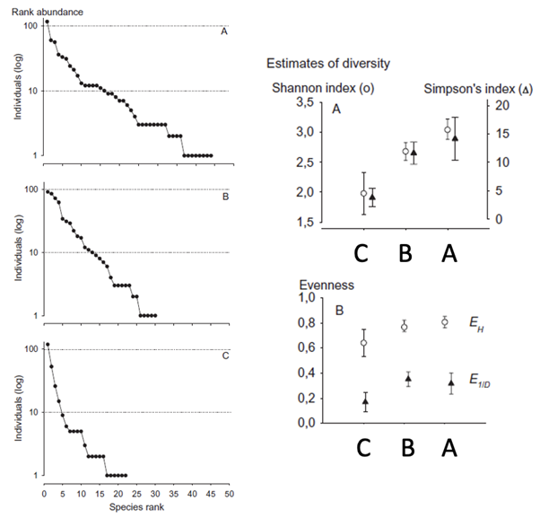
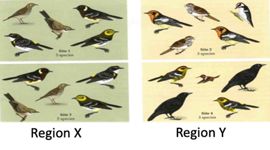

# Ecological diversity {#sec-ecological-diversity}

## TL;DR

Diversity indices combine how many species there are (richness) and species abundance (evenness) into a single metric, to more easily compare large data sets across different temporal and spatial scales. There are many different ways to calculate diversity indices, and each one has its own underlying models, assumptions and nuances for interpretation. Boiling your analysis down to a single metric is usually not a good idea; consider using multiple diversity indices with different assumptions, and explore the data at different scales, with an exploration of variation (error/uncertainty/sampling bias) in your analysis, to ensure a more robust set of conclusions.

## Species diversity: species richness and rank abundance

Rank abundance plots and species richness estimators tell us quite a lot about ecological diversity within a community, but as tools to compare many communities, in the context of underlying factors driving those patterns, they are relatively complex. Species rank abundance distributions give us a measure of the community structure and the relative abundance. Models can tell us what processes might be generating that structure, and start to explain some of the dynamics and processes driving those distributions. Species richness tells us how many species are present in a community, but we may need to account for the differences in observed vs true species richness depending on our sampling effort. Diversity indices try to pull these concepts together into a single representative value: quantitative measures that reflect **how many species** there are (richness) and simultaneously take into account **how evenly the individuals are distributed** among the species (evenness). There are lots of tools available for us to do this. These can be:

-   Parametric, which make assumptions about the underlying processes or distribution of the data. You will be familiar with many of these from your statistics knowledge:
    -   Samples should be independent;
    -   Data should be normally distributed;
    -   Samples should have been taken at random.
-   Non-parametric, which make far fewer assumptions about the distribution of the data.

### Log series alpha

One of the most common of the parametric diversity indices is the log series alpha. Recall that the log series (@sec-abundance-and-evenness) is a series of calculations that estimates the number of species in our community that are represented by one individual, two individuals, three individuals… all the way up to *n* individuals. Alpha is approximately the number of species with 1 individual, i.e. the number of rare species. In the example of butterflies on Buru, Indonesia (Hill et al. 1995), the alpha value for the unlogged site was 7.94, slightly higher than for the logged site, which was 6.99. There were also more individuals for the same effort of sampling in the unlogged site than in the logged site, and there are more total species in the unlogged than the logged. Based on these calculations, logging has clearly had an effect on the community, leading to fewer individuals and fewer species present.

### Case study: Barro Colorado Island

Another real world dataset example comes from Barro Colorado Island. Barro Colorado island is an artificial island that was created when a dam was built to create the Panama canal (@fig-barro-colorado-island). The raised water levels cut off a previously connected area of land into an island, which was declared a nature reserve. The Smithsonian institute have been performing surveys on it since its creation in the 1980s, so we have some continuous data about the environment and communities in that region.

Early in the surveying, a number of 50 hectare plots were established, and every tree above a certain stem diameter in each of those plots was recorded. Plot 53, for example, has 600 individuals representing approximately 83 individuals, while plot 23 has about 340 individual trees and nearly 100 species (@fig-barro-colorado-island). Many plots have more than 100 species of tree - much higher than temperate woodland!

::: {#fig-barro-colorado-island}
{fig-alt = "Number of individuals and number of species for 50 plots sampled across Barro Colorado Island, showing that there is not a clear linear relationship between number of individuals (tree density) and number of species in each plot."}

There is no clear relationship between the number of individual trees in a Barro Colorado Island (BCI) plot (tree density; x axis) and the number of species found there. BCI is located in Panama, west of the Panama Canal.
:::

But which of these plots is the most diverse? We can’t just assume it’s plot 19 with the most species (@fig-barro-colorado-island), because the tree densities also vary. How do these plots compare if we use the log series alpha to measure diversity through the lens of rare species abundance? There is a strong, positive relationship between the number of species and the log alpha estimate of a site (@fig-bci-log-alpha). This suggests that sites with greater species richness also have more rare species. However, there is a lot of variation: sites with the same observed species richness may still differ in our log series alpha estimate of diversity.

::: {#fig-bci-log-alpha}
{fig-alt = "Log series alpha fitted to each tree plot on Barro Colorado Island: there is a strong positive correlation between the number of observed species at a plot, and log series alpha."} There is no clear relationship between the number of individual trees in a Barro Colorado Island (BCI) plot (tree density; x axis) and the number of species found there. BCI is located in Panama, west of the Panama Canal.
:::

### Non-parametric diversity indices

Non-parametric diversity indices, in the same manner as non-parametric statistical tests, make fewer assumptions about the species abundance distribution. They can be thought of as a weighted sum of the relative abundance of different species.

A simple non-parametric measure of ecological diversity is a measure of the relative abundance of different species $p_i = {n_i \over N}$, where $n_i$ is the number of individuals in species $i$ and $N$ is the total number of individuals. This can then be weighted according to some proportion of the rarity of a species, and this creates a diversity index value. Non-parametric diversity indices make few assumptions about the data; they do not have to be normally distributed, but still must be able to be ordered in a meaningful rank order.

### Simpson's index

Simpson’s diversity index asks, if you sample an individual from the community, what is the probability that a second individual sampled will be a member of the same species? To calculate $D$, we take the relative abundance of each species $p_i$ (the probability of selecting an individual of species $i$), square it (i.e. multiply by the probability of selecting a second individual of species $i$), and then take the sum (because the first individual can be any species):

$$
D = \sum p{_i}{~^2}
$$

This produces a diversity index that works in the opposite direction to what you might expect: when diversity is low (few, dominant species) the probability of picking two individuals from the same species is high because there are not many rare individuals around. When diversity is high, $D$ will give a low value because you are unlikely to consecutively pick two individuals from the same species. To resolve this, typically we use $1-D$ which is the complementary Simpson’s index. Alternatively, we take the reiciprocal, $1/D$, which is the inverse Simpson’s index. These indices both ‘correct’ the value so that we get a higher value for a more diverse or even community. Bear this in mind when reading the literature and make sure you know which one is being used.

In practice, we might want to use an adjusted calculation for Simpson’s index to account for small sample sizes. This is similar to the different versions for variance, for the Bailey correction to the Lincoln-Peterson index, etc. In this case, we use the equation:

$$
D = \sum ({n_i \over N}) ({n_i - 1 \over N - 1})
$$ This means that the probability of picking the second individual is adjusted for the fact that the first individual of that species is no longer available for selection, and the whole population has gone down by one.

### Shannon's index

Simpson’s index gets used slightly less frequently than the Shannon’s index (also called the Shannon-Weiner, Shannon-Weaver, or the Shannon Entropy index). Initially, Shannon devised this pattern to look at strings of text. Instead of multiplying the proportion of each species by itself, as in Simpson’s index, it is multiplied by the log of itself.

$$
H = -\sum {p_i}~ln~(p_i)
$$ It is usually the natural log used here: rather than log10, “ln” is log to the base e.

Shannon’s index usually gives a value between 1.5 and 3.5, and a very large sample may exceed 4. You would need a sample of over one hundred thousand individuals to get an H above 5. The higher the value of the Shannon index, the more diverse and even the community is, and high values only occur when there are many species and many individuals.

## Calculating confidence intervals

Non-parametric tests can’t use estimates from underlying distributions to create a confidence interval, so other approaches are to gain some sort of estimate of how sure we are of these values, and remove sampling bias. Calculating confidence intervals for Simpson’s and Shannon’s diversity indices are usually done by methods of repeat sampling, usually called jack-knifing or bootstrapping.

By performing repeated samples of subsamples, we can estimate the standard error of the non-parametric index. In bootstrapping, this is done by subsampling the data *x* times and calculating the diversity index from the subsample (@fig-bootstrap-process). Jack-knifing is a similar process, but calculates the statistic *x* times, each time removing one individual observation from the set of values. In both cases, the set of diversity indices that are produced can be used to infer a distribution.

::: {#fig-bootstrap-process}
```{mermaid}
%%| echo: false
---
mermaid:
  theme: neutral
---
flowchart LR;
A(("Original Sample")) ==> B("Bootstrap Subsample 1");
A ==> C("Bootstrap Subsample 2");
A ==> D("Bootstrap Subsample 3");
B ==> E("Bootstrap Statistic 1");
C ==> F("Bootstrap Statistic 2");
D ==> G("Bootstrap Statistic 3");
E ==> I["Bootstrap Distribution"];
F ==> I;
G ==> I;
A ==> J("Sample Statistic")

```

Bootstrapping is a process whereby subsamples of the original dataset are selected, and statistics calculated repeatedly to generate distribution of possible values for that statistic. This provides a picture of how variable the statistic might be, given the variation present in the original sample, and allows us to calculate confidence intervals and standard errors.
:::

### Case study: Neotropical bats

Rex et al. (2008) used mist nets set overnight to capture bats in three regions:

A.  Primary rainforest (190 - 270 m a.s.l.\[above sea level\]) in eastern Ecuador, 0°S;
B.  Protected forest in Costa Rica (30 - 100 m a.s.l.), 10°N;
C.  Old growth/successional forest next to pasture land (900 – 1200 m a.s.l.) in southern Ecuador, 4°S.

At each region they had 10 one ha plots within a 1.5 km radius, covering all land-cover types. The rank abundance plots all show differences in species richness and evenness (@fig-neotropical-bats). Simpson’s (1/*D*) and Shannon’s (*H*) indices helped to interpret the rank abundance plots: with standard errors generated through bootstrapping, it was possible to say that diversity was significantly lower in the high altitude, old growth, successional forest (C) compared to both the northern, protected area (B) or the equatorial primary rainforest (A), but areas A and B were not significantly different from each other.

The literature suggests that species richness in bats declines with latitude, and with increasing altitude. However, this pattern may also be associated with the levels of disturbance in different habitats, and we are interested in evenness of communities as well as species richness. The diversity index gives us these two things simultaneously, and it is possible for two communities with different rank abundance plots to end up with the same diversity index value, and for similarly shaped plots to have different diversity indices. So how might we separate out the species richness information from the evenness information in this one value?

In a species abundance plot, evenness is represented by how flat the middle species are: i.e. the species that are all similar in abundance but increasing in rarity. If there are lots of relatively common species then there is a relatively even community, while lots of rare species and a few very common species produces a very uneven community.

One way to quantify this is to determine what the maximum possible evenness could be with your calculated diversity, and look at the ratio of your diversity index that you actually get against that maximum possible. Once again we are comparing the observed (our calculated diversity) versus the expected (under specific conditions). Maximum evenness happens when all species have equal abundance: if you had 100 individuals with 10 species, there would be 10 individuals assigned to each species. The process of creating this ratio gives us a value of between 0 and 1, where 1 means that the species have matched that ideal evenness, and zero when they are a long way from that ideal evenness.

::: {#fig-neotropical-bats}
{fig-alt = "Rank abundance plots and estimates of diversity for three sites sampled for bat communities. See caption for pertinent details."}

Rank abundance plots for bats found in three neotropical regions: (A) primary rainforest (190 - 270 m a.s.l.) in eastern Ecuador, 0°S; (B) protected forest in Costa Rica (30 - 100 m a.s.l.), 10°N; (C) old growth/successional forest next to pasture land (900 – 1200 m a.s.l.) in southern Ecuador, 4°S. Right column (top): Simpson’s (triangle) and Shannon’s (circle) indices, with standard errors generated through bootstrapping, indicate that sites A & B are more diverse than site C, but are not significantly different from each other even though site A is more species rich than B. Right column (bottom): Evenness ratios for Shannon’s index (circles; EH) and Simpson’s index (triangles; E1/D) suggest that Simpson’s index is much more sensitive to evenness than the Shannon’s index, because the values calculated for Shannon’s index are higher (i.e. the observed communities are closer to maximum evenness compared to using Simpson’s index). Sites A and B are much more even than site C. This is reinforced by the patterns seen in the rank abundance plots (left).
:::

Rex et al. (2008) calculated the evenness ratios for Shannon’s and Simpson’s indices for their neotropical bats (@fig-neotropical-bats), and found that the bat assemblages at lower elevation (A and B), between 30 and 270 metres above sea level, have similar evenness, despite the changes in latitude. This implies that altitude may be the main drivers of differences in the bat communities between these regions, rather than latitude. This understanding of the evenness changes the interpretation of the data compared to when we considered diversity index data alone. Evenness, as a ratio of the possible maximum, is therefore a major factor to consider when describing communities.

### Berger-Parker index

To reduce evenness to its most basic level, we can ask: what proportion of the individuals in a community are represented by the commonest species? This is known as a dominance index. In an even community this will be low, and in a dominated community it will be high – it will be 1 if the commonest species is the only species you have in your sample.

The Berger-Parker index is calculated from the number of individuals in the sample (*N*), and the number of individuals in the most abundance species ($N_{max}$):

$$
d = {N_{max} \over N}
$$ As with the other non-parametric indices, you have to take the reiprocal in order to get the index working the 'right' way around: 1/*d* gives an increase with an increase in diversity (reduction in dominance)

## What are you investigating?

When you are choosing measures of diversity, you should know in advance what aspect of biodiversity is being investigated, and why. There are some challenges that can come with converting rank abundance plots into a single diversity index value. However, in order to work out what is going on in your community you need to have a way to condense that information down. It is simply not feasible to look at hundreds of rank abundance plots.

These are good starting places for your experimental design and analysis plans:

-   If **species richness**: Shannon, rarefaction
-   If **heterogeneity**: log series $\alpha$ or Simpson's index
-   If **evenness**: one of the evenness indices
-   If **dominance**: Simpson, or Berger-Parker is simple and easily interpretable

## Diversity across spatial scales

Diversity of a single site, quadrat or area is called the point or alpha ($\alpha$) diversity. However, species presence and relative abundance, or diversity, changes across spatial scales. We also need the concepts of gamma ($\gamma$) diversity, diversity at the landscape or regional scale, and beta ($\beta$) diversity, which tells us how smaller sites within that region differ from each other. There are different ways to calculate $\alpha$ and $\beta$ diversity, but usually $\gamma = \alpha + \beta$.

We will work through a simple example to illustrate how this helps to quantify diversity at different scales. @fig-bird-communities shows four sites where five individuals from local bird communities have been counted. Using observed species richness as a simple index of diversity, we see that sites 1 and 3 (in region X) have five species, and sites 2 and 4 (in region Y) have 3 species. The alpha diversity is therefore almost twice as high for sites in region X ($\alpha$ = 5) compared to sites in region Y ($\alpha$ = 3).

Beta diversity represents the difference in the composition or the turnover between multiple sites in the same region. It asks the question, how many species that are present in one site are also present in another site within the same region? In region X, the same five species are present at sites 1 and 3. Although the alpha diversity is high, there is no turnover between sites. In contrast, in region Y there are no shared species between sites 2 and 4.

One of the ways to calculate the beta diversity is to take the number of species in a region, and divide that by the mean alpha diversity for the region. This gives an estimate of the turnover in a region. This would give us $\beta = {5 \over 5} = 1$ for region X, but $\beta = {6 \over 3} = 2$ for region Y is double that.

The gamma diversity is a measure of the total landscape or regional richness, assessed across all sites within that landscape. It is a combination of the alpha diversity and the beta diversity. For our example, region X has a high alpha diversity (5) but a low turnover (1), which gives us a gamma diversity value of 6. Region Y has a lower alpha diversity (3) but a higher turnover (2), giving us a gamma diversity value of 5.

Each of these scales tells us different things about the regions that we’ve been sampling, but as with the alpha diversity that we created from our condensed rank abundance plots, they help us to condense complex levels of information about a species composition into single points of information that we can then start to compare, whether that’s across sites, regions, or landscapes. We might conclude that region X is marginally more diverse at the landscape scale, or we might conduct bootstrapping and more intensive sampling and conclude that they are similarly diverse but with different spatial distributions. Our next experimental and observational steps will depend on the question that we are really interested in answering.

::: {#fig-bird-communities}
{fig-alt = "Cartoon of bird species in two regions, each with two sites, showing that they have different beta diversity. Region X has 2 sites: sites 1 and 3. Both sites have 5 species, but these species are the same across both sites. Region Y has 2 sites: sites 2 and 4. Both sites have 5 individuals with 3 species, but the species are different between the two sites."} Four sites each have some bird species resident. The sites are clustered into two regions. In region X (left) the species richness is 5 in both sites 1 and 3, but each site has the same 5 bird species present. In region Y (right), the species richness is 3 in both sites 2 and 4, making the individual sites less species rich than in region X. However, they are different species at each site, and region Y overall has 6 bird species.
:::

## References

Rex K, Kelm DH, Wiesner K, Kunz TH, Voigt CC (2008), Species richness and structure of three Neotropical bat assemblages. Biological Journal of the Linnean Society, 94: 617-629.
