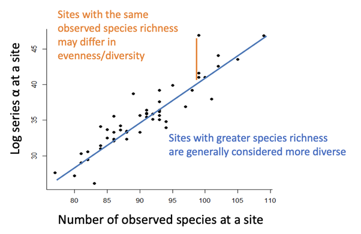

# Ecological diversity {#sec-ecological-diversity}

## TL;DR

Diversity indices combine how many species there are (richness) and species abundance (evenness) into a single metric, to more easily compare large data sets across different temporal and spatial scales. There are many different ways to calculate diversity indices, and each one has its own underlying models, assumptions and nuances for interpretation. Boiling your analysis down to a single metric is usually not a good idea; consider using multiple diversity indices with different assumptions, and explore the data at different scales, with an exploration of variation (error/uncertainty/sampling bias) in your analysis, to ensure a more robust set of conclusions.

## Species diversity: species richness and rank abundance

Rank abundance plots and species richness estimators tell us quite a lot about ecological diversity within a community, but as tools to compare many communities, in the context of underlying factors driving those patterns, they are relatively complex. Species rank abundance distributions give us a measure of the community structure and the relative abundance. Models can tell us what processes might be generating that structure, and start to explain some of the dynamics and processes driving those distributions. Species richness tells us how many species are present in a community, but we may need to account for the differences in observed vs true species richness depending on our sampling effort. Diversity indices try to pull these concepts together into a single representative value: quantitative measures that reflect **how many species** there are (richness) and simultaneously take into account **how evenly the individuals are distributed** among the species (evenness). There are lots of tools available for us to do this. These can be:

-   Parametric, which make assumptions about the underlying processes or distribution of the data. You will be familiar with many of these from your statistics knowledge:
    -   Samples should be independent;
    -   Data should be normally distributed;
    -   Samples should have been taken at random.
-   Non-parametric, which make far fewer assumptions about the distribution of the data.

### Log series alpha

One of the most common of the parametric diversity indices is the log series alpha. Recall that the log series (@sec-abundance-and-evenness) is a series of calculations that estimates the number of species in our community that are represented by one individual, two individuals, three individuals… all the way up to *n* individuals. Alpha is approximately the number of species with 1 individual, i.e. the number of rare species. In the example of butterflies on Buru, Indonesia (Hill et al. 1995), the alpha value for the unlogged site was 7.94, slightly higher than for the logged site, which was 6.99. There were also more individuals for the same effort of sampling in the unlogged site than in the logged site, and there are more total species in the unlogged than the logged. Based on these calculations, logging has clearly had an effect on the community, leading to fewer individuals and fewer species present.

### Case study: Barro Colorado Island

Another real world dataset example comes from Barro Colorado Island. Barro Colorado island is an artificial island that was created when a dam was built to create the Panama canal (@fig-barro-colorado-island). The raised water levels cut off a previously connected area of land into an island, which was declared a nature reserve. The Smithsonian institute have been performing surveys on it since its creation in the 1980s, so we have some continuous data about the environment and communities in that region.

Early in the surveying, a number of 50 hectare plots were established, and every tree above a certain stem diameter in each of those plots was recorded. Plot 53, for example, has 600 individuals representing approximately 83 individuals, while plot 23 has about 340 individual trees and nearly 100 species (@fig-barro-colorado-island). Many plots have more than 100 species of tree - much higher than temperate woodland!

::: {#fig-barro-colorado-island}
{fig-alt = "Number of individuals and number of species for 50 plots sampled across Barro Colorado Island, showing that there is not a clear linear relationship between number of individuals (tree density) and number of species in each plot."}

There is no clear relationship between the number of individual trees in a Barro Colorado Island (BCI) plot (tree density; x axis) and the number of species found there. BCI is located in Panama, west of the Panama Canal.
:::

But which of these plots is the most diverse? We can’t just assume it’s plot 19 with the most species (@fig-barro-colorado-island), because the tree densities also vary. How do these plots compare if we use the log series alpha to measure diversity through the lens of rare species abundance? There is a strong, positive relationship between the number of species and the log alpha estimate of a site (@fig-bci-log-alpha). This suggests that sites with greater species richness also have more rare species. However, there is a lot of variation: sites with the same observed species richness may still differ in our log series alpha estimate of diversity.

::: {#fig-bci-log-alpha}
{fig-alt = "Log series alpha fitted to each tree plot on Barro Colorado Island: there is a strong positive correlation between the number of observed species at a plot, and log series alpha."} There is no clear relationship between the number of individual trees in a Barro Colorado Island (BCI) plot (tree density; x axis) and the number of species found there. BCI is located in Panama, west of the Panama Canal.
:::

### Non-parametric diversity indices

Non-parametric diversity indices, in the same manner as non-parametric statistical tests, make fewer assumptions about the species abundance distribution. They can be thought of as a weighted sum of the relative abundance of different species.

A simple non-parametric measure of ecological diversity is a measure of the relative abundance of different species $p_i = {n_i \over N}$, where $n_i$ is the number of individuals in species $i$ and $N$ is the total number of individuals. This can then be weighted according to some proportion of the rarity of a species, and this creates a diversity index value. Non-parametric diversity indices make few assumptions about the data; they do not have to be normally distributed, but still must be able to be ordered in a meaningful rank order.

### Simpson's index

Simpson’s diversity index asks, if you sample an individual from the community, what is the probability that a second individual sampled will be a member of the same species? To calculate $D$, we take the relative abundance of each species $p_i$ (the probability of selecting an individual of species $i$), square it (i.e. multiply by the probability of selecting a second individual of species $i$), and then take the sum (because the first individual can be any species):

$$
D = \sum p{_i}{~^2}
$$

This produces a diversity index that works in the opposite direction to what you might expect: when diversity is low (few, dominant species) the probability of picking two individuals from the same species is high because there are not many rare individuals around. When diversity is high, $D$ will give a low value because you are unlikely to consecutively pick two individuals from the same species. To resolve this, typically we use $1-D$ which is the complementary Simpson’s index. Alternatively, we take the reiciprocal, $1/D$, which is the inverse Simpson’s index. These indices both ‘correct’ the value so that we get a higher value for a more diverse or even community. Bear this in mind when reading the literature and make sure you know which one is being used.

In practice, we might want to use an adjusted calculation for Simpson’s index to account for small sample sizes. This is similar to the different versions for variance, for the Bailey correction to the Lincoln-Peterson index, etc. In this case, we use the equation:

$$
D = \sum ({n_i \over N}) ({n_i - 1 \over N - 1})
$$ This means that the probability of picking the second individual is adjusted for the fact that the first individual of that species is no longer available for selection, and the whole population has gone down by one.

### Shannon's index

Simpson’s index gets used slightly less frequently than the Shannon’s index (also called the Shannon-Weiner, Shannon-Weaver, or the Shannon Entropy index). Initially, Shannon devised this pattern to look at strings of text. Instead of multiplying the proportion of each species by itself, as in Simpson’s index, it is multiplied by the log of itself.

$$
H = -\sum {p_i}~ln~(p_i)
$$ It is usually the natural log used here: rather than log10, “ln” is log to the base e.

Shannon’s index usually gives a value between 1.5 and 3.5, and a very large sample may exceed 4. You would need a sample of over one hundred thousand individuals to get an H above 5. The higher the value of the Shannon index, the more diverse and even the community is, and high values only occur when there are many species and many individuals.

## Calculating confidence intervals

Non-parametric tests can’t use estimates from underlying distributions to create a confidence interval, so other approaches are to gain some sort of estimate of how sure we are of these values, and remove sampling bias. Calculating confidence intervals for Simpson’s and Shannon’s diversity indices are usually done by methods of repeat sampling, usually called jack-knifing or bootstrapping.

By performing repeated samples of subsamples, we can estimate the standard error of the non-parametric index. In bootstrapping, this is done by subsampling the data x times and calculating the diversity index from the subsample (Figure 5.15). Jack-knifing is a similar process, but calculates the statistic x times, each time removing one individual observation from the set of values. In both cases, the set of diversity indices that are produced can be used to infer a distribution.

```{mermaid}
flowchart LR
id1((Original Sample)) ==> id2(Bootstrap sample 1) & id3(Bootstrap sample 2) & id3(Bootstrap sample ")

```
