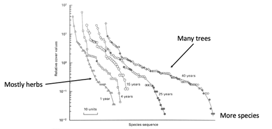
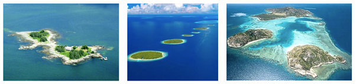
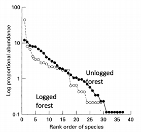
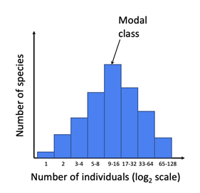
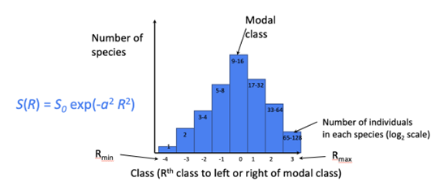
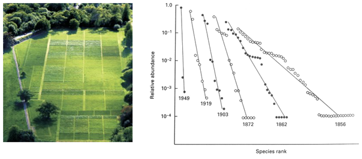
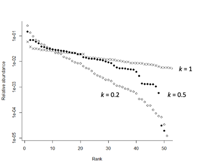
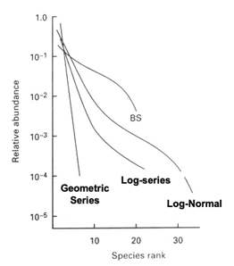

# Patterns of species abundance and evenness {#sec-abundance-and-evenness}

## Too Long; Didn't Read (TL;DR)

What’s the take home message for @sec-abundance-and-evenness? Rank abundance, or species abundance, tells us how individuals are distributed across species in a community. There are many mathematical models developed to describe the different shapes seen in the curve made by a rank abundance plot, where the number of individuals in each species are plotted from most common to rarest (x axis) on a log scale (y axis). We can fit models to observed data: here, we are asking whether the expected values produced by the model are a good match to the observed values, like we did with the Poisson distribution to assess whether *Plantago lanceolata* were randomly distributed in space in week 2. The best fitting species abundance model tells us that, whatever the assumptions sitting behind that model might be, this is a credible explanation for why the community looks the way it does. When we have multiple communities, we can compare the parameters of the best fitting models or different model types to better understand why the communities are similar or different.

## Why use models?

Within any community of interest (whether at the large scale or the microscopic), we want to describe the relationship between the number of species and the number of individuals in those species. This is the relative abundance of species that make up a community. Rank abundance models help us to understand both species richness, and the evenness of the distribution of those species.

As ecologists, we need models to use as tools to produce realistic rank-abundance patterns. These models help us to describe and explain the processes that help to form or change a community. At a simple level, the shape of the line of the rank abundance plot is a descriptive model. For example, Bazzaz (1975) created rank abundance plots for a number of species growing in fields, where the number of years for which the fields had been left fallow varied from one to 40 years (@fig-plant-succession). The plants are identified as herbs, shrubs and trees, and the index of abundance is relative cover, rather than biomass or abundance. Take a look back at Chapter 2 to reacquaint yourself with measures for plant abundance if you need to: counts, masses, and areas, are all acceptable for this type of plot.

Bazzaz (1975) shows that in early succession, i.e. the fields left fallow for only a short period of time, rank-abundance can be described by a relatively straight line. There are few species in total, and they are mostly herbs; there is a high degree of dominance. As time progresses and succession continues, trees and shrubs begin to appear, and in the 25 to 40 year rank abundance plots you can see both a higher species richness, and a more even community structure, although some species are still considerably more abundant (or dominant) than others.

::: {#fig-plant-succession}
{fig-alt = "Rank abundance plots showing the relative cover of different species of plant in fields after a period of being left fallow After 1 year, the plants are mostly herbs, and the field is relatively species poor. The longer the field is left fallow, the further through succession the community gets, moving from mostly herbs through shrubs towards a tree-dominated community. In addition, the relative distribution of cover to species gets more even: there are fewer very rare or very common species, and many species with a similar representation in the field."} Plants in old fields of five different successional ages in southern Illinois. Symbols are open for herbs, half-open for shrubs, and closed for trees. Reproduced from Bazzaz (1975).
:::

In the previous chapter, we saw a similar pattern of change in rank abundance moving from the straight line of the species poor boreal forest through temperate deciduous and tropical semideciduous forests towards the species rich and relatively even tropical rainforest.

Rank abundance can help us describe patterns, and change in patterns, over time and space. To help to explain these, we can develop models that produce different rank abundance patterns as a result of underlying processes. When we fit models to real world data, we can estimate parameters and goodness of fit, to see which models are a reasonable description of the community structure. We can then use these models as evidence to suggest which process gave rise to the community that we have observed.

## Species abundance models

There are two broad categories of species abundance models: **statistical** and **biological**. \* Statistical models such as the log species **describe** the observed patterns of rank abundance, and the parameters of these models can tell us useful information such as the mean or variance of rank abundance within the community. \* Biological (or theoretical, or mechanistic) models, such as the geometric series or niche apportionment, **explain** the observed pattern of rank abundance as the result of a process. The parameters of these models therefore tell us something about how the community arose.

When we are referring to species abundance models, there is some common terminology: \* *S* is (usually) the total number of species. However, sometimes this refers to the number of sites. When you write about models, always define your terms when you use them, to avoid ambiguity. We will endeavour to do the same here. \* *N* is the total number of individuals \* $P_i$ is the proportion of individuals that species *i* contributes to the total (relative abundance) \* $S_n$ is the number of species with *n* individuals (the frequency of species in relation to abundance)

Within our statistical and biological models, we can also ask whether the patterns of distribution are **stochastic** or **deterministic** (@fig-model-examples).

::: {#fig-model-examples}
{fig-alt="Three different ways in which islands might be distributed across the sea: there might be a single island or two very closely connected pieces of land surrounded by water; evenly spaced islands in a line; islands of different sizes and distances apart."}

. In a deterministic model, there is one rule to distribute individuals among islands, e.g. as a function of their number, size, habitat or distance from the mainland. In a stochastic model, there is a random variable at play and the rules are probability-based rather than perfectly repeatable. This is still a function of the driving factors such as number, size, habitat or distance, but two islands with equal properties are not guaranteed to have the same community composition.
:::

Here follows a handful of common species abundance models, with case studies for when they have been used to understand change or formation of communities. You do not need to memorise equations or be able to apply these from scratch. The main learning outcome is to appreciate that there are many different models, and each one has different underlying assumptions or implications for the community that it best fits.

## Statistical models

### Log series

One of the first statistical species abundance models was developed by Fisher *et al.* (1943). The log series model gives the number of species within a community that are predicted to have *n* individuals ($S_n$):

$$
S_n = {\alpha x^n \over n}
$$ The number of species with an abundance of *n* ($S_n$) is equal to a positive constant derived from the sample data ($\alpha$ : alpha) multiplied by a positive constant also derived from sample data (*x*), divided by the number of individuals that you are interested in (*n*). What does this mean in practice? If we wanted to find the number of species with 1, 2, 3, or more individuals, all the way up to n individuals, we would need to calculate the sequence:

$$
\alpha x, {\alpha x^2 \over 2}, {\alpha x^3 \over 3}, {\alpha x^4 \over 4}, ... , {\alpha x^n \over n}
$$ In practice, the value of *x* tends to be close to one. This means that at the beginning of the sequence (n=1), $\alpha$ is roughly the number of species with 1 individuals. This can be taken as a measure of the number of rare species.

As we approach the other end of the sequence, the number of individuals within a species increases (i.e. as it becomes more common), and the expected number of species with *n* individuals decreases. This means we may only get one or two species with a high number of individuals, or only one or two common species.

### Case study: log series in Indonesian butterflies

Hill et al. (1995) compared the species abundance of butterflies in Buru, Indonesia, comparing logged and unlogged forest to determine if the community structures differed with different levels of disturbance (@fig-hill-species-abundance-plots). Unlogged communities had more individuals and more species compared to the logged forest regions (@tbl-butterfly_data). When a log series model was fitted to the data, the alpha value from the unlogged forest (7.94) was higher than that from the logged forest (6.99). Remembering that alpha is a rough representation of the number of species with 1 individuals, this implies that the unlogged communities have more rare species than the logged communities.

::: {#fig-hill-species-abundance-plots}
{fig-alt="Rank abundance plot for butterflies in logged and unlogged forest. The logged forest appears to have fewer species, and the most common species is more dominant. The unlogged forest also has more rare species."} Species abundance plots of butterflies in logged (open circles) and unlogged (closed circles) forest regions of Buru in Indonesia (from Hill et al. 1995).
:::

```{r}
#| echo: false
# create the data
butterfly_data <- matrix(c("37","29",
                           "828","458",
                           "7.94","6.99",
                           "0.99","0.98"),  
                    nrow = 4,
                    byrow = TRUE)

# make a list object to hold two vectors
vars <- list(rows = c("Number of species",
                        "Number of individuals",
                        "alpha",
                        "x"),
             headers = c("Unlogged",
                        "Logged"))
dimnames(butterfly_data) <- vars
```

```{r}
#| echo: false
#| label: tbl-butterfly-data

knitr::kable(butterfly_data, 
             caption = "Observed number of species and individuals, and best-fit parameters for the log series model, for unlogged and logged forest (from Hill et al. 1995).") |> 
  kableExtra::kable_styling()
```

### Log normal

The log normal model for species abundance was devised by Preston in 1948. Rather than plotting the relative number of individuals by species in rank order (as per a rank abundance plot), or calculating the exact frequencies of species with abundance *n* (as seen in the log series), the log normal model looks at the distribution of individuals amongst species using a histogram. In this histogram (@fig-species-abundance-histogram), the y axis represents the number of species. The x axis represents the number of individuals in that species, and these are grouped together into classes called octaves. The maximum number of individuals in each octave doubles as the classes increase, so the lowest octave is the number of species with one individual, then two individuals, then three or four individuals, then five to eight individuals, and so on: the x axis is thus using a log base 2 scale, and the species distribution should look approximately normally distributed. The modal class (remembering that the ‘mode’ is a version of an average, like the mean or the median) is the class containing the most common number of individuals per species (@fig-species-abundance-histogram).

::: {#fig-species-abundance-histogram}
{fig-alt = "A Preston plot; a histogram that looks normally distributed, but the x axis has a log2 scale such that if it was drawn out linearly, each bar on the histogram would be twice as wide as the preceding one."} A histogram of species abundance, framed through the log normal model. The x axis uses a log base 2 scale to ‘bin’ the number of individuals per species, and the y axis shows how many species there are in each ‘bin.’ The modal class shows the most common number of individuals found per species.
:::

The log normal equation $S(R) = {S_0}exp(-\alpha^2R^2)$ uses the number of species within the modal class ($S_0$) and a function of the variance of the distribution ($\alpha =( 2\alpha^2 )^{-0.5})$) to calculate the number of species in any of the octaves to the left or right of the modal class (@fig-log-normal-distribution-class). The key takeaway is that in a community that follows the log normal model, we expect to see very few species with very few individuals, and very few species with a large number of individuals.

::: {#fig-log-normal-distribution-class}
{fig-alt="Another Preston plot, showing the equation described in the text. Rmin and Rmax describe the width of the distribution as the bars furthest to left or right of the modal class."} The log normal distribution uses the number of species in the modal class, and the variance of the distribution, to estimate how many rare or common species there are.
:::

## Biological models

Biological models for species abundance are based on the assumption that an ecological community has a ‘multidimensional niche space’ that is divided up amongst the species who live there. The relative abundance of species is used as a surrogate for niche size: for example, if half of the individuals observed belong to one species, we assume that that species occupies half of the available niche space. Biological models describe a process of niche fragmentation or niche filling that results in the observed species abundances. There are a number of different models that describe different niche apportioning. We will consider a handful briefly here.

### Geometric series

The geometric model is a very commonly seen biological model. It describes a process by which species arrive at regular time intervals into an unsaturated habitat (meaning there is still space left to occupy). It is assumed that each species that arrives will occupy a fixed fraction of the remaining niche space. The proportion of space occupied by the *i*th species to arrive is then:

$$
P_i = k(1 - k)^{i - 1}
$$ 

For example, if *k* = 0.5, then the first species occupies $P_1$ = 0.5 or half of the niche. The second species to arrive gets $P_2$ = 0.5(0.5) = 0.25 or quarter of the niche. The third species gets $P_3$ = 0.5(0.5)$^2$ = 0.125 or an eight of the niche, and so on.

We see geometric mechanisms occurring in species-poor environments, or in environments that are very early in succession processes. One species is common and dominates the niche space, and the rare species very rapidly become rare - and eventually are not present at all. Because the ratio of each species to its predecessor is constant, when we plot the log abundance-rank graph, we see a straight line.

### Case study: geometric series in the Park Grass experiment

The Park Grass experiment at Rothamsted is an experiment that was initially designed to determine the effects of organic and inorganic amendments and lime addition on grasslands used for hay. However, this is a long term experiment that also includes information about how the vegetation composition of the plots has changed over a number of years, from 1856 to 1949 (@fig-rothamsted-park-grass). Since 1856, we can see that the gradient of the rank-abundance lines has become steeper, from which we can deduce that the value of k in the geometric series model fitted to each set of data is increasing over time. That indicates that the dominant (nominally ‘first arriving’) species are increasingly dominant in recent years compared to during the Victorian origins of the experiment. As a result, species richness is lower, and presumably competition (and competitive exclusion) is stronger.

::: {#fig-rothamsted-park-grass}
{fig-alt = "Photograph of the Park Grass experiment showing patches of green plants separated by small lines of mown grass. Species abundance plots: see caption for details."}
An aerial photograph of the Park Grass experiment at Rothamsted research centre. (Right) Straight lines fitted to species abundance data from the Park Grass experiment suggests that the geometric series explains the patterns well, but that the dominant species are becoming increasingly dominant over time, to the exclusion of rarer species in the community. 
:::

### Power fraction
Power fraction models are sequential breakage models in which niche space is divided at random into pieces. An invading species (the ‘colonists’) will compete for the niche of a species already present, and take a random proportion of that niche. The relative change of choosing any one niche is a power function of the size of that niche: that is, the relative chance of choosing a species with relative abundance $P_i$ is $P_i^K$ where $0 ≤ K ≤ 1$ (@tbl-niche-colonisation).

```{r}
#| echo: false
# create the data
niche_colonisation_data <- matrix(c("Random fraction","$P{_i}{^0}$", "0.33","0.33","0.33",
                        "Power fraction", "$P{_i}{^K}$","0.293","0.293","0.414",
                        "MacArthur fraction", "$P{_i}{^1}$", "0.25","0.25","0.5"),  
                    nrow = 3,
                    byrow = TRUE)

# make a list object to hold two vectors
vars <- list(rows = c("","",""),
             headers = c("Niche space occupied",
                         "Chance",
                        "0.25",
                        "0.25",
                        "0.5"))

dimnames(niche_colonisation_data) <- vars
```

```{r}
#| echo: false
#| label: tbl-niche-colonisation

knitr::kable(niche_colonisation_data, 
             caption = "Diagram showing the chance of choosing a niche for colonisation, if the original community has three species occupying a quarter (0.25), a quarter (0.25) and a half (0.5) of the niche space on arrival of the invader. The power fraction example uses K = 0.5. The random fraction is the special case in which K = 0, and each species has equal chance of being invaded regardless of space occupied. The MacArthur fraction model is the special case in which K = 1, and the chance of being invaded is proportional to the niche space occupied.") |> 
  kableExtra::kable_styling()
```

Power fraction models are pretty good at reflecting what’s happening in the real world: if you occupy a large niche, you’re slightly more likely to be invaded, but only slightly. This means that we see a long plateau in the rank abundance plots, with a lot of species of approximately similar relative abundance across the middle ranks (@fig-power-fraction-relative-abundance). This plateau is very flat where K=1, and becomes steeper as the K value gets closer to 0. Very species-rich assemblages tend to have a K value of less than or equal to 0.2.

::: {#fig-power-fraction-relative-abundance}
{fig-alt = "A range of different rank abundance lines showing power fraction models with different values of K. Where K = 1, there is a high degree of evenness. More species rich assemblages, with a K value of 0.5 or 0.2, show a higher level of dominance in some species."}
Relative abundance of different communities that follow the power fraction model, showing the change in shape of the rank abundance plot with changing *K*.
:::

## Comparing models
All our models produce different distributions of species abundances (@fig-comparing-models). Some have more in common than others. For example, the log series yields a more even distribution of individuals among species than the geometric series, but both tend to have a low number of very abundant species and a large proportion of rare species. In fact, the log species is predicted to occur as a result of the same arrival model described by the geometric series, but here the interval between the arrival of species into an unsaturated habitat is random rather than regular. In the real world, it is most applicable where only one or a few factors drive the community assemblage - for example, on a forest floor, the main factor driving the community assemblage might be the availability of light.

::: {#fig-comparing-models}
{fig-alt = "A comparison of the different rank abundances between different theoretical models. The log normal model shows a diverse species, with higher levels of evenness than the log series. The geometric series shows a very regular decrease in relative abundance, with low levels of evenness."}

A comparison of rank abundance curves generated by geometric series, log-series and log-normal models. The geometric series is characterized by a straight line, species poor, uneven community. The log series tends to be more species rich and more even but retains a number of very common species that may dominate. The log normal model is characterized by greater evenness, with some rare species and few very common ones, and many intermediately-ranked species with similar relative abundance.
:::

In contrast, log normal communities are diverse communities sampled with a high level of effort. Compared to the geometric series and the log series, log normal communities have a high species richness and a high level of evenness: 99% of species will occur within ±3 standard deviation of the mean. This evenness occurs because many small factors act on the abundance of each species, driving them all back towards the mean (you may remember this as the central limit theorem from your mathematics lessons at school). If there are lots of individuals within a population, then those are likely to reduce due to competition. If there are not many individuals, their numbers are likely to increase, and thus the species is likely to become less rare.

Of course, ultimately we need to know if any of these models are useful when trying to understand the patterns of rarity and evenness in our communities of interest. It is important to remember that the observation of a pattern that is predicted by a model doesn’t necessarily validate the mechanisms that the model assumes; just because the pattern looks the same as the model, it doesn’t necessarily mean that the species arrived at the same end point in the same way as the model implies.
 
In practice, usually more than one model will fit the real data quite well. As researchers, we hope that one or two models will fit the data particularly well: we are looking for statistical analyses to guide and support our evaluation of biological meaningfulness, not to replace it. We can then consider the underlying mechanisms in the sample location, and choose the ‘best’ model(s) that match both the patterns of rarity and commonness that we see and the likely underlying mechanisms for that environment and set of species.


## References

Bazzaz FA (1975). Plant species diversity in old-field successional ecosystems in South Illinois. Ecology 56: 485-488. https://doi.org/10.2307/1934981

Hill JK, Hamer KC, Lace LA, Banham WMT (1995). Effects of selective logging on tropical forest butterflies on Buru, Indonesia. Journal of Applied Ecology 32: 754-760.
