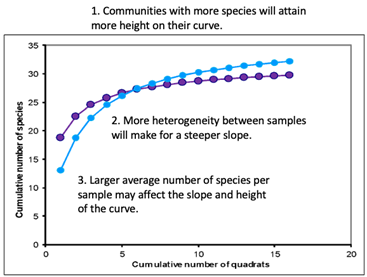
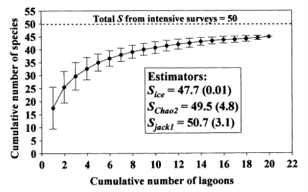
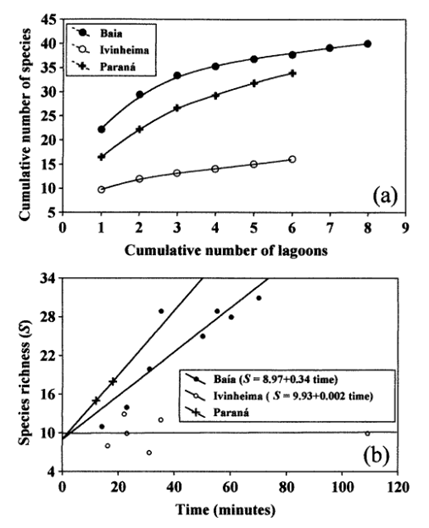
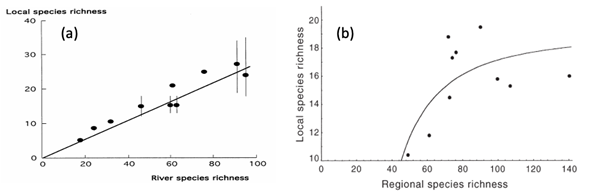

# Patterns of species richness {#sec-patterns-species-richness}

## TL;DR

The take home message from @sec-patterns-species-richness is that we don’t have to eyeball species accumulation curves constructed from observed species richness data to guess what true species richness is. There are estimators to do this for you. These take into account the number and relative abundance of species in the observed data, and may be more or less affected by representation of rare species in the dataset. Together with sampling locations at local and regional scales, these can help better understand patterns of species richness across the landscape.

## Observed versus true species richness

Species abundance models help us understand patterns of relative abundance: how individuals are distributed among species. Species richness estimates tell us how many species are present. In @sec-species-richness-overview, we established that species accumulation curves change with commonness and rarity, and with sampling effort. This is in part because as sampling effort increases, the curve begins to encapsulate different processes and the scales that these occur at. Patterns of species accumulation depend on a range of factors such as the average species richness of a single sample and the community at large, and the variability among samples, and among communities.

Two communities can differ in many respects, which may affect how we view their respective species richness, and the shape of the species accumulation curve (@fig-representative-species-accumulation-curves). In practice, this means that it’s important to consider how a sampling protocol may affect the answer to the research question. For example, expressing sampling effort as the number of quadrats used may present a slightly different curve to expressing sampling effort as the number of plant individuals sampled.

::: {#fig-representative-species-accumulation-curves}
{fig-alt = "Two representative species accumulation curve, with the number of quadrats representing the sampling effort on the x axis, and the cumulative number of species on the y axis. Communities with more species will attain more height on the curve. More heterogeneity between samples will make for a steeper slope. And a larger average number of species per sample may affect the slope and height of the curve."}

Two representative species accumulation curves, with the number of quadrats representing the sampling effort on the x axis, and the cumulative number of species on the y axis. Communities with more species will ultimately attain more height on the curve. More heterogeneity between samples will make for a steeper slope. A larger average number of species per sample may affect the slope and height of the curve. Sampling effort affects which one ‘looks’ more species rich.
:::

One way to mitigate for this is to estimate ‘true’ species richness from our rank abundance data: what is the asymptotic value, or the point at which the curve plateaus. There are a number of estimators for true species richness: 
-   **Parametric methods** fit a model to species rank abundance data, and model the species accumulation curve from this data. 
-   **Non-parametric methods** use estimators known to converge rapidly towards the asymptote, by applying different correction factors depending on the rarity of species within the sample data.

The log series model that you encountered in @sec-abundance-and-evenness is an example of a parametric method: the equation calculates the expected number of species with *n* individuals, which allows an estimate of how many species there are in total.

Non-parametric methods use information about the species that have been observed to infer how many species have not been observed. We are not going to go into mathematical details about any of these now, but you can read more about them in the workshop case studies. They follow the same characteristic equation, where predicted species richness started with the observed species richness, and is adjusted based on a function of the relative abundance of species, often focusing on the number of rare species (e.g. those with only 1 or 2 individuals), and the number of sites, because the more sampling you have done, the more likely it is that you’ve seen everything.

The following three equations follow the same approximate formula: Predicted species richness ($S_p$) is equal to the observed species richness ($S_0$) plus a correction term.

### Jackknife

$$
S_p = S_0 + a_1({{N - 1}\over N})
$$ Where: $a_1$ is the number of species that only occur once *N* is the number of sites in the dataset

### Chao

$$
S_p = S_0 + {a_1~^2\over 2a_1}({{N - 1} \over N})
$$ \### Bootstrap $$
S_p = S_0 + \sum^{S_0}_{i = 1} (1 - {Y_i \over N})^N
$$ Where: $Y_i$ is the number of individuals in species *i*

## Case study Aquatic macrophytes and species richness

Species richness estimators in action can be quite powerful. Bini et al. (2001) conducted a study of aquatic macrophytes in a South American floodplain, sampling 20 lagoons in October and November of 1999 to estimate the species richness of three regions. The researchers intensively sampled these enclosed lagoons, and were fairly sure that there were fifty species in total (@fig-bini-accumulation-curves).

::: {#fig-bini-accumulation-curves}
{fig-alt = "Cumulative number of species found from intensive lagoon sampling, with data from all areas pooled. Between 10 and 25 species are estimated to be present after looking at any one of the lagoons, and this range decreases to \~45 species as the effort increases towards 20 lagoons."} 

Species accumulation curve from intensive lagoon sampling, pooling data across all 20 lagoons and showing three estimates for total species richness approaching 50 species (reproduced from Fig. 4, Bini et al. 2001).
:::

However, when the lagoons were considered individually, one area of sampling appears to be much lower in species richness than the other two (@fig-bini-lagoons). Indeed, when effort is measured by time rather than sample, the Ivenheima region doesn’t become any more species rich with increased effort: it didn’t matter how long the researchers looked, they were never going to find more than ten species at this particular site. In this instance, an increase in sampling effort wouldn’t have led to finding more species, as is assumed in the models above.

::: {#fig-bini-lagoons}
{fig-alt = "Species accumulation curves by region, with sampling effort described by number of lagoons and with time spent sampling. Two regions are more species rich, but one yields few new species when new lagoons are visited, and in fact increased sampling time makes no difference to the number of species found."} Species accumulation curve from less intensive lagoon sampling, with lagoons from three regions kept separate. The Ivenheima region (open circles) appears less species rich than Baia (closed circles) or Paraná (crosses).
:::

## Why do patterns of species richness exist?

Why do some communities have more species than others? Are there patterns or gradients of species richness? If so, why do these exist? Broadly speaking, there are four factors that affect species richness: \* Geographical factors: latitude, altitude, depth (under water) \* Factors correlated with latitude: climate, energy, productivity, environment \* Factors not correlated with latitude: physical disturbance, isolation, heterogeneity \* Biotic factors: Predation/parasitism, competition, succession

Geographic factors vary spatially, and slowly over time. Factors correlated with latitude can vary both spatially and temporally due to differences in e.g. climate and weather. Factors may not be correlated with latitude: for example, the physical levels of disturbance of a site, or a site’s isolation. Are you sampling an island a long way from the mainland? Are resources evenly spread, or are they patchy and heterogenous? Finally, biotic factors might also be influencing your site, such as predation and parasitism; these vary with space, time and the community that is present.

We may also need to consider how saturated a community is, by comparing “local” richness against “regional” richness. Here, a local area is one in which the species within it can encounter and interact with each other in ecological time, whereas a region is larger. Dispersal rates within local sites within a region should be greater than the dispersal rates between different regions, meaning that individuals should be moving much more within the region than they are moving between regions.

An unsaturated population follows a straight line relationship, implying that where local samples are more diverse, the regional richness is also greater. With the saturated community, the local richness reaches a plateau: it doesn’t matter how much richer the regional richness gets, the local richness cannot increase. This may occur in regions that are limited in space, for example.

To illustrate this, we can look at the species richness of fish in African rivers (@fig-local-vs-regional-species-richness a) and ants in soil litter (@fig-local-vs-regional-species-richness b) to see unsaturated and saturated communities respectively. Hugueny and Paugy (1995) sampled ten rivers (the regions) by looking for fish in a number of small pools (the local areas). They calculated the local species richness as the average number of species found in each pool in a river, and calculated total river species richness using the whole set of samples from that river. Where individual pool samples were more diverse, the whole river was more diverse: this community had room for more diversity at both the regional and local scales (@fig-local-vs-regional-species-richness a). The river species richness was well explained by the size of the catchment area: the larger the catchment area, the more diverse the river.

In contrast, Soares et al. (2001) sampled ten forest fragments (the regions) by sampling from ten quadrats (the local areas) within each fragment. Again, they calculated average local species richness from the quadrats taken individually within each region, and regional species richness by pooling the data from the ten quadrats. Although some fragments had much higher species richness, individual quadrats had an average of 18 or 20 ant species. The local species richness reached a plateau, regardless of the regional species richness (@fig-local-vs-regional-species-richness b). Factors such as the space available, or social behaviour of the ants, are limiting local species richness.

::: {#fig-local-vs-regional-species-richness}
{fig-alt = "See caption for pertinent details."}

Local species richness against regional species richness. (a) For fish in African rivers, local species richness (pools) increase with river species richness, implying that this is an unsaturated community (Hugueny and Paugy 1995). (b) For ants in soil litter, quadrats (local sites) never contain more than 18-20 species of ant, even when the wider forest fragment (the region) has greater species richness (Soares et al. 2001). This is a saturated community: it doesn't matter how species rich the region becomes, there is a limit to how rich the local areas can become.
:::

## References

Bini et al. (2001) Species richness and ß-diversity of aquatic macrophytes in the Upper Paraná River floodplain. Arch. Hydrobiol. 151: 511-525

Hugueny B, Paugy D (2001). Unsaturated fish communities in African rivers. The American Naturalist 146(1): 162-169.

Soares SM, Schoereder JH, DeSouza O. (2001), Processes involved in species saturation of ground-dwelling ant communities (Hymenoptera, Formicidae). Austral Ecology, 26: 187-192. https://doi.org/10.1046/j.1442-9993.2001.01101.x
