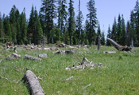
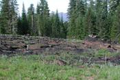
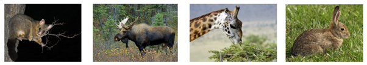

# Experimental design {#sec-experimental-design-intro}

## TL;DR

The key points to know in this subsection are: - Experimental design is the structure of an experiment: the plan that will allow you to collect the right information (type and amount) to answer your question. - Manipulative experiments are experiments in the true sense, whereby we change something, and measure the effect of the intervention. - Mensurative experiments, or observational studies, are experiments in which we measure and monitor, but don’t change anything directly. - The way you phrase your hypothesis within your wider research question affects the way you design your experiment, and thus the sort of results you will be able to report.

## What is an experiment?

What is an experiment? The [Cambridge dictionary online](https://dictionary.cambridge.org/dictionary/english/experiment), that go-to for degree level knowledge, says an experiment is a process “*a test done in order to learn something or to discover if something works or is true.*” [Wikipedia](https://en.wikipedia.org/wiki/Experiment), an equally excellent first stop for gathering the right words for your critical search, starts by saying, “*An experiment is a procedure carried out to support or refute a hypothesis, or determine the efficacy or likelihood of something previously untried.*” Experimental design, therefore, is the logical structure of an experiment that enables you to learn something; that is, the process that you work through to learn the answer to your question, and decide whether there is evidence to support your hypothesis.

The previous chapters have explored ways to collect, analyse and interpret data because these are the tools you need in order to design an experiment so that a question can be answered satisfactorily. To design a good experiment, you first have to design a good question, and craft a testable hypothesis. The way your hypotheses are phrased affects the way in which you can approach the experimental design, and how you can analyse your data to reach appropriately robust conclusions.

## Manipulative experiments

A manipulative experiment is an experiment in the true sense, whereby we change something, and measure the effect of the intervention. In a grassland restoration study looking at the role of tree removal and fire, Halpern et al. (2012) crafted the hypothesis:

**Tree removal promotes the abundance and diversity of meadow species over forest herbs.**

To test it, they set up three different treatments (manipulations): (1) doing nothing, (2) removing trees and burning the slash in piles, and (3) removing trees and doing a broadcast burn (@fig-tree-removal). They measured the species abundance and diversity of their sites and inferred a causal relationship; that the treatment was what affected the metrics between their different sites.

::: {#fig-tree-removal layout-ncol="2"}
{fig-alt = "A grassy clearing at the edge of a primarily coniferous forest, where some old trees have been cut and left on the ground. Their branches and needles/leaves have been removed from the site."} {fig-alt = "A grassy clearing at the edge of a primarily coniferous forest, where some old trees have been cut and burned on the ground, leaving patches of scorched earth among the grass plants."} Treatments in a tree-removal experiment, with (left) tree removal with slash burned elsewhere in piles and (right) tree removal with broadcast burn. From Halpern et al. (2012).
:::

Manipulative experiments fall into the classical experimental framework, which requires a number of experimental units, each of which undergoes some form of manipulation or treatment, at least one control (a null treatment; not always ‘doing nothing’), and replication and randomization. We'll come back to all of these terms in more detail later in the chapter.

## Mensurative experiments

A mensurative experiment, or observational study, is one in which we measure and monitor, but don’t change anything directly. For example, Whitehead et al. (2014) were interested in how livestock removal alters native plant and invasive mammal communities in a dry grassland-shrubland ecosystem. Their hypothesis was:

**Rabbits have greater presence on pastoral sites compared to conservation land.**

Whitehead et al. (2014) identified paired sites either side of a fence, where there were livestock on one side of the barrier, but on the other side the livestock had already been removed. They monitored the animal and plant communities on both sides of the fence to explore the differences between the two environments.

Observational studies don't fall into the true experimental framework because the treatment isn't imposed. Examples of observational studies include inventory-taking, monitoring studies, and so on. Some of these can be called quasi-experiments because they satisfy some of the requirements of a manipulative experiment, for example, experimental units with some kind of control or baseline, but not all the requirements are satisfied. In general you might get weaker inference than from the manipulative experiment but on the other hand, especially with ecological studies, it is not always possible in terms of time or money or feasibility to do a manipulation on the scale that is required.

## Comparing hypotheses and experiments: case study

When we start with a research question, it might sound like a very vague and general hypothesis, for example, “herbivore browse damages plants.” There are many different kinds of herbivore, and many different kinds of plants and damage (@fig-herbivore-damage), so it is possible to do a variety of different kinds of study to explore the question, using hypotheses crafted using different phrases.

::: {#fig-herbivore-damage}
{fig-alt = "Four photographs of animals that eat plants: brushtail possum, moose, giraffe, rabbit."} Herbivores, damaging plants. From left to right: a brushtail possum that has consumed the leaves on its tree, a moose snacking on tree seedlings and saplings, a giraffe browsing on a tree, and a rabbit in the grass.

### Higher possume density is associated with greater browse damage on kamahi

Duncan et al. (2011) carried out an observational study to record foliar damage on kamahi trees at a number of sites across New Zealand. They also measured possum density at those sites using a trap catch index. They showed that the probability of a tree appearing in a more severe browse category (i.e. more leaves chewed) increased as possum density increased.

### Extensive control reduces possume browse on preferred tree species, increases foliage cover, and decreases the probability of annual tree mortality

Gormley et al. (2012) recorded the same sort of measurements as Duncan et al. (2011), but this time before and after a period of five years. They were thus able to consider the mortality rate of trees across a ‘long’ time scale. They chose sampling sites which had received extensive pest control over the last twenty years (usually poison baiting and/or trapping) versus sites that had had no control. Again this was an observational study, but quasi-experimental because it had replication but not really randomization, and they chose sites to have the necessary range of pest control history (or lack thereof), rather than implementing it directly.

### Moose herbivory and tree damage

Bergeron et al. (2011) looked at regeneration of trees in three areas which had different moose densities, in an observational study. Their hypothesis was “*Regeneration of commercial tree species differs with moose density*,” which tells us that we expect a **correlation** between moose density and regeneration: when one changes, the other is also observed to change.

In contrast, Edenius et al. (2011) had the hypothesis that “*Moose herbivory affects growth and fecundity of Scots pine*.” They simulated moose herbivory by clipping plants, rather than finding places where moose had browsed plants specifically. This manipulative experiment allowed them to claim **causation**; it was the clipping, or artificial herbivory, that drives the change in growth and fecundity of the Scots pine

## References

Bergeron DH, Pekins PJ, Jones HF, Leak WB (2011). Moose browsing and forest regeneration: a case study in Northern New Hampshire. Alces 47: 39-51.

Edenius L, Danell K, Hyquist H (2011). Effects of simulated moose browsing on growth, mortality, and fecundity in Scots pine: Relations to plant productivity. Canadian Journal of Forest Research 25: 529-535

Duncan RP, Holland EP, Pech RP, Barron M, Nugent G, Parkes JP (2011), The relationship between possum density and browse damage on kamahi in New Zealand forests. Austral Ecology 36: 858-869. https://doi.org/10.1111/j.1442-9993.2010.02229.x

Gormley AM, Holland EP, Pech RP, Thomson C, Reddiex B. (2012). Impacts of an invasive herbivore on indigenous forests. Journal of Applied Ecology, 49(6), 1296–1305. http://www.jstor.org/stable/23353509

Halpern CB, Haugo RD, Antos AJ, Kaas, SS, Kilanowski AL (2012). Grassland restoration with and without fire: evidence from a tree-removal experiment. Ecological Applications 22(2): 425-441.

Whitehead AL, Byrom AE, Clayton RI, Pech RP (2014). Removal of livestock alters native plant and invasive mammal communities in a dry grassland-shrubland ecosystem. Biological Invasions 16:1105-1118.
:::
