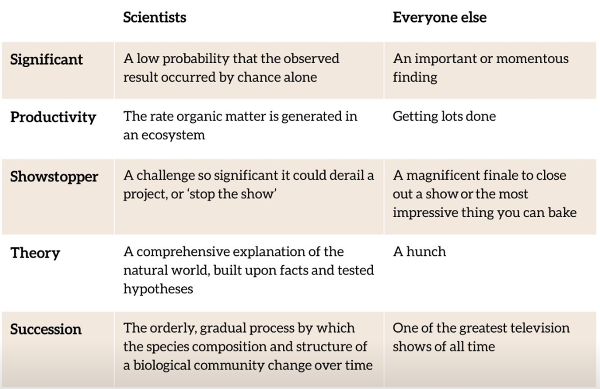

# Experimental design: A brief summary {#sec-experimental-design-summary}

Effective experimental design starts with a good question, turned into a good hypothesis, and an idea about what the graph might look like. You do not need to know what the answer will be: endings may change when you explore the data for real, but you do need to understand the scaffolding on which the story will be built so that you can collect data that will lead you to a convincing narrative.

You can come back to this chapter when you are designing your fieldwork experiments, and don’t forget the module glossary of experimental design. Sometimes the words we use in ecology have a specific meaning within the discipline that is not quite the same as the way you use the words in real life (for example, @fig-scientist-definitions). Other words may be altogether unfamiliar (@tbl-new-words). Read them, test them out in fieldwork preparation workshops, develop your own list, and enjoy ecology!

::: {#fig-scientist-definitions}
{fig-alt = "A table comparing scientist definitions with everyone else's definitions of the same terms. Significant: A low probability that the observed result occurred by change alone, or an important or momentous finding.
Productivity: The rate organic matter is generated in an ecosystem, or getting lots done.
Showstopper: A challenge so significant it could derail a project, or 'stop the show', or a magnificant finale to close out a show or the most impressive thing you can bake.
Theory: A comprehensive explanation of the natural world, built upon facts and tested hypotheses, or a hunch.
Succession: The orderly, gradual process by which the species composition and structure of a biological community change over time, or one of the greatest television shows of all time."}

Some words useful for ecological investigations about which your non-ecologist peers may not be on the same page. Reproduced from the British Ecological Society
:::

```{r}
#| echo: false
# create the data
ecology_words <- matrix(c("Ontology","The study of being","What the heck?","Causality", "The influence by which one thing contributes to a change in another thing","Why the heck?","Ecology","The study of organisms and their interactions in the context of the environment", "Who, how, and where the heck?","Phenomenon","An observable event","The heck"),  
                    nrow = 4,
                    byrow = TRUE)

# make a list object to hold two vectors
vars <- list(rows = c("", "","",""),
             headers = c("Word","Definition","Translation"))
dimnames(ecology_words) <- vars
```


```{r}
#| echo: false
#| label: tbl-new-words

knitr::kable(ecology_words, format = "html",
             caption = "Definitions (serious and for day-to-day use) that you may find useful. Adapted for ecology from @philosophy_matters (instagram).") |> kableExtra::kable_styling()
```