# Key aspects of experimental design {#sec-key-aspects-experimental-design}

## TL;DR

There are three key aspects of experimental design to understand: 1. Treatment structure 2. Design structure 3. Response structure

**Treatment** is the general term for a set of comparisons, where you will measure a response variable under different conditions. Considerations in the set up of these conditions include:

-   Whether your conditions represent discrete treatment factors (i.e. the response variable differs in this location compared to that location) or a continuous scale (i.e. the response variable changes along a gradient).
-   Whether you are interested in fixed effects (the effect of this condition on the response variable) or random effects (the response variable is this, on average, but may vary by this much for any given instance that we measure).
-   Experimental units are the smallest division of the experimental material such that two independent units may receive different treatments (or treatment combinations) in a manipulative experiment or have different ecological conditions for a mensurative experiment.

Four principles to consider when thinking about **experimental design** are:

1.  Replication
2.  Control
3.  Randomization
4.  Blocking and interspersion

**Replication** allows us to be confident that differences in a response variable measured in different experimental units are caused by (or at least related to) the treatment, against a background of random variation. **Controls** allow us to understand the baseline against which we are measuring the effect of a treatment. **Randomization** assigns treatments to experimental units randomly, to support statistical requirements that the units are independent and to reduce bias that may inadvertently invade an experiment, so it increases the accuracy of your estimates of treatment effects. **Blocking and interspersion** are methods by which to manage a not-completely-random experimental design arising from variation in space and time, or sampling constraints. In all of these designs, it is important to avoid **pseudoreplication**, when replicates have some kind of interdependence in space or time.

There are five general types of experimental design that will assist you to choose an appropriate **response structure** to answer your research question:

1.  Factorial
2.  Randomized block
3.  Split unit
4.  Latin square
5.  Repeated measures

In **factorial design**, all possible treatments of each factor should be tried with all treatments of another factor. The **randomized block design** lets you adjust for one source of variation between sampling areas. The **Latin square design** extends this to two dimensions by blocking in two directions. In a **split-unit design**, we can cope with treatment factors with different experimental unit sizes. Repeated measures on the same experimental units over time are not independent, but can be used with appropriate analysis methods to still make robust conclusions.

## Treatment structure

Treatment is the general term for a set of comparisons. For example (@fig-treatment-structure), if you want to compare the body size of lizards on a set of islands, with the hypothesis that body size differs among islands, the treatment is the island. If your hypothesis is that the concentration of certain gases in the atmosphere affects grass growth rates, you might set up gas chambers, with different gas concentrations in each chamber. The chambers are the treatment.

Treatment factors (each ‘level’ in the set of comparisons) can be qualitative or quantitative, and the treatment structure reflects the ecological hypothesis under study. It will also affect the graph that you can draw! For example, when measuring the range of lizard body sizes found on different islands, we will probably group the response data (body size) by island (categorical/qualitative labels) to draw a box plot. However, when measuring the growth rate of grass at different gas concentrations, we will probably plot the response data (growth rate) against gas concentration (continuous/quantitative numbers) to draw a scatter plot.

::: {#fig-treatment-structure layout nrows = "2"} {fig-alt = "Different kinds of treatment: two islands, or three gas chambers with differing gas concentrations."} 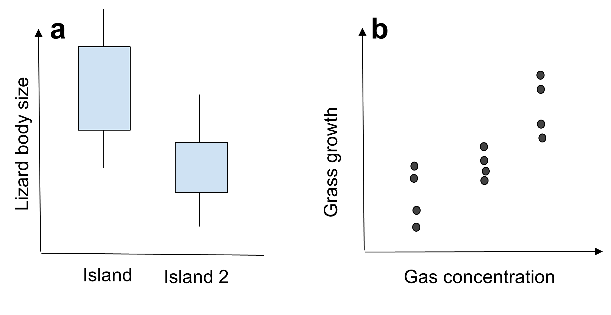{fig-alt = "Graphs showing a box and whisker plot to compare lizard body size on two islands, and a scatter plot to infer how grass growth rates change as a function of gas concentration."} Treatments describe the comparisons being made in a study, and influence the graph; for example, when comparing how an organism grows under different environmental conditions such as on different islands (a) or under different gas concentrations (b). :::

Returning to our previous examples, Whitehead et al. (2014) and Halpern et al. (2012) both had qualitative, categorical treatments that were essentially different kinds of habitat: Whitehead et al. (2014) were looking at differences in rabbit presence on pastoral land versus conservation land (@fig-rabbit-presence), while Halpern et al. (2012) were recording meadow species in patches of land that had no tree removal, or tree removal with different burning patterns (@fig-tree-removal).

::: {#fig-rabbit-presence}
{fig-alt = "A photograph showing a hard border between grazed land and regeneration on conservation land (shrubby), separated by a fence."}

Different plant communities with a very clear edge defined by a fence dividing pastoral land (left and conservation land with no livestock (right). From Whitehead et al. (2014).
:::

### Fixed versus random factors

Within the treatment structure, we may have fixed and random factors. It is important to know which treatments are which kind of factor when you come to consider analysis of the data.

If your factor is fixed, it means that all the levels of interest are included in your experiment. For example, in Halpern et al. (2012) there are three levels of interest: no tree removal, and two types of tree removal. In treating these as a fixed effect, the assumption is that no other type of removal is of interest to the study: if someone else were to repeat a tree removal and fire experiment, there are not any other ways to remove trees and conduct burns that would be useful to explore. Fixed factors can be quantitative, like gas concentration, although clearly you need to be wary of extrapolating beyond the limits of your treatments tested.

Random factors are a random sample from all possible levels of the treatment. For example, if you have data on mouse detection and abundance over a number of years, you might identify some fixed factors such as land cover and altitude that are likely to be driving the number of mice. You might also want to include year to year variation as a random factor: some years yield lower mice counts compared to others, and it is not the effect of 2015 itself that you are interested in, but the longer term variation among years.

Some factors could be considered either way; if we were interested in dragon body sizes on the eleven islands of the Dragon Archipelago and no others, then island is a fixed factor, and it is of interest to know that there are larger dragons on Goosander Island compared to Coot Island. However, if we are interested in dragon body size on islands across the West Coast of Scotland more generally, and we have sampled ten out of fifty islands as a representative sample, then island is a random factor and we want to know, if we pick an unsampled island at random, what will be the average body size of a dragon there?

### Experimental units

The experimental unit is: *“The smallest division of the experimental material such that two units may receive different treatments (or treatment combinations) in a manipulative experiment or have different ecological conditions for a mensurative experiment.”* (Charlie Krebs)

Experimental units should be independent (i.e. bounded or physically separated): what transpires in one experimental unit should have no effect on other experimental units. It is easier in some kinds of experiments than others to set up an experiment such that each experimental unit is independent from all the others, because of the scale at which the treatments and the organisms of interest operate and interact (@fig-two-sampling-regions). Not all experimental units are randomly distributed in space; sometimes they might appear along transects or gradients (@fig-altitude-sampling-regions).

::: {#fig-two-sampling-regions}
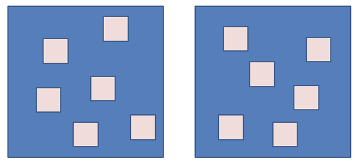{fig-alt = "Diagram showing two regions, each containing six smaller sampling areas randomly located within the region."} An experimental design with two regions (blue) and multiple sampling areas (pale pink) within each region. We might apply different treatments to each region, for example, in a fire study, one region gets burned and the other doesn’t. The experimental units are then the two regions, and our six vegetation samples per region are evaluation units (sub-samples): they have all received the same treatment within their region. However, if the regions are merely different locations in space, and the smaller squares within them depict $1 m^2$ plots receiving different fertilizer treatments, we have twelve experimental units
:::

::: {#fig-altitude-sampling-regions}
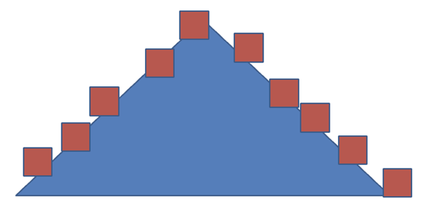{fig-alt = "Diagram showing sampling units spaced more or less evenly up and down either side of a triangle representing a mountain."} In a study of tree growth up an altitudinal gradient, the experimental unit might be the tree (small red square). Altitude is a fixed factor: perhaps we want to know about the annual change in beech (Nothofagus) tree heights at altitude x in the Southern Alps, and how that changes with a unit change in altitude. However, tree ID might be included in an analysis as a random factor: we don’t expect all beech trees at the same altitude to have the same growth rate, but we do expect there to be some underlying pattern of variation such that we can talk about the average tree at gradient x, and describe the likely range that we will see in a population.
:::

## Experimental Design

Four principles to consider when thinking about experimental design are:

1.  Replication
2.  Control
3.  Randomization
4.  Blocking and interspersion

### Replication

Replication is key because we want to be sure that the differences between experimental units are caused by (or at least related to) the treatment, against a background of random variation. There is a lot of random variation in ecology: chance events are a major source of interference or noise in field ecology. You will get a chance to consider some of these in the workshop.

If we have two experimental units (A and B) and two treatments, we could just apply one treatment to each unit and see what happens. How would we know that differences between A and B are a result of the treatment, rather than just because A and B are different places? Replication gives us more than one unit receiving each treatment, because if all the replicates show the same direction of difference, even when they are located in different places (@fig-replicates-pairing), we can more robustly conclude that the treatment is the reason why they differ.

::: {#fig-replicates-pairing}
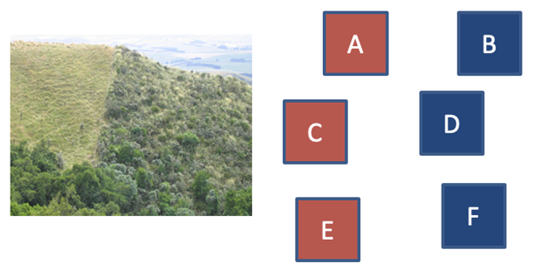{fig-alt = "Diagram showing six experimental units, A-F, nominally placed either side of a fence so that A, C and E are experiencing one treatment, and B, D and F are experiencing a different treatment. A-B, C-D, E-F provide pairwise comparisons in different locations."} Pairing sites when locating experimental units relative to treatments can help to focus on the effect of the treatment. For example, Whitehead et al. (2014) chose sampling sites divided only by a fence, so that everything was as similar as possible between e.g. A & B, C & D, E & F, except vegetation and animal communities
:::

Another reason for replication is redundancy. When you have multiple experimental units for each treatment, if a fire takes one out, or a plague of locusts eats all your data (@fig-disaster), you will hopefully still be able to collect enough information to make solid inference in your analysis. The chance of fire removing, or elephants trampling, or foot and mouth denying you access to all your units is fairly slim. Ecologists need to get comfortable dealing with disasters in the field, but designing your experiment to be resilient to some of these is a useful safety net.

::: {#fig-disaster}
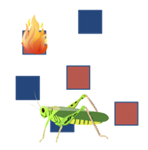{fig-alt = "Six experimental units with two treatments. Disaster has struck one unit from each treatment: a fire, and a plague of locusts. Two each of each treatment remain to provide data for the experiment.} Chance events may impinge on one experimental unit and not on others
:::

Be wary of pseudoreplication. This occurs when experimental units are not actually independent; for example, if you weigh the same fish twice, or measure the same tree twice, but don't take that into account in your analysis. We'll come back to this in more detail later. Replication can occur on a number of scales, including experimental units, evaluation units, subsamples and measurements. As long as you consider carefully what each scale is and define all the units carefully then you should be able to identify what is independent or not, and analyse or adjust accordingly.

### Control

A key part of good experimental design is the control. This tells us that the only difference between experimental units (other than random variation) is that caused by the treatment. Having an inadequate control for your experiment may (temporarily or completely) discredit a promising study. The control treatment provides a baseline, without which it is impossible to conclude clearly that the treatment was the reason for the change.

A simple example might be the implementation of predator control in a nature reserve. We could claim afterwards that the control was the reason for the recovery of ground nesting birds. But if we haven't measured predator numbers before the control, and predator numbers outside the fence, and something about nesting success outside the fence as a comparison for inside, we cannot be sure that our happy birds in the reserve are a result of control or whether there simply weren't any predators there in the first place, or if there's a measurable difference compared to similar birds who haven't had predators removed from their vicinity.

Manipulative and observational studies have different sorts of controls. Manipulative experiments must have a baseline treatment; for example, Halpern et al. (2012) not removing the trees (@fig-halpern-case-study, left). Mensurative studies must have a baseline comparison: for example, Whitehead et al. (2014) selected paired sites of grazed and ungrazed land (fig-halpern-case-study, right).

::: {fig-halpern-case-study}
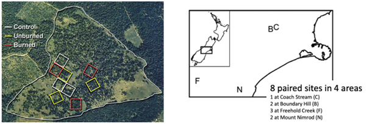{fig-alt = "Aerial photograph showing the random placement of nine units (3 in each of 3 treatments), and a map showing eight units paired across four sites, in two different experimental designs."} (Left) Halpern et al. (2012) delineated their nine sampling units on an aerial photograph so that they could ensure similarity of habitat cover among the units. They have three replicates for each treatment, and the control treatment is to do nothing. (Right) Whitehead et al. (2014) identified eight sites: two paired sites of grasped and ungrazed land divided by a fence, in each of four areas, with areas chosen to have similar environmental conditions. The ungrazed land provides a baseline comparison.
:::

We want at least two replicates to account for spatial variation, but more is better: three is better than two, and five is better still. If you are designing a huge experiment over a vast scale, let there be at least two units per treatment. In ecological studies, variation through time is also often large. As a result, if you are collecting data over a long time period, you need to have controls in each time period as well as through space. How we define ‘long’ here depends on the question and the study: annual, seasonal or even daily or between day and night variation may be of interest.

To account for all of this variation, before-after comparisons can be a powerful tool. For example, if we study the effect of mining waste discharge into a river, before mining waste is discharged, we want a spatial control above the discharge point, and we also want to look at a future impact area below it (@fig-mining-waste-discharge-example). The difference between these two **before** discharge occurs gives us a baseline for the effect of flow along the river. The difference in the control area **before** and **after** discharge occurs can be used as a temporal control, because it should not be affected by the treatment - it is independent. So if the river temperature as a whole has gone up, we'll detect this background variation here. Then the differences between the control and the impact area **after** discharge, and the difference between the impact area **before** and **after**, give us our treatment effect. Ideally there would be more than one measurement before and after as well; and in all of this our repeat measurements are not quite independent so that needs to be accounted for in the analysis.

::: {#fig-mining-waste-discharge-example}
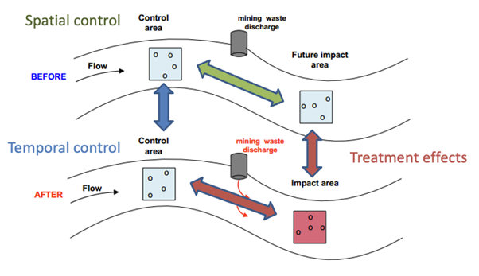{fig-alt = "Infographic showing a river before and after a period of time has passed. Experimental units above (control areas) and below (impact areas) a mining waste discharge location have been identified, allowing treatment effects in space and time to be identified as per the figure caption."}

Diagram showing an experimental design for the effect of mining waste discharge on a river. It has spatial controls (upstream, before and after discharge) and temporal controls (upstream and downstream, before discharge), to allow for a fuller investigation of change through space and time.
:::

### Randomization

The design of an experiment gives us the rules by which treatments are allocated to experimental units. This will depend on the questions asked, but dictate what analysis we can do afterwards. Many of the statistical tests that you have encountered so far in your studies like to assume that observations in your data are independent. This is rarely achieved perfectly, but you can get closer to the ideal by taking random samples from a population, or assigning your treatments at random. Randomization also reduces bias that may inadvertently invade an experiment, so it increases the accuracy of your estimates of treatment effects.

How might this be achieved? In Tilman et al.’s (2006) long-term study of the diversity-stability hypothesis, there were 168 plots (each 9 by 9 metres) set up across a seven hectare field (Figure 6.11). Each plot was randomly assigned to be seeded with 1, 2, 4, 8 or 16 perennial grassland species, giving 39, 35, 29, 30 and 35 replicates respectively. The composition of each plot was randomly chosen from a set of 18 perennial species, so that even plots with the same number of species at the beginning of the experiment had a random collection of different species. That meant that the analysis could focus on the number of species present as a treatment, and not be biased by **which** species were present (for example, if one species was behaving differently).

Cieraad et al. (2012) explored photosystem efficiency and frost tolerance by selecting random trees along transects at two sites in the Southern Alps of New Zealand (@fig-grassland-and-alps). Five species were recorded and sampled at different altitudes. They collected foliage three times through the year, and allocated these randomly to eight different frost treatments conducted in the lab.

::: {#fig-grassland-and-alps}
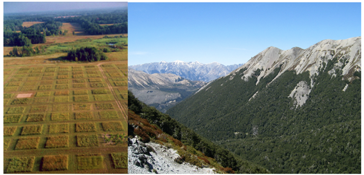{fig-alt = "Photographs showing the Park Grass experiment, with many small squares of planting, separated by mown paths, and the Southern Alps treeline: this is quite stark, with trees growing up the side of steep mountains quite densely until a fixed altitude where they rapidly disappear."} (Left) Long term plots in the grassland experiment. (Right) The tree line in the Southern Alps of New Zealand.
:::

Sometimes the ecological requirements of the study mean that it is difficult to fully randomise. In our rabbit (Whitehead et al. 2014) and tree (Halpern et al. 2012) studies, the sites were not chosen randomly, but were selected using a search for the most appropriate areas of habitat (@fig-halpern-case-study). ). For Whitehead et al. (2014), the paired sites had to be chosen to have similar topography, aspect and elevation, with a well-maintained fence separating grazed and ungrazed land, where the ungrazed area had been retired from livestock grazing in the last 35 years. They made a decision that having adequate replication was more important than randomising and losing control over the baseline comparisons that would help support a robust analysis. Halpern et al. (2012) chose nine 1 hectare plots using aerial photographs, such that all the plots contained meadow and forest patches. However, they were able to assign treatments randomly to the experimental units once they were identified on the map.

*“A good biologist almost never follows instructions from a statistician.”* (Charlie Krebs)

The take home message is that we should randomize wherever possible, but also bear in mind that it isn't always possible, for good reasons. You can ask yourself the following sorts of questions to help you decide what to do:

-   **Is it practical to randomize?** You might have special access requirements in order to apply 55 tons of fertilizer, or require specific habitat types.
-   **Do you need to be in a nature reserve or on private land?** This is not usually in a landscape that is economically viable for farming or agriculture.
-   **Do you want to draw on ecological history and information?** Field stations or previously researched locations have a legacy of information but are not randomly located.

If you can't be random, then you can be systematic. Statisticians may disapprove, but most ecologists use some form of systematic sampling. This means to take into account as much variation as possible given your restraints. There is no good evidence that systematic sampling leads to biased or unreliable comparisons, but there is always doubt. Semi-systematic sampling is a good compromise.

### Blocking and interspersion

How should you spread your treatments in space and time when you know that both are heterogeneous? We want to minimise bias as a result of treatment placement as much as possible, and yet be as random as possible. There are a number of ways of doing this (@fig-treatment-distributions).

::: {#fig-treatment-distributions}
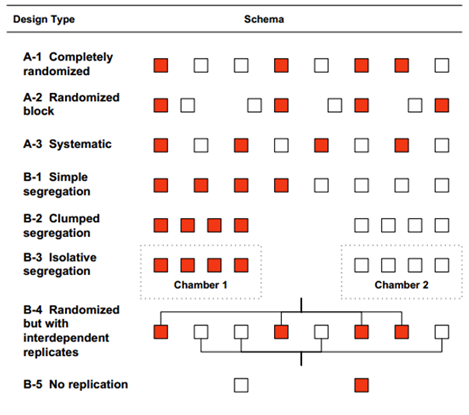{fig-alt = "Diagram showing different ways of assigning two treatments (R and W) to eight experimental units depicted in a line. A1 random choice: RWWRWRRW A2 Randomised block: RW WR WR WR A3 systematic: RWRWRWRW B1 simple segregation: RRRRWWWW B2 clumped segregation: RRRR WWWW B3 isolative segregation: (RRRR) (WWWW) with different treatments in enclosed chambers B4 Randomized but with interdependent replicates: RWWRWRRW but R are all connected to the same gas supply, and W are all connected to a different gas supply B5 No replication WR"}

Schematic showing different distributions of two treatments (red or white) to experimental units (eight squares) for different experimental designs.
:::

**Completely randomised** (@fig-treatment-distributions: A-1) is the simplest design, recommended by statisticians. However, there is a chance with totally random sampling that this will segregate our treatments: we might end up with all the controls very close to each other, and thus not being representative of the whole. We could also get spurious treatment effects if there is some underlying gradient. Our biological nouse therefore tells us not to just go with the output of a random generator simply because it is random.

In a **randomised block design** (@fig-treatment-distributions: A-2), we group experimental units in blocks. You will test this design with pitfall traps later in the semester. Each block should be relatively uniform inside, but differences between blocks can be large. Each block will get one of each treatment, so we can identify the differences within blocks as being a result of treatment, even if blocks themselves act differently. This design also has the benefit of being resilient to disasters and underlying gradients.

Totally **systematic** interspersion (@fig-treatment-distributions: A-3) of treatments means that every treatment is spread along any possible gradient beneath, but also means that if there's any periodicity to the environment, the data could be flawed - for example, in the figure, if every red experimental unit lands on the peak and every white experimental unit lands in the trough of an underlying variable that fluctuates regularly through space. Temporal periodicity is common in ecology, so you should also be aware of how that might affect the outcomes of an experiment as a result of the timing of measurements as well.

**Total segregation** (@fig-treatment-distributions: B-1) is of course not recommended by anyone, but sometimes a form of segregation in your design can lead to **pseudoreplication** (@fig-treatment-distributions: B-2, B-3, B-4).

### Pseudoreplication

A common form of pseudoreplication is if all replicates have some kind of interdependence. For example, in @fig-treatment-distributions: B-4, although the experimental units are separated in space, their supply, e.g. of gas to chambers, is segregated. As a result, we can't be absolutely sure if it is the treatment or the supply that makes the difference between units.

Another form of pseudoreplication is sacrificial pseudoreplication, where the original design may have been fine, but the samples have been pooled improperly - for example, if leaf litter was collected from a number of locations and then collated for the analysis. This may be recoverable if the original data exist, but not if the data were pooled physically, for example if the leaves were all put into the same sample bag.

The final type of pseudoreplication is temporal, because repeat measurements from the same site or individual are not independent. For example, burned and unburned plots may be sampled every week over two months; successive samples from the same experimental unit are not independent of those that came before. However, these can be analysed using date-by-date or repeated measures tests that take into account the repeat measurements and account for cumulative variation over time resulting from e.g. different individual trees or soils within plots.

## Response structure

The response structure of an experiment is what we are going to measure, when and where, and is it appropriate? On the surface this is fairly simple: if you want to measure seasonal changes, you have to make measurements at least seasonally because you cannot infer changes smaller than your time scale.

There are five general types of experimental design that will assist you to choose an appropriate structure to answer your research question:

1.  Factorial
2.  Randomized block
3.  Split unit
4.  Latin square
5.  Repeated measures

### Factorial

In factorial design, all possible treatments of each factor should be tried with all treatments of another factor. If you did the Life on Earth module in your first year, you encountered a two-factorial experimental design in the bean practical: you measured and calculated various metrics on two types of bean (purple teepee and safari) grown at two temperatures (cool and hot), and all possible combinations of bean and temperature were present in the experiment.

Two-factorial experiments are relatively simple: four combinations cover all the options. If we are interested in the egg laying rate of an amphipod in water with four different salinities at low and high temperatures, we need replicates in all eight of the boxes of @tbl-factorial-design. In a balanced design we have the same number of replicates per box; in an unbalanced design they might differ. Many ecological systems force you into an unbalanced design; for example if you are doing an observational study, you may not be able to find the same number of appropriate locations per treatment.

```{r}
#| echo: false
# create the data
factorial_design <- matrix(c("","","","","","","",""),  
                    nrow = 2,
                    byrow = TRUE)

# make a list object to hold two vectors
vars <- list(rows = c("Cool","Warm"),
             headers = c("None","Low","Medium","High"))
dimnames(factorial_design) <- vars
```

```{r}
#| echo: false
#| label: tbl-factorial-design

knitr::kable(factorial_design, format = "html",
             caption = "Example design for a factorial experiment investigating egg laying rates of an amphipod at different salinity levels and temperatures.") |> kableExtra::kable_styling() |>
kableExtra::add_header_above(c("Temperature", "Salinity" = 4))
```

The factorial design allows you to work out what the effect of each factor is on your response variable, but also how they interact. For example:

-   **What effect does factor one (temperature) have on my response variable?** Higher temperatures mean more eggs.
-   **What effect does factor two (salinity) have on my response variable?** Higher salinity means more eggs.
-   **Is there an interaction between factors one and two?** Yes; there is a positive interaction. That is, at low temperatures, salinity has a small effect on egg production, but at high temperatures, higher salinity leads to many more eggs.

### Randomized block

The randomized block design lets you adjust for variation between sampling areas. Here, experimental units are grouped into blocks which are uniform internally, with all treatments applied within the block (@fig-randomised-block). This design increases precision because it can identify the variation between blocks in the analysis.

Without the blocks, we can say that we have four replicates of each treatment, and differences between them are a result of treatment. Effectively, we can carry out an analysis that says the response variable for treatment *i* is a function of treatment *i*, plus additional variation. This is large, because the response variable will vary due to underlying environmental conditions and stochasticity.

With block included in the analysis, we can say that the response variable for treatment *i* is a function of treatment *i* and block *j*, plus additional variation for treatment i at location j. Thus we can compare differences between treatments within blocks, and between blocks, not just replicates of the treatments.

::: {#fig-randomised-block}
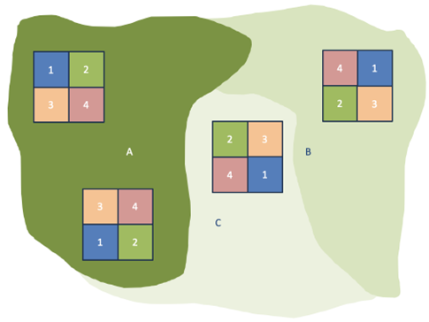{fig-alt = "A map showing three areas in different shades of green. Area A has two experimental blocks; Area B has one and Area C has one. Within each block there are four treatments, ordered differently to other blocks."}

Four blocks in a randomized block design. Two blocks are in habitat A, one block is in habitat B, and one block is in habitat C. Four treatments (1-4) have been applied in each block, with the order of each treatment randomized within the block.
:::

You will put this experimental design to the test later in the semester when you carry out the pitfall practicals. To illustrate the ideas above using @fig-randomised-block, let us call our response variable the number of ants captured in a pitfall trap. Under treatment 1, we might catch 10 and 30 ants in the pitfall traps in habitat A, and 10 in habitats B and C. Under treatment 4, we might catch 15 and 32 ants in the habitat A traps respectively, 12 in habitat B, and 13 in habitat C.

Taken separately, the average catch for treatment 1 is 15 ants (range 10-30), compared to 18 for treatment 4 (range 12-32). However, the response variable for treatment 4 is consistently higher than that measured under treatment 1 *in that block* (by a factor of 1.5, 1.07, 1.2 and 1.3 respectively).

### Split-unit

In a split-unit design, we can cope with treatment factors with different experimental unit sizes. For example, if we want to look at the effect of CO~2~ and soil temperature on plant growth, but can't afford enough greenhouses to have one for each soil temperature, we can do a paired, randomized block of the smaller unit of soil temperature in growth chambers, within the larger CO~2~ treatment unit of the greenhouse (@fig-split-unit).

::: {#fig-split-unit}
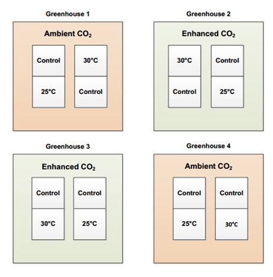{fig-alt = "Four greenhouses with ambient or enhanced CO2, showing smaller experimental units within each treatment. See caption for more details"}
A split-unit experimental design with four greenhouses (two replicates each of enhanced and ambient CO~2~ treatments). Each greenhouse houses two control replicates next to a 25&deg;C and 30&deg;C soil temperature treatment replicates, managed in smaller growth chambers.
:::


## References

Cieraad E, McGlone M, Barbour MM, Huntley B (2012). Seasonal Frost Tolerance of Trees in the New Zealand Treeline Ecotone. Arctic, Antarctic, and Alpine Research, 44(3); 332–342. https://doi.org/10.1657/1938-4246-44.3.332

Halpern CB, Haugo RD, Antos AJ, Kaas, SS, Kilanowski AL (2012). Grassland restoration with and without fire: evidence from a tree-removal experiment. Ecological Applications 22(2): 425-441.

Tilman D, Reich P, Knops J (2006). Biodiversity and ecosystem stability in a decade-long grassland experiment. Nature 441, 629–632. https://doi.org/10.1038/nature04742

Whitehead AL, Byrom AE, Clayton RI, Pech RP (2014). Removal of livestock alters native plant and invasive mammal communities in a dry grassland-shrubland ecosystem. Biological Invasions 16:1105-1118.
