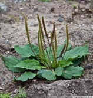

The theme for this week’s Practical Ecology is the sampling of immobile organisms: organisms that do not move. This can be done in a variety of ways, but the most common is to assess the number of individuals in a set area. That area might be quite large for trees, such as a hectare (100 x 100 metres), but for smaller organisms it is normal to use a metre square or even smaller. For example, if you carry out fieldwork on the rocky shores of Cumbrae at the end of the module, you might use a 10 cm by 10 cm area to count snails or barnacles. Once you have assessed (by counting, estimating or using an index) the number of individuals appearing in a set area, you can start to infer things about the ecology of the population.

In this chapter, we will start with an exploration of how individuals might be arranged in space (@sec-poisson), think about qualitative and quantitative ways of counting individuals (@sec-qual-and-quant), and consider what is an individual (@sec-individual). There is a practical in which you will count individual *Plantago lanceolata* on campus. In the workshop you will assess the spatial distribution of the class *P. lanceolata* data, and use LEGO® to explore how sampling strategies affect the effort and biases of population density estimates.

::: {#fig-plantago}
{fig-alt="One Plantago individual. Plant sampling is studied in this module."}

An individual Plantago plant growing on a patch of muddy ground.
:::
