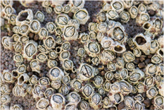
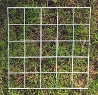
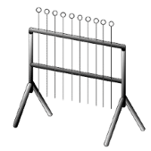
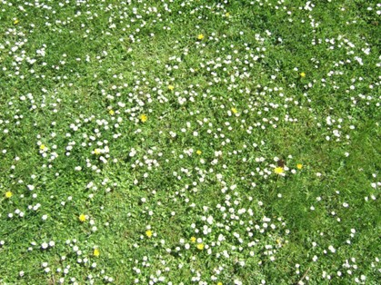
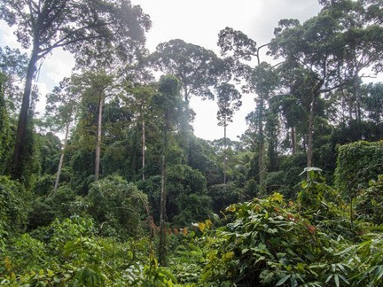

# Qualitative and quantitative approaches to sampling {#sec-qual-and-quant}

```{r}
#| results: "asis"
#| echo: false
```

Now we’re moving on to consider our approach to sampling in the field. We have to adapt our sampling strategies to suit the circumstances, and any previous studies that you want to compare results with.

Sampling takes time, effort and equipment. There is going to be a trade-off between the quantity of data you can collect and the quality: you will usually only have capacity to collect few very high quality data points, or many lower quality data points. The decision will vary with the study and may take some pilot testing first.

Sampling takes time, effort and equipment. There is going to be a trade-off between the quantity of data you can collect and the quality: you will usually only have capacity to collect few very high quality data points, or many lower quality data points. The decision will vary with the study and may take some pilot testing first.

## Qualitative approaches to sampling

Some approaches you might take to sampling qualitatively are:

-    “Fast and dirty”
-    Qualitative grouping of abundance
    -    Using an arbitrary scale
    -    Using % cover
-    Subjective, often unsuitable for statistical analysis.
-    Frequently used for monitoring temporal change.

Qualitative data has a huge advantage - it is fast. It’s quick because we don’t have to take big samples and closely ID things, and don’t need to count things in a time-consuming quantitative way. However, the data quality might be poor and the data you get might not be suitable for statistical analysis.

We can get a qualitative estimate of what’s there by grouping abundance, either using an arbitrary scale (such as abundance scales) or using percentage cover. So rather than counting the exact number of individuals, you can classify a species as rare on one site and abundant on another, or can give an estimate of percentage cover of that species.

These counts are subjective and on an arbitrary scale so they’re often not suitable for statistical analysis. But if the same person makes these qualitative estimates, and there is some consistency, they can be effective means of monitoring temporal change or making a quick comparison between sites or areas. For example, for fixed monitoring sites, you can ask whether the abundance of a species is increasing or decreasing and get fast and dirty estimates for those changes.

## Examples of qualitative measures

-    Species lists
-    Abundance scales:
    -    ACFORN: Abundance, Common, Frequent, Occassional, Rare, None.
-   "Cover-class" scales
    -   Conversion of % cover into a 1-n scale
    -   Weights lower abundance species

Species lists are a crude estimate for species diversity (because abundance might change but the species list might not) and therefore only give a partial picture of the community.

Abundance scales give categorical values to the abundance of a species in an area. The ACFORN scale using the descriptors ‘abundant’, ‘common’ and so on is a very widely used method.

Cover-class scales are a little more quantitative than the abundance scale. They take percentage cover values to convert into some sort of scale that tells you something about the structure of the community. If these are related to specific % cover (e.g. how much of a rock is covered by barnacles; @fig-barnacles) they can be relatively comparable among studies and observers. They are often used for rare species where percentage cover values would be very low and so changes between temporal points are difficult to determine.

::: {#fig-barnacles}
{fig-alt="A large number of barnacles."}

A large number of barnacles fixed to a rock
:::

## Cover-class scales

Three of the most common cover-class scales that you’ll come across in the literature are Braun-Blanquet, Domin and Daubenmire. The simple approach is to take estimated percentage cover e.g. within a quadrat, and map that percentage onto one of these numbered classes. This is good for long-term monitoring of sites.

```{r}
#| echo: false
# create the data
cover_class_scales <- matrix(c("+", "<1 %", "Insignif; 1 - 2 inds", "",
                               "1", "1-5%","<4%  - rare", "1 - 5%",
                               "2", "6 - 25%", "< 4% - occasional", "1 - 5%", "3", "26 - 50%", "<4% - frequent", "26 - 50%", "4", "51 - 75%", "4 - 10%", "51 - 75%", "5", "<75%", "11 - 25%", "76 - 95%", "6", "", "26 - 33%", ">96%","7", "","34 - 50%", "", "8","", "51 - 75%", "", "9", "", "76 - 90%", "", "10", "", ">90%", ""),  
                    nrow = 11,
                    byrow = TRUE)

# make a list object to hold two vectors
vars <- list(plants = c("","", "", "", "", "","","","","",""),
             headers = c("Class", "Braun-Blanquet",
                       "Domin",
                       "Daubenmire"))
dimnames(cover_class_scales) <- vars
```

```{r}
#| echo: false
#| label: tbl-cover-class

knitr::kable(cover_class_scales, 
             caption = "Three common cover-class scales seen in the literature.") |> 
  kableExtra::kable_styling()


```

## Quantitative approaches to sampling

When you come up with hypotheses you need to test them using statistics. The qualitative approach will only get you so far and you will need to use quantitative approaches to get data more suited to statistical analysis.

What do you measure?

-   Individuals:
    -   Counts of individuals in the experiment area
-   Other variables:
    -   Productivity/yield measures, e.g. total biomass, or harvestable yield (seed production, timber volume etc.)

    -   Leaf area estimates

What you choose depends on the question or hypothesis as well as what organisms you are interested in.

The most obvious thing to count is the number of individuals at a particular location, or within a set area. You can then test differences between areas or within an area through time.

There may be other variables that might be more appropriate and it will, again, depend on the question. If you’re interested in productivity or ‘net ecosystem carbon exchange’ you might need a biomass measure or a growth rate, or if it’s a measure of fitness then seed production might be appropriate. If you’re creating a life table then the ages, stages or size of individuals might be appropriate.

Once you’ve articulated the question you need to think about what data is appropriate to collect to address it.

Always think about the stats you’re going to use before you actually collect the data. That way you can be sure that you’re going to record appropriate data.

## How do you make quantitative measurements?

We’ve covered some of what you could measure – but what about how?

-   Density; no. of individuals per unit area
    -   Comparison among species/treatments
-   Frequency; how many occurrences of target in a sample
    -   Distribution in space

The number of individuals counted doesn't give a sense of the area that you’re sampling from. By expressing abundance as density (i.e. number of individuals or biomass per, say, square metre) then you have a much more standardised measure which is therefore appropriate for comparisons across species, sites or treatments (depending on your question).

Often it's not practical to count all individuals in an area. Instead, we use sampling. That means counting individuals in small representative areas and extrapolating. For plants that usually means using quadrats. For animals it’s often by setting traps (physical or camera) which will generate data from which we determine a frequency of our target species and get an understanding of their distribution in space.

How many samples to take is an important consideration and you may need to use some statistical analyses such as power analysis, to work out an appropriate sampling regime.

Power analysis is best deployed once you’ve got some pilot data and it will give you an idea of what sample size would be needed to achieve a significant result.

There are usually many ways of measuring different properties. Therefore you should be mindful of the biology of your species when deciding which one to pick. For example, think about a snail and a slug: they are both molluscs and quite closely related, but you might not choose the same size measure for both of them.

## Quadrats - The ecologist's friend

Quadrats are the ‘go to’ method for sampling plants. They are something you probably are already familiar with.

Quadrats are squares of known area made of wire or something similar. There are two types of quadrats (@fig-quadrats)

::: {#fig-quadrats layout-ncol="2"}
{fig-alt="A 5 by 5 frame quadrat placed over a patch of lawn."}

{fig-alt="A point quadrat frame"}

A frame quadrat (left) and a point quadrat (right).
:::

The size and placing of quadrats is determined by the organism & hypothesis being tested, and you have to consider the scale of the organism in relation to the environmental ‘grain’ or ‘pixel size’ you should be looking at. The most important part of your decision here is practicality - how many quadrats could you measure? Almost as important is the size and spread of your organism. You don’t want a quadrat that can only capture one individual. It is a bit like deciding on what sieve to use – what mesh size will get you the info you want without getting a load of excess info that you don’t want. That is sometimes hard to enumerate.

Usually you will only use one quadrat size, but there is potentially extra information to be gained by using different sizes of quadrats.

As an example, @fig-daisies-and-dandelions shows a small area of a vibrant lawn with a large number of daisies and dandelions. Here a 1 metre by 1 metre quadrat might be a good size to count dandelions. However something more like 50 cm by 50 cm (or even smaller) will be appropriate for counting the daisy flowers. A simple conversion will allow you to express the density of both flowers to ‘per square metre’.

::: {#fig-daisies-and-dandelions}
{fig-alt="Image showing the spatial distribution of daisies on a lawn, in small clusters or randomly spread."} An area of lawn covered in daisies and dandelions
:::

In contrast, in a tropical rainforest (@fig-old-growth-rainforest) a 50 cm quadrat would be useless. It would be much more likely that you would choose 100m x 100m (a hectare) to count dipterocarp trees in tropical rainforest, as even one trunk wouldn’t fit into 50cm by 50cm unit space. Trees per hectare is likely to be much more use than trees per square metre.

::: {#fig-old-growth-rainforest}
{fig-alt="Image showing trees and undergrowth in an old growth forest."} An old growth tropical rainforest.
:::

## Placing quadrats

There are lots of ways of placing quadrats and it is not as simple as it sounds. Throwing quadrats is not recommended as it will nearly always have a bias of some sort. Instead, consider:

-   Random placing:
    -   Appropriate for most sites and scales
    -   Assumes all locations have equal probability of being sampled in space and time
-   Systematic placing
    -   Monitoring plots
    -   Transects along environmental gradients
-   Stratified random sampling
    -   e.g. regular samples along randomly placed transects

By far the most common approach is to try to achieve random placement within a larger area. This assumes that all locations have equal probability of being sampled in space and time so a random sample should give representative results. Another advantage of random placement of quadrats is that you can stop when time runs out and there’s less bias than something more systematic.

That being said, systematic sampling is useful too. This is when samples are structured in time/space. Temporal sampling would be used for monitoring plots: to be able to return to exactly the same point is helpful rather than sampling from random locations. One way that is achieved is to place metal pegs marking quadrat locations and then find them again using a metal detector. These days, using a GPS on a phone will get you back to pretty much the exact point.

Sometimes you want to place a sampling transect across an environmental gradient. That would require systematic placement of quadrats across a gradient of wet to dry, or open to closed canopy or any other environmental gradient.

The two approaches could be combined with fixed transects but with random samples along the transect.

Stratified random sampling is deployed when you know there is some environmental or habitat change. For example in your wooded area you know that 70% has closed canopy and the rest open (clearings, rides, verges etc.). So to ensure you’re sampling from both habitats at the same density you might place 70% of the quadrats at random locations in closed canopy etc.
