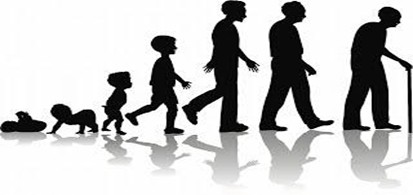
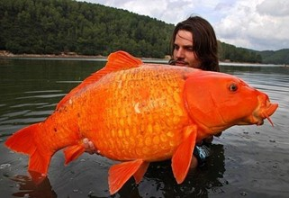
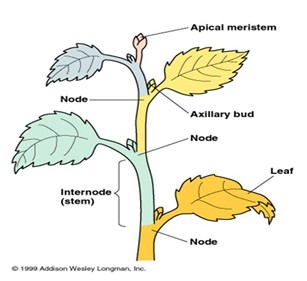
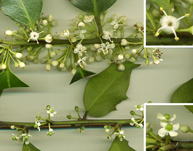
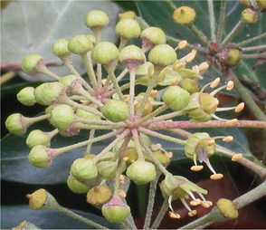
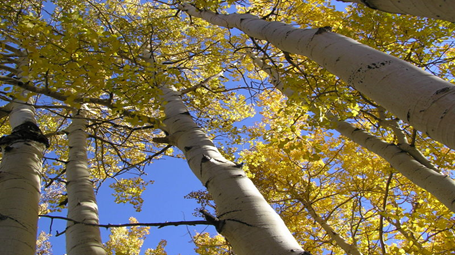
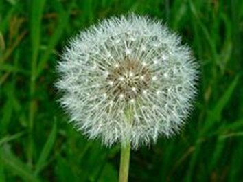
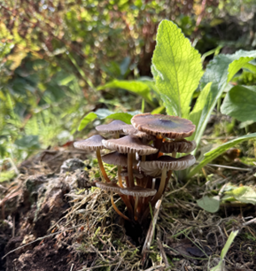

# The concept of the individual {#sec-individual}

```{r}
#| results: "asis"
#| echo: false
```

## What are we sampling?

So far the idea of counting individuals has come up several times. However, it’s not always easy to be sure exactly what an individual is, or to know whether we’ve encountered it before. In this module we will introduce various methods of ecological data collection. Whether we’re interested in distribution, or commonness, or diversity, or function or fitness, it is important to consider what it is we are actually sampling, in order to design the right experiment and get useful data. In a simple world we would address our ecological question by collecting many independent data points, each being from a genetically distinct individual, then carry out the appropriate statistical analysis and decide whether to accept or reject our null hypotheses. But as we are about to find out, determining what an individual is isn’t quite so straightforward and so the independence of our data points may be called into question. For example there might be genetic structure in our data. This has implications for the analysis and interpretation of our data, and we have to think about how to sample appropriately. In @fig-clonal-correlation there are ten data points, but it turned out that with clonal growth there are only three genetically distinct individuals. How should we treat the data when we do an analysis? Should we assume ten independent data points, or should it be considered as three independent points?

```{r}
#| echo: false
#| label: fig-clonal-correlation
#| fig-cap: "Ten data points showing a hypothetical gradient of an unknown variable on the y-axis."
#| fig-alt: "Illustrative graph showing that the data points are not independent because they come in groups from a small number of individuals. The first three data points belong to individual A, the fourth to sixth data points belong to individual B, and the seventh to tenth data points belong to individual C."
# generate data
x_pos <- c(1,3,2,4,3,5,4,5,7,6)
y_pos <- c(1,2,3,4,5,6,7,8,9,10)
group <- c("Individual A","Individual A","Individual A","Individual B","Individual B","Individual B","Individual C","Individual C","Individual C","Individual C")
clone_data <- data.frame(x_pos, y_pos, group)
# create ggplot object
library(tidyverse)
p1 <- ggplot(clone_data, aes(x = x_pos, y = y_pos, colour = group)) +
  geom_point(size = 3) +
 scale_x_discrete(labels = NULL, breaks = NULL) +
  scale_y_discrete(labels = NULL, breaks = NULL) +
  labs(x = "", y = "", colour = NULL) +
  theme_classic()
p1
```

## What is an individual?

When we consider humans, the question of what an individual is seems to be obvious. We form obvious discrete and genetically distinct units due to our determinate growth and sexual reproduction (@fig-human-life-forms). Our size and our proportions may vary over time but our fundamental body plan remains constant. (Let’s not consider identical twins too much here, although we should acknowledge that they have been an invaluable source of research data for psychologists.)

::: {#fig-human-life-forms}
{fig-alt="Decorative image showing the size and shape of a human growing from a baby through childhood to adult and then aging."}

Life forms of a human, from baby through childhood to adult and older adult.
:::

## Individual animals

Most animals have determinate growth like humans, which means that they reach a size and stop growing. That is not true for all animals: many animals, including many fish species, have indeterminate growth, and so continue to get bigger, the longer they live (@fig-big-fish).

::: {#fig-big-fish}
{fig-alt="Image of a large fish, which does not have determinate growth."}

A monster koi carp that has continued to grow as it gets older.
:::

When we are sampling such species, it may make more sense to have some other measure of abundance rather than just the number of individuals. The amount of biomass present might be more appropriate, and you will often see this used for e.g. marine ecosystems.

The concept of an individual also gets muddy when we consider clonal, colonial & social animals where there is strong genetic structure and differences in ploidy levels. When considering eusocial insects (insects where some individuals have completely given up with reproduction and just help raise the offspring of another individual), would it be appropriate to count organisms or colonies or biomass or number of reproductive individuals? It really depends upon the question you are asking. If you are interested in foraging, perhaps data from the individual ant level would be useful, if you are talking about colonisation, you probably want data at the nest level.

## What is an individual plant?

Most plants have indeterminate growth. They keep growing throughout their lives and will grow in a modular fashion adding stems, leaves and flowers (@fig-plant-illustration).

-   Plants are *modular*, growing by increasing the number of units
-   Reproduction in plants is variable:
    -   Sexual: dioecious, hermaphrodite
    -   Asexual: apomictic, vegetative

::: {#fig-plant-illustration}
{fig-alt = "Illustration of a plant showing the names of various parts of the stem in relation to growth."}

Illustration of a plant showing the names of various parts of the stem in relation to growth.
:::

Many flowers contain both male and female organs so the individual is a hermaphrodite. Pollen is akin to sperm and is produced by the male parts of the flower. However, there are also many species where there are two separate sexes with individuals producing either only male or female gametes. In sexual reproduction new individuals are produced by the fusion of gametes. These gametes can come from different individuals, or with self fertilization, from the same individual - that is called ‘selfing’, or ‘self fertilization’.

There are also plant reproduction strategies that have no fusion of gametes. This can be vegetative growth where new individuals are produced through budding or tillering, or it can be by the creation of seeds without the fusion of gametes which is called apomixis. In some cases the process requires the presence of pollen to produce the seed, but no genetic material comes from the pollen.

## The Holly and the Ivy

To explore the two contrasting methods of sexual reproduction we can use the Holly (@fig-holly) and the Ivy (@fig-ivy).

::: {#fig-holly}
{fig-alt="Image of holly leaves and flowers, showing male and female flowers on different individuals."} Holly leaves and flowers, showing male (top) and female (bottom) flowers on different individuals.
:::

Holly (*Ilex aquifolium*) is dioecious: it has male and female flowers on separate plants. Male plants have staminate (male, pollen-producing) flowers with anthers and stamen (@fig-holly). Female plants have carpellate (female, ovule-producing) flowers. When you see holly with berries on, you know it’s a female plant. Holly has to undergo sexual reproduction – it cannot self fertilize because it only has male or female reproductive parts on a single plant. Therefore each individual is a genetically distinct individual.

::: {#fig-ivy}
{fig-alt="Image of ivy flower, which is a hermaphrodie and has male and female parts on a single flower."} Ivy is hermaphroditic, with male and female parts on a single flower.
:::

Ivy (*Hedera helix*) is not so simple. This species is hermaphrodite with male and female parts on the same flower (@fig-ivy; it is like the classic flower diagram with sepals, petals, carpels and stamen all in one flower). Seeds are formed after fusion of gametes, but self fertilization is possible. Ivy also does a lot of vegetative growth – if it grows along the ground and where nodes touch the ground they form rootlets. Individuals could therefore be clonal (if vegetative), genetically identical to the parent, or be genetically mixed with both gametes coming from the same parent (if selfing) or genetically distinct (if from out-crossing).

## Asexual reproduction: vegetative

There are some extreme cases where vegetative reproduction completely dominates. Enter Pando the trembling giant – this single male clone of quaking aspen (*Populus tremuloides*) in Utah has been around for many thousands of years and consists of roots and c. 47,000 stems covering a huge area (43 hectares; @fig-pando). It is difficult to count individuals where they are connected vegetative clones. Is this one individual or 47,000? Go and read about [Pando the trembling giant](https://en.wikipedia.org/wiki/Pando_(tree)) and the factors that gave rise to it! It is fascinating stuff.

::: {#fig-pando}
{fig-alt="Image of quaking aspen, a clonal tree species."} Pando the trembling giant
:::

## Asexual reproduction: apomixis

The other type of asexual reproduction we find in plants is exemplified in the asteraceae family (e.g. dandelion) and Rosaceae family (e.g. bramble). These reproduce asexually through apomixis, or specifically agamospermy, in which seeds are produced without meiosis. In some parts of the range there is normal sexual reproduction with fusion of gametes. But at northern latitudes, such as the British Isles, there is only apomixis, so the seeds on a dandelion clock (@fig-dandelion) are genetically identical. But they are not genetically identical to the seeds on another plant (unless the two plants are clones). They don’t interbreed, so there are a number of genetic lines with no recombination between them. This goes against the definition of a species (not all individuals are capable of interbreeding) so we call these aggregated species. Again, we must consider what an individual is. If we are just counting organisms and investigating their distribution, treating each plant as an individual is probably fine. If we are asking a question about fitness, genetic relatedness may play a part so what do we consider the individual to be then?

::: {#fig-dandelion}
{fig-alt="Image of a dandelion seed head."} Common dandelions (*Taraxacum officinale*) at northern latitudes are apomictic.
:::

## Fungal populations

Sampling fungal populations suffers from many of the challenges mentioned previously, including indeterminate growth and varied reproductive strategies. An added complication is that for most of their life cycle they are not visible to us. Only when sporocarp (or fruiting body in the form of mushrooms, toadstools, puff-balls etc.) is produced can we visibly see fungi (@fig-fungus).

::: {#fig-fungus}
{fig-alt="Imagine of a fruiting fungal body"} Fungal populations are only visible for a small part of the year.
:::

Just counting the fruiting bodies is not a great way to sample abundance of fungi. It is very biased as they are around for different lengths of time, highly variable within and between years. This might be true even when there is little difference in the amount of mycelium; this is the part of the organism that does everything except reproduction, and we’re not counting it! New indirect methods have much improved fungal sampling such as testing for the presence of fungal DNA/RNA in the field from samples of soil.
