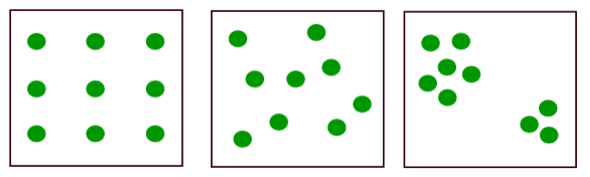
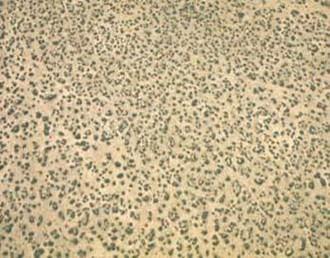
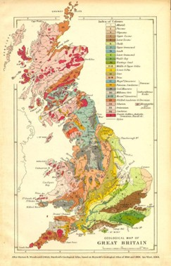
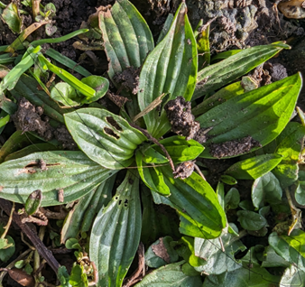
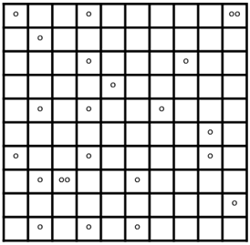

# The Poisson Distribution {#sec-poisson}

```{r}
#| results: "asis"
#| echo: false
```

The Poisson distribution, which is named after a nineteenth century French mathematician, is the starting point for many ecological questions. 

-   When you count the number of individuals in a set area, for example, in a square metre, you might find none, one, two individuals etc. These are your observations.

-   The Poisson distribution will give you the expected proportion of the observations that will have none, one, two, etc (number of individuals in the set area) when all the individuals are distributed randomly across the wider landscape. These are your expected values.

-   We can compare a set of observations with the expected values from the Poisson distribution to see if our observed distribution deviates from a random (Poisson) one. 

## Patterns of dispersion

There are two ways that distributions might deviate from the random distribution shown in @fig-dispersal (centre). They might occur together in clumps (@fig-dispersal, right). Here, the distance between one individual and its closest neighbour(s) is less than expected in a random distribution.

The alternative is that individuals might be more spread out than random, or even uniformly distributed across space (@fig-dispersal, left). Here, the distance between one individual and a close neighbour is more than expected compared to a random distribution.

::: {#fig-dispersal}
{fig-alt="Overdispersed, random, and aggregated or clustered dispersal."}

Three examples of spatial patterns of individuals: from left to right, these are overdispersed or regular, random, and aggregated or clustered.
:::

Let’s briefly think about the reasons why you might get these deviations from random.

### Clusters

If there is very limited dispersal of offspring from the parents, e.g. seeds fall right next to the parent, then clumps will naturally form.

Clusters could also arise from environmental heterogeneity, such as damp and dry areas. If the species of interest is suited to one environment, clumps may form in their preferred conditions.

### Regular patterns

If individuals suppress the presence of others, then they will tend to form a more uniform distribution in space. We call this ‘overdispersed’ because the individuals are more spread out than you would expect if they were distributed at random.

### Overdispersion

Overdispersed patterns of immobile organisms reflect competition among individuals for resources.

In the desert, there is a very limited water supply. Individual creosote bushes (*Larrea tridentata*; @fig-creosote) will deplete the water around themselves once they are established. That means that no individual can start to grow if it’s too near to another individual because it won’t get enough water. The result is that the bushes are overdispersed; we do not see two individuals close together as often as we would if the pattern was random or clustered.

::: {#fig-creosote}
{fig-alt="Overdispersed creosote bushes competing for water appear quite evenly spaced in this overhead view"}

An overhead view of creosote bushes (*Larrea tridentata*) in a semi-desert area.
:::

This is a pattern that’s much more commonly seen in animals, as they will hold and defend territories. In this case it is the population unit (such as a family group) that does not move, while individual animals move across the landscape, within and around the territory.

### Aggregated

The yellow-wort, *Blackstonia perfoliate*, (@fig-yellow-wort) grows best in calcareous soil (high pH, occurring chiefly on chalk and limestone), so although it is very widespread in the southern half of the British Isles, it is restricted to those areas where the soil is suitable (@fig-yellow-wort-distribution). This means that on a very big scale such as the UK the distribution is very clumped, or aggregated. Other calcicoles follow a similar pattern.

::: {#fig-yellow-wort}
{fig-alt="Yellow wort"}

*Blackstonia perfoliata* plant in flower
:::

::: {#fig-yellow-wort-distribution layout-ncol="2"}
{fig-alt="Map of the UK showing the patchy distribution of Blackstonia perfoliata.  Most observations are in England south of the Humber, but there are some observations in North Wales and central West Ireland"}

{fig-alt="Geological map of the UK"}

*Blackstonia perfoliata* distribution across the UK (left) and geological map (right) showing chalk (6; pale green) and limestone (17, 21-22; turquoise shades)
:::

@fig-yellow-wort-distribution shows the distribution of the chalk and limestone geology across the UK that is required for the higher pH soils that the yellow-wort prefers. If you compare the geological distribution with that of B. perfoliata you will see there’s a very strong overlap, with the plant distribution fitting within the geology. However, you can also see that the plant’s distribution is much more southern than the geology. This might indicate that there are other restrictions on where it grows, such as the number or severity of frost days. If you consider the European range of the species, you would see that it’s mainly a Mediterranean species, so perhaps a northern limit set by cold is quite likely.

There are other ways that aggregated distributions might occur. One is by clonal dispersal where plants might reproduce through vegetative propagation of genetically identical, but independent individuals. These ‘parents’ are usually called ‘genets’ and the ‘offspring’ are called ‘ramets’. We’ll come back to an example later in the chapter.

Animals may form groups for a range of reasons. One is the ‘selfish herd’ where individuals are safer from predators within groups than they are out on their own because it reduces the ‘apparency’ of each individual to predators. Another is aggregation of resources, such as animals near a water source, or in a patch of woodland.

### Random Distribution

Populations will be randomly dispersed if there is an equal probability of an individual successfully occupying any space within the habitat. This requires species with high dispersal ability and low competition (inter- or intra-), and a homogenous habitat.

A truly random distribution is actually quite rare in nature. It is only going to occur in a plant if individuals are equally likely to get anywhere, so it requires a species with a very high dispersal ability. Once the seed arrives it can’t be picky about the soil, and it can’t be affected by competition, either intra-specific or inter-species. There are a few species that fit that description but the dandelion, *Taraxacum officinale*, is one that comes close.

## Analysing patterns of distribution

This week, you will have an opportunity to sample ribwort plantain (@fig-individual-ribwort-plantain) on campus, in a practical. In the workshop, you will use the data you have collected as a class to assess whether they are randomly distributed or not, using the Poisson distribution.

::: {#fig-individual-ribwort-plantain}
{fig-alt="An individual plantain in the lawn near the University of York West Campus lake."}

An individual ribwort plantain
:::

As an example, let’s use snake’s head fritillary, *Fritillaria meleagris*, and assume we want to analyze the distribution of this species in a hay meadow. We can imagine that the hay meadow is depicted as a grid (@fig-snakes-head-example).

::: {#fig-snakes-head-example layout-ncol="2"}
{fig-alt="Image showing 'plants', depicted as small dots, distributed across a 10 by 10 quadrat frame."}

{fig-alt="Image of Snake's head fritillary"}

Snake's head fritillary (illustrated on the right): Individual plants (dots) are distributed across a hay meadow that has been divided into a grid (left).
:::

By dividing the area into the grid of quadrats (square areas of a set size), and counting the number of organisms per quadrat, we can assess the mean and variance of the number of plants per quadrat. In this example, there are 100 quadrats, and 23 individual plants.

The mean number of plants per quadrat is therefore:

$$
\mu =  ({23 \over 100}) = 0.23 
$$ Variance indicates the spread of our data, or how variable it is. The equation for variance is:

$$
\displaystyle \sum_{i = 1}^{N} {(\chi_i - \mu)^2 \over N}
$$ In technical terms, this is the average of the squared differences from the mean. In the equation N is the number of samples (quadrats), the Greek letter mu ($\mu$) is the mean number of individuals per quadrat, and ($\chi_i$) is the individual value. The big Greek sigma ($\sum$) indicates that we’re adding up all the values.

One of the really useful characteristics of the Poisson distribution is that the mean and the variance are the same. We can use this characteristic as a quantitative basis for deciding on what type of distribution we are observing.

## The Poisson Distribution

Before we can do our calculations for the snake’s head fritillary, we need to introduce the Poisson distribution a bit more formally.

It is a discrete distribution describing the number of times an event occurs in a unit of time or space. This means that you can only get whole numbers of sightings, and whole units of time or space. This is useful for count data. When you place a quadrat and count something (e.g. the number of individual plants in an area) you’re going to get a whole number and you’re going to have a whole number of observations. For example, you could have recorded 16 quadrats and found 2 individuals, but you can’t record 15.8 quadrats with 1.18 individuals.

There are some assumptions that apply if we really have a **random** distribution: 1. The mean number of occurrences is small relative to the maximum possible (i.e. it’s **rare**). 2. Occurrences must be **independent**. 3. Occurrences are **random**.

For a Poisson distribution to apply, the number of individuals you can get into a quadrat must not be limiting. That means you can’t use a quadrat that’s so small that it can only possibly have one or two individuals in it at the most. The other assumptions are that ‘events’ or ‘occurrences’ (i.e. each time you see a plant) have to be independent of each other and random.

In our snake’s head fritillary survey of 100 quadrats, we have lots of quadrats with no plants, some with one, and some with two. In your survey of *P. lanceolata*, you may have quadrats with up to ten or fifteen individuals in them. Some years we have found as many as 31 individuals together.

We want to ask the question, what's the probability distribution of the number of individuals per quadrat? Any problem like this can be fitted to the discrete Poisson distribution. The Poisson distribution tells us that the **expected** number of "hits" per trial, if the "hits" are randomly distributed, is the mean. In our case, $\mu$ = 0.23 is the expected number of plants per quadrat. That is, for every four quadrats you inspect, you will usually find one plant in one of those four quadrats.

The Poisson distribution has the property that its **mean equals its variance**. Given the mean number of "hits" we can generate the **probability density function (PDF)** of the distribution. For our case, the mean number of plants per quadrat is $\mu$ = 0.23 (23 plants in 100 quadrats). We therefore already have a prediction: the variance of number of plants per quadrat should also be 0.23, if the plants are distributed at random.

## The Equation

You will rarely use this equation directly because you can easily get R to calculate the values, but it is useful to understand how it works, and to be able to do the calculations ‘on the back of an envelope’ in those situations where you don’t have a computer to hand.

The equation describes the probability $P(y)$ of a rare event y occurring in a unit of time or space. This is a function of a single parameter, $\mu$, the mean number of occurrences of the event in the unit time or space.

$$
P(y) = {e^{-\mu} \mu{^y} \over y!}
$$

Here, e (sometimes written exp) is the base of the natural logarithm, which is 2.718.

The exclamation mark indicates a factorial. That means you have to multiply all the numbers up to the value. Factorial five would be written 5! and is calculated as 5x4x3x2x1 = 120.

The factorial of 1 is 1, i.e. 1! = 1. It is convention that 0! is also 1, which is convenient as it prevents ‘divide by zero’ problems in this equation.

If we look at this equation for zero occurrences (that is when $y$ = 0, a quadrat has no individuals in it), we would have

$$
P(y = 0) = {e^{-\mu} \mu{^0} \over 0!} = {e^{-\mu} 1 \over 1} = e^{-\mu}
$$

In our example of snake’s head fritillary, we had $\mu$ = 0.23. This means we can calculate $P(y = 0) = e^{-\mu} = 2.718 ^{-0.23}$ , to get the portion of quadrats where we would expect there to be zero individuals. In this case $P(y = 0) = 0.7945$, which means that we would expect around 79% of the quadrats to have no plants observed in them if the plants are distributed at random.

## Poisson distributions and biology

When you compare the mean and the variance of a distribution, there are three outcomes:

1.  If rare events are random and independent they follow a Poisson distribution, and the mean and variance are equal.\
    \
    If the mean and variance are similar, we would have no evidence to indicate that the distribution isn’t random.\

2.  If events enhance the chance of other events, the distribution will be aggregated, and the variance will be greater than the mean.\
    \
    If the variance is greater than the mean we have a situation where there are more zero values than we would expect and more big values (far above the mean) where there are many individuals together in a single quadrat. This increases the variance. This occurs where individuals are in clumps or aggregated.

3.  If events reduce the chance of other events, the distribution will be uniform, or overdispersed, and the variance will be less than the mean.\
    \
    If the variance is less than the mean, we are seeing fewer observations higher and lower than the mean and more that are close to or at the mean. This reduces the variance and we interpret this as an over-dispersed population: the individuals are more spread out than we would expect by chance (we find no/few clusters), but also do not fall in such a way that any are particularly far from any other individuals (we find no/few isolated individuals).

## Poisson as a null hypothesis

If the variable is random, the probability distribution will follow a Poisson distribution. A $\chi^2$ (chi-squared) goodness-of-fit test can be carried out to compare observed and expected data and use statistics to decide whether there is evidence to suggest the observed distribution differs from the expected one.

If the plants are distributed randomly, the probability of getting 0 or 1 or 2 or 3 etc plants in a quadrat will not be significantly different from the numbers expected by applying the Poisson probability. That means we can estimate the values by using the population mean and number of samples, and use a chi-square goodness of fit test to compare observations with the Poisson expected values (@tbl-snakes-head) To do this by hand, you will need a chi-square table, which you can look up using R, Sheets or Excel. This week’s R script gives you the code to do these calculations by hand, and using the `chisq.test` function.

```{r}
#| echo: false
# create the data
snakes_head_chi_squared <- matrix(c(0, 79, 79.45, 0.0026,
                      1, 19, 18.27, 0.0288,
                      "2 or more", 2, 2.27, 0.0326,
                      "Sum", 100, 100, 0.064),
                    nrow = 4,
                    byrow = TRUE)

# make a list object to hold two vectors
vars <- list(plants = c("", 
                      "",
                      "", 
                      ""),
             headers = c("Number of Plants", "Observed Frequency",
                       "Expected Frequency",
                       "(O-E)^2/E"))
dimnames(snakes_head_chi_squared) <- vars
```

```{r}
#| echo: false
#| label: tbl-snakes-head

knitr::kable(snakes_head_chi_squared, 
             caption = "Calculations to test whether the snake’s head fritillary is distributed randomly in space. O = Observed, E = Expected. Here, df = 4, chi squared = 6, and P = 0.1991; there is no evidence to suggest that the plants are not distributed randomly.
") |> 
  kableExtra::kable_styling()


```

You will have an opportunity to practice the calculations for your *Plantago* practical data in the workshop (\@sec-workshop).

## The R code version

First we need to create a vector of the observed counts of Snake's Head Fritillary. In our field (@fig-snakes-head-example) we had 79 quadrats with no plants, 19 quadrats with one plant, and 2 quadrats with more than one plant, giving us a mean ($\mu$) of 0.23

```{r}
observed <- c(79, 19,2)
mu <- 0.23
```

We can also determine the relative probabilites of any quadrat containing zero, one, or two plants, using the poisson distribution.

The probability of a quadrat containing zero plants is the exponential of $\mu$: $e^{-\mu}$

```{r}
Prob_zero <- exp(-mu)
```

The probability of a quadrat containing exactly one plant is determined using the poisson distribution

```{r}
Prob_one <- dpois(1, mu)
```

And the probability of a quadrat containing two or more plants is 1, minus the probability of finding one plant, minus the probability of finding zero plants.

```{r}
Prob_two_or_more <- 1 - Prob_one - Prob_zero
```

Using these generated values, we can then determine the expected values: how many quadrats would we *expect* to contain zero plants? Or one? Or two or more?

```{r}
Exp0 <- Prob_zero * 100 # probability of finding zero, multiplied by number of quadrats
Exp1 <- Prob_one * 100 # probability of finding 1, multiplied by number of quadrats
Exp2plus <- Prob_two_or_more * 100 # probability of finding 2+, multiplied by number of quadrats
```

We can then combine all of our expected values into a single vector, which we can compare to our observed values in the $\chi^2$ test.

```{r}
expected <- c(Exp0, Exp1, Exp2plus)
```

We can either do the $\chi^2$ test the long hand way, using the equation, or we can do it using the R `chisq.test`function.

The $\chi^2$ equation is:

$$
\chi^2 = \sum{(O - E)^2 \over E}
$$

Which we can express in R as:

```{r}
(observed - expected)^2 / expected
sum((observed - expected)^2 / expected)
```

Or we can use the built in `chisq.test`function in R:

```{r}
chisq.test(observed, expected)
```

What do you conclude about the outcome of the test?
