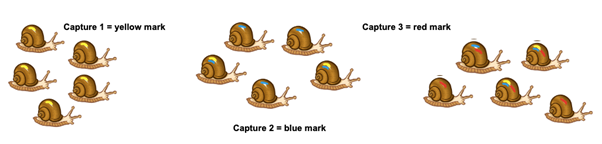
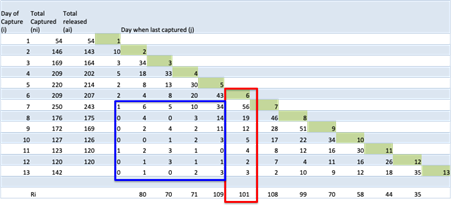

# Building on limitations of the Lincoln-Petersen index {#sec-limitations-lincoln-petersen}

In this section, we’ll build on our understanding of the Lincoln Petersen index, to:

1.  Understand the assumptions and therefore limitations of the Lincoln-Petersen index
2.  Appreciate how derivations of the model look to overcome some of these limitations
3.  Understand the importance of timing in models estimating population size

## Closed populations

A key assumption we make when using the L-P index to estimate population size is that the population is closed. A closed population is one in which there is no immigration or emigration.

Do we ever see closed populations in the wild? We can see closed populations due to geography, for example when a population becomes isolated from others and there is no migration between populations. Metapopulations with very low exchange between populations may be effectively acting as closed.

The timescale of examination can also result in a (near) closed population. We must think about the appropriateness of the length of time between our sampling events. If we look at short intervals, this may mask long term change for the purposes of analysis; if your research question is not interested in long term change that might be alright. Unless you repeat sampling efforts at another time, you won't see any population change through time. However, if you repeat-sample too quickly, you will record a snap shot of population size “in this location” as there won’t be time for any individuals to move in or out from the wider area of interest.

## Open populations

Open populations are subject to demographic change: immigration, emigration, birth and death. Here we explore how to incorporate demographic change in derivations of the L-P index to be more realistic in estimates of population size. To do this, indices may consider the loss rate of "marks" in subsequent captures or estimate rates of movement in and out of populations.

## The Jolly Seber estimate

The Jolly Seber estimate is a derivation of the L-P index that aims to improve it using repeated sampling, with unique marks for each sampling time point.

If the population is completely closed, in the way that we assume for the L-P index, then all of the marked individuals are at risk of being recaptured. But in a typical population there is a mortality risk and there is an emigration rate. The repeated sampling in the Jolly Seber index allows you to assign a probability to recapturing particular marks. The total number of marked individuals at risk of being recaptured is central to this method. We can estimate how this is changing from the number of old marks from previous sampling efforts that we then recapture.

@fig-snails-capture-mark illustrates how repeated sampling with unique marks could work for a population of snails. After n sampling sessions, individuals may have 0-n marks, depending on how many times they have been captured. On each of the capture days, rather than just recording mark or no mark, as with the L-P index, you would count how many individuals have no marks, or any combination of the unique marks that have been applied over the course of the experiment. The counts of how many individuals you see at each of the time points and how many marks these individuals have can be used to estimate the total population size, and also estimate immigration rates and survival rates.

::: {#fig-snails-capture-mark}
{fig-alt="Illustration of snails being marked for a Jolly Seber estimate of population size. See caption for details."}

On the first capture (left), 5 individuals are captured and marked with a yellow mark, from an unknown population size N. On the second capture (centre), a further 5 individuals are marked with a blue mark. Two of these also had a yellow mark, and three are new to being marked. On the third capture (right), 5 individuals are marked with a red mark. Two of these already had a yellow mark and a red mark, and one had a red mark but no yellow mark. Two are new to being marked.
:::

You don’t need to be able to calculate Jolly Seber estimates yourself in this module, but you might be interested in reading about it if you are considering repeat population sampling in the future.

The assumptions of the Jolly Seber index are the same as the L-P index with regards to marks being permanent and readable and that the marks won’t impact mortality risk. However, as you are undertaking repeated sampling you can estimate movement into and out of the population (through mortality or physical movement), and this rate can vary at different times, giving a very flexible approach to population size estimation. This model is calculated based on probability distributions and is just one of the different derivations of the Lincoln Petersen index.

The original paper by Jolly was performed using black-kneed capsid bugs over 13 sampling occasions (@fig-jolly-mark-recapture). At each capture, it was recorded when each individual was last captured; for example, on the seventh capture, 250 bugs were captured, of whom 56 were most recently seen at capture six, 34 at capture five, 10 at capture four, 5 at capture three, 6 at capture two, and 1 at capture one: 112 bugs have some combination of marks, and 138 are unmarked.

Reading down the columns provides the number of bugs that were marked on a given day and subsequently captured again, for example, 101 bugs were marked on day 6 and turned up in later sampling efforts.

::: {#fig-jolly-mark-recapture}
{fig-alt="The original mark-recapture data from Jolly (1965) where the combination of marks on each of the individuals has been recorded over 13 catches."}

The original mark-recapture data from Jolly (1965) where the most recent previous marks on each of the individuals has been recorded over 13 catches. Note that the total released is increasingly lower than the number captured as there is a mortality risk associated with capture. For example, of the 146 individuals captured on day 2, only 143 were released.
:::

This method hinges on knowing how many marks there are in the population at any time point. This isn’t an estimate you need to know how to calculate yourself but you can see the types of estimates you could calculate from the data collected in this index:

-   The number of marks “at risk” at day *i* as a function the total individuals marked, with a correction for the rate of loss of previous marks.
-   The population size at day *i*, using the L-P for the subset of data from that day and the previous one.
-   The survival rate from day *i* to day *i* +1 and the number of additions to the population from day *i* to day *i* +1, using declines in the proportion of marks over time.
-   The standard errors surrounding these estimates.

Begon (1983) published a critique of these types of models in Oikos 40:1555 (practice your literature searching skills if you would like to read the original). It was an interesting reflection on experimental design and data analysis. His key conclusion was that most studies did not test whether the assumptions of the models they used were met. Ultimately not enough studies tested or knew enough about the biology of a population to see if the immigration, emigration and mortality assumptions were actually followed.

If you were looking into using these indices in a project setting you would want to think about being explicit about the assumptions of the model. You would want to think about being able to justify the assumptions either in reference to the biology of the organisms you are testing and consider if you could also test any of these assumptions and how.

## The issue of timing

With both the L-P, Jolly Seber and other models that estimate population size, timing is very important. As we said in sampling plants that the size of the quadrat needs to be appropriate for the biology of the plant you are studying. Similarly the timing of sampling efforts is important for estimating population sizes of animals.

Most sampling methods treat the sampling period when the marks are made as a single point in time. Mathematically they are instantaneous but in reality, they are not. Repeated captures are used to some extent to overcome this, but the time period for the mark-recapture needs to be short relative to the time interval between the next mark-recapture effort. For example you may leave some pitfall traps out for 7 days (this is your sampling period - a week long, rather than a single point in time) but you probably wouldn’t come back and repeat the trapping within the next week because it would effectively be extending your sampling period rather than being a ‘new’ time period. Instead you might wait a month before putting your traps out again.

## References

Begon, M. (1983). Abuses of Mathematical Techniques in Ecology: Applications of Jolly’s Capture-Recapture Method. Oikos, 40(1), 155–158. https://doi.org/10.2307/3544213
