# Methods for sampling animal populations {#sec-methods-sampling-animal-populations}

Here we will explore some of the methods we can use to sample animal populations, in order to gather data with which to estimate population sizes and learn about individuals and populations in a location. We will focus on sampling invertebrates and larger vertebrates. You should: - Appreciate the varied methods used to accurately sample animal populations - Understand how the methods used should be appropriate to the life history of the animal and be able to consider the strengths and limitations of sampling methods.

## Day flying invertebrates

It’s one thing to count individuals and model population sizes, but first we have to collect the data with which to do the analyses. When you choose a sampling technique, once again you need to use a method appropriate to the biology of the organism that you're studying. For example, you wouldn't use a fishing net to catch snails!

Day flying insects can be caught using a variety of methods: - sticky traps - malaise traps - water traps - nets

Malaise traps (@fig-malaise-traps) are adapted to the biology of the organism they’re looking to catch. Flying insects will look to go up and over any barriers they encounter, as they are not burrowing organisms. So, if you see an insect trapped in a house it will fly upwards at the window. This behaviour is what the malaise trap exploits.

It is a type of tent with open sides and a net barrier down the middle. The insects fly into the barrier in the middle and to try and get away from this barrier they go up. They continue moving up the sloped roof of the tent and at the highest point of the roof there is a gap that the insect crawls through. This gap leads to a bottle with ethanol or another preservative in it. Given that this trap exploits a typical behaviour of day flying insects it is a very effective way to take an estimate of what is flying around in an area at a particular time.

::: {#fig-malaise-traps}
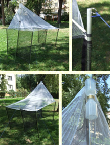{fig-alt="A Malaise trap. See caption for details."}

Malaise traps, showing the tent like structure and preservative bottles at the apex.
:::

Water traps (@fig-water-and-sticky-traps) have a flat sheet of some sort that the insects can't grip onto. This sheet is in a colour that the insect is attracted to, for example pollen beetles are attracted to the colour yellow, so you have a yellow Perspex plate, the insects fly towards it, try to land on it but they can't grip and so they slide down. The Perspex sheet sits in a tub of water that the insect lands in after sliding down, which it can't then escape from.

You will see examples of Sticky traps in the glasshouses around the department (@fig-water-and-sticky-traps) and these can be baited with insect pheromones or other baits appropriate to your target organism. The insect flies towards it and can't escape.

::: {#fig-water-and-sticky-traps layout-ncol="2"}
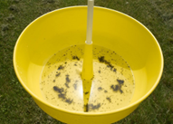{fig-alt="A water trap."}

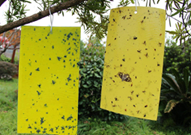{fig-alt="Sticky paper traps."}

Water traps (left) and sticky traps (right).
:::

You have probably seen a butterfly net before; these are useful for day flying insects.

## Night flying invertebrates

For night flying insects you can use light to attract individuals. @fig-robinson-trap shows a Robinson trap, which uses a mercury vapour bulb to attract moths. Skinner traps work similarly but are more of a box shape. Moths are attracted to the light, but when they collide with the Perspex cross barrier in the middle, they fall down into the box. This is full of cardboard and places for the moths to rest until daytime. You can then count them whilst they are at rest and then let them go so it is a non-destructive sampling technique.

::: {#fig-robinson-trap layout-ncol="2"}
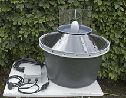{fig-alt="A Robinson trap."}

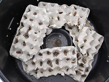{fig-alt="Egg boxes provide hiding places for moths inside a Robinson trap"}

A Robinson trap showing the external set up (left) and the hiding places inside (right).
:::

## Non-flying insects

Not all insects fly so we also need to think about how to capture non-flying insects and other invertebrates. Methods include: - Pitfall traps, in which insects fall into a trap dug into the ground (you will have an opportunity to do this later in the semester); - Sweep nets, which are used to sweep across vegetation and catch vegetation; - D-vacs are similar to a hoover, and you can hoover up a whole community of insects sitting on a plant’s leaves; - Tree beating, in which you collect insects on a sheet after devising a sampling method that involves hitting the tree at a certain height for a specific number of repetitions.

The key thing you can take from all of these different methods is that if you went to a site and said I want to enumerate the entire invertebrate or insect community from this site, it would be very difficult to do that by relying on just one method. You will need different sampling methodologies to capture different functional groups of insects.

## Pitfall traps and beetles

For pitfall traps, you take a core out of the soil and use a cup containing different liquids to capture different functional groups. Some may be water; some may be washing up liquid or antifreeze. We need to consider the content as some groups may be attracted to different types of compounds.

Pitfall traps are particularly good for animals that move quickly over the soil surface. If you’re using them to look at multiple species in a community, the abundance of each of the different types of organism and the density that you calculate is a function of how quickly that organism moves.

If an organism is slow and it has a small range, you’ll see fewer of them across your pitfall traps than an organism that moves around very quickly and this impacts on the probability of them being captured. The faster they move, the more likely they are to walk into one of your pitfall traps, the slower they move, the less likely they are to encounter a pitfall trap.

## Pitfall case study

Garcia *et al.* (2000) looked at a ground dwelling beetle, *Nebria brevicollis*, which is an aphid-eating woodland species. They studied it in a field margin, using repeated sampling to calculate the activity density (as a proxy for population density) of the beetles at different distances from the hedge (@fig-brevicollis-hedge). They acknowledge that the number of individuals they catch is a function of how busy they are, as well as how densely they occur.

::: {#fig-brevicollis-hedge}
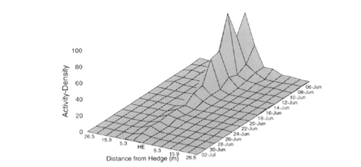{fig-alt="Three dimensional surface graph showing how activity of beetles increases nearer a hedge, but decreases over time."}

Time series of total activity density (vertical up the page) of *N. brevicolllis* against date (y-axis, with time running from the ‘back; of the page towards the front) during aestivation in the field boundary. Activity-density summed down columns of traps parallel to hedgerow (HE) in cross-section across the experimental site (x-axis, left to right on the page), through the hedgerow. Reproduced from Fig. 1 of Garcia *et al.* (2000).
:::

## Sampling larger animals

When sampling larger animals we can use a wide variety of methods depending on the biology of the animal of interest: - By trapping and marking: Longworth traps, mist netting, collaring etc. - By observing: Camera traps can ID animals with unique markings, e.g. tigers and other big cats - By hearing: Bird and other calls have been used, but harder to identify recaptures. Used to estimate population density

Mist nets are used for birds and bats; they can be banded or marked and then released. You can also trap and mark animals, for example using Longworth traps (@fig-trapping-methods). These are humane traps for rodents up to the size of a squirrel. You bait the box at the end and the animal triggers a trap door as it goes in. You go back in the morning, count and mark the individuals and then release them.

We can also sample larger animals by observing them. This might include using camera traps to ID animals that have unique markings such as tigers and other big cats. We can also identify zebras and giraffes using this methodology.

In dense habitats it can be useful to use bird calls and other noises to track animals. You can estimate population density and behaviour with these methods as animals may be making calls in a territorial or mating context for example. With these methods it can be difficult to identify recaptures though as you can't necessarily tag a call to a certain individual.

::: {#fig-trapping-methods layout-nrow="2"}
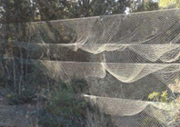{fig-alt="Mist nets for trapping small birds: fine netting held up between two poles in woodland setting."}

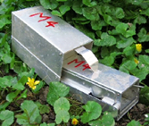{fig-alt="Longworth trap - two silver boxes conjoined to catch small mammals e.g. voles."}

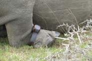{fig-alt="Identification and location detection tag on rhino leg."}

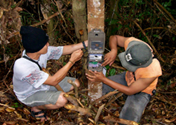{fig-alt="Fitting a motion sensor camera to a tree."}

Methods for sampling larger animals (clockwise from top left): Mist nets, Longworth traps, motion sensor cameras and ID tags with GPS.
:::

## Case study: frog calls and recapture

Nelson and Graves (2004) used amateur recorders to log the calls of *Rana clamitans*, and correlated the call records with a mark recapture experiment as a way to measure abundance. They were able to show that there was a relationship between the number of calls and frog density, but that it was a non-linear relationship (@fig-frog-calls).

::: {#fig-frog-calls layout-ncol="2"}
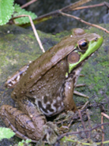{fig-alt="A frog."}

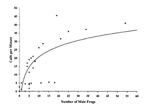{fig-alt="Graph showing the relationship between number of male frogs and calls per minute"}

Male frog (*Rana clamitans*, left panel) calls per minute (y axis, right panel) increase with number of male frogs (x axis). Individual data points are shown for each frog, clustering under 15 frogs and 30 calls per minute. The trend follows an upwards curve that plateaus at approximately 60 frogs and 35 calls per minute.
:::

As the number of male frogs increases, the number of calls plateaus: the male frogs call more when the population is not as dense and we can see that there is a behavioural element to the amount of calling the males do. There is another bias to these population estimates as only the males make these calls: it is a territorial call that the males make prior to mating. The females were unsurprisingly underestimated in this study and so this is another clear example of the biology of an organism impacting on the data that you get, in relation to the sampling methods you use.

## Examples of marks

Other examples of some of the marks you might use to identify individuals and count abundance include a number of types of clipping and marking.

To produce unique identifying marks in birds we can clip nails. In the past, toe clips have been used in frogs. These create unique identifying combinations. However, we do need to be sure that these methods meet with current ethical standards and approvals.

Wing clipping in butterflies has previously been common but as with the assumptions of the mark recapture models you would have to be sure that it wouldn't affect their ability to fly.

Pen and paint marking on beetle wings or ants and unique shapes of hair clipping in small mammals are other methods used. These fur clips in fixed locations on the body can be a way of marking small mammals without needing tags or collars.

## Camera trapping

Camera trapping is a non-invasive methodology used to identify unique individuals, and was first formalised as a methodology by Karanth and Nicholls (1998). They set out to estimate the population size of tigers in India (@fig-tiger). Camera trapping was used as an alternative to estimating using footprints, as previously the density of the individuals had been estimated using the number and the freshness of the footprints on the trails that tigers regularly use trails to mark out their territories.

Camera trapping could exploit these trails to identify which individuals were using them and estimate population size. Using cameras is now an established technique with methodologies that take into account things like the density of the cameras.

::: {#fig-tiger}
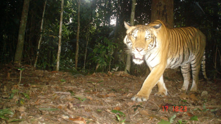{fig-alt="A tiger in the woods, caught on camera."}

A tiger walking in the woods, caught on camera.
:::

## Tracking tunnels

Another non-invasive method for estimating indices of population density is tracking tunnels. @fig-tracking-tunnels shows a simple mock-up of a tunnel with bait in the middle. Pieces of paper are clipped to the tunnel on either side of the bait. There is tape on either side of the bait which has a non-toxic neutral coloured paint mixed with vegetable oil painted over it, so to get at the bait the animal has to walk through the paint and they then leave footprints behind after traversing the paper having reached the bait (@fig-prints).

::: {#fig-tracking-tunnels layout-ncol="2"}
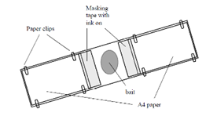{fig-alt="A birds eye view of a tracking tunnel - bait is in the middle with masking tape covered in paint immediately on either side. Between the paint and the end of the tunnel there are white sheets of paper to capture the animals' footprints."}

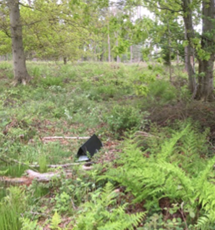{fig-alt="A forest with trees and plants surrounding a black triangular tracking tunnel."}

Tracking tunnels (left) usually have bait in the centre, and animals have to walk over an ink pad to reach it. On their way out, they leave footprints on the paper, and can be identified to species level. We will use tracking tunnels later in the semester to see what is active on campus, and the photo on the right shows a tracking tunnel in action on the North York Moors, during a field trip to Ellerburn in 2015.
:::

::: {#fig-prints layout-ncol=3}
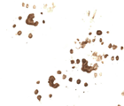{fig-alt="Hedgehog footprints are larger than you think!"}

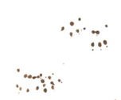{fig-alt="Rat footprints have a characteristic claw mark."}

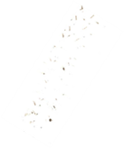{fig-alt="Burying beetles leave marks that look a bit like a tire track."} Footprints left in tracking tunnels by a hedgehog (left), rat (centre) and burying beetle (right).
:::

You can influence what goes through the tunnels depending on the type of bait that you put out – this might be rats, beetles or hedgehogs.

## Case study: tracking tunnels

Tracking tunnels have been used to monitor animals like brushtail possums (*Trichosurus vulpecula*) to detect their prevalence in different habitats and also to detect threatened insects like giant wētā in New Zealand (@fig-giant-weta). In these cases, the number of footprints is an estimate of density.

::: {#fig-giant-weta layout-ncol="2"}
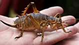{fig-alt="A giant weta sitting on a hand: this invertebrate is longer than an adult's fingers."}

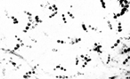{fig-alt="Weta footprints on a tracking tunnel page"}

Giant wētā (left) and their footprints (right) caught in tracking tunnels in New Zealand (Watts et al. 2008).
:::

## Animal sampling ethics and welfare

When sampling any animal population, we have to think about the sampling technique and if it is destructive or not. This has conservation implications for example. If you are live trapping and releasing animals you must consider their welfare and to do that you need to understand the biology of the organism and the logistics of the sampling process.

For example, Longworth trapping needs a license for mammal trapping in the UK and there are only certain times of the year when you're allowed to set up traps like this so that you’re not trapping animals during the breeding season. If a mother is caught in a trap during the breeding season when foraging for young and is caught overnight then the offspring could die. These regulations are in place to consider this.

For moth traps we still need to think about welfare, for example monitoring how many moths die of those that you catch. One of the most problematic things here is keeping moths in a trap for too long. Traps need clearing daily but we don't want to then release them such that after release the moths are resting all day and local birds can easily predate them, so there are considerations for an appropriate release consideration here.

## References

Garcia et al. Ann Appl Bid 2000 137: 89-97

Nelson, G. L., & Graves, B. M. (2004). Anuran Population Monitoring: Comparison of the North American Amphibian Monitoring Program’s Calling Index with Mark-Recapture Estimates for Rana clamitans. Journal of Herpetology, 38(3), 355–359.

Karanth, K. U., & Nichols, J. D. (1998). Estimation of Tiger Densities in India Using Photographic Captures and Recaptures. Ecology, 79(8), 2852–2862. https://doi.org/10.2307/176521

Watts, C. H., Thornburrow, D., Green, C. J., & Agnew, W. R. (2008). Tracking tunnels: a novel method for detecting a threatened New Zealand giant weta (Orthoptera: Anostostomatidae). New Zealand Journal of Ecology, 32(1), 92-97. https://www.jstor.org/stable/24058104
