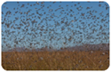
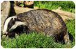
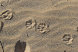
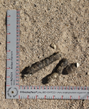
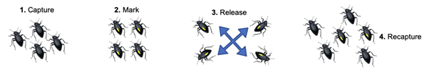

# Sampling animal populations: the Lincoln-Petersen index {#sec-lincoln-petersen}

## Why count animal populations?

Before we consider the theory and practicalities of sampling animals, we’ll first look at why we want to count animal populations (@fig-animals-we-might-count)

### Conservation

-   Size and location of breeding populations
-   Rates and routes of migration

### Pest control

-   Monitoring insect pest outbreaks
-   Culling programmes

### Prediction

-   Response to climate change
-   Disease outbreaks

::: {#fig-animals-we-might-count layout-ncol="3"}
{fig-alt="A monarch butterfly"}

{fig-alt="An insect outbreak over a crop field"} {fig-alt="A European badger"}

Three examples of animals that might need to be counted, for conservation (e.g. the Monarch butterfly, left); for pest control (e.g. an insect outbreak, centre); and to predict outbreaks (e.g. Tb in badgers, right).
:::

There are many areas of ecology and management that rely on estimates of population size. This might be in a conservation context, wanting to understand how large your breeding population is and the range that it covers. It could also be to understand rates of and routes used for migration, from monarch butterflies to humpback whales.

Understanding population size and spread is important for monitoring pest control in agricultural and forestry contexts, for example to be able to predict or minimise the impacts of locust swarms or armyworm outbreaks in Africa. Insects are not the only pests we might want to count: we might be looking to reduce numbers of feral cats and rats in the antipodes in Australia or New Zealand, or wanting to control numbers of escaped mink in East Anglia.

When looking at controlling populations, it is important that we understand the population biology of the organism, for example its reproductive strategies, so that we know how to target the organism and control it effectively.

We might also want to look at change through time, for example how populations respond to climate change, whether numbers decline or home ranges shift. This might be looking at scenarios from the changing elevation of dung beetles or butterflies, to the feeding range of polar bears. Similarly, we might want to count animals to monitor disease outbreaks and predict future spread, and we’ve seen this over recent decades with bird flu and swine flu, as well as the perennial debate about culling badger populations (in the UK) or brushtail possums (in NZ) and its efficacy in controlling bovine tuberculosis in cattle.

## How do we go about estimating population size?

We can use counts to monitor population density associated with specific places in space and time.

When doing this we need to know which individual we are counting, especially as we can't always see all of the animal population by virtue of the fact that they are moving. If we can’t see animals themselves, we can use a proxy (@fig-proxy). This involves monitoring calls, tracks, sightings or other evidence like faecal samples, usually along transects or in fixed monitoring locations as with our plant monitoring techniques.

We might go to these locations or walk the transects on multiple occasions to record evidence. We might also use a continuous monitoring strategy to get an idea of how many individuals are using that location, for example using camera traps to photograph tigers and then identifying them by their coat patterns.

::: {#fig-proxy layout-ncol="3"}
{fig-alt="A yellowhammer singing on a branch"}

{fig-alt="A close up of an animal foot print in the sand"}

{fig-alt="A ruler indicating the size of a faecal sample on the ground."}

From left to right: A yellowhammer singing on a branch; A close up of an animal foot print in the sand; A ruler indicating the size of a faecal sample on the ground.
:::

The sampling efficiency of this type of methodology is difficult to estimate. When designing our sampling regimes, we need to consider how the biology of the species affects the scale of our sampling effort. As we discussed last week, getting the spatial scale right with respect to the organism we are measuring is key - just as we wouldn’t use a metre square quadrat to record rainforest trees, or a hectare to count daisies, we need to consider the home range size and activity of the animal so that we don’t look for wolves for just two days in a small patch of land when they might be roaming across the landscape and only visit that part of their territory rarely.

When designing an experiment, think about what properties of the animal population could impact on the probability of the animal being sampled, to help you decide whether transects or plots are most appropriate for recording presence or abundance of the animal, and how the timing of your data collection should work. Factors to consider include:

-   The extent to which the animal roams, on daily, seasonal and annual timescales.
-   When the animal is active, e.g. in the day and night, or across the seasons
-   What behavioural changes might occur during the breeding season, for example if birds are incubating eggs, or if there is any kind of mating display.

If you go out into the field to sample an animal at fixed locations but don't have any information about territoriality in the species that you're sampling, then where you place your sampling plots may be extremely biased and you may not be getting a good estimate of population size. This would impact on the probability of the animal being sampled. Similarly, if you're on a track that the animals use frequently then you may be resampling the same individual all the time, so there are two components to this challenge of sampling animals. First of all, we need to determine whether the animal is there at all, and if so, whether you are sampling different individual animals each time. Both of these are much more difficult to account for than when we are studying sessile plants and animals that don't move around.

## The Lincoln-Petersen Index

There are multiple indices for estimating population size. In this chapter, we are focusing on the Lincoln-Petersen index.

You may come across a number of names for this index, such as the Petersen index, the Lincoln index, the Petersen-Lincoln index or the Lincoln-Petersen index – this is because this model was derived independently by both authors in different contexts. Petersen studied fish, specifically European plaice in the 1890’s and Lincoln studied banding returns in waterfowl in the 1930s. In these notes we may use L-P index for short but in your own scientific writing (especially for assessments) please write it out in full.

The L-P index is based on a simple and intuitive model (@fig-capture-release):

1.  First we capture *r* individuals.
2.  We mark all of them and then let them go.
3.  After an appropriate period of time we have a second capture round, collecting *n* individuals.
4.  We count all *m* individuals in that capture that already have a mark.

::: {#fig-capture-release}
{fig-alt="Illustration of insects being marked for a Lincoln Petersen estimate of population size. See caption for details."}

On the first visit, *r* = 4 individuals are captured and marked, from an unknown population size N. On the second visit a further sample of size *n* = 6 is captured, of which *m* = 2 individuals are already marked.
:::

The key assumption of the L-P index model is that the \*proportion of marked individuals remains constant\*\* between the first and the second capture, and so we can estimate population size from the number of marked individuals that are recaptured as:

$$
{m \over n} = {r \over \hat{N}}
$$ or $$
 \hat{N} = {rn \over m}
$$

Where $\hat{N}$ means an estimate of true population size *N*.

That is, the proportion of marks in the second capture is equal to the proportion of the whole population that was marked in the first capture.

There is a modification to this equation for small sample sizes, called the Bailey modification:

$$
\hat{N} = {r(n+1) \over (m+1)}
$$

This can be used in cases where the recapture size is very low, e.g. less than 10. You might not use the Bailey modification, but it is shown here to make you aware that there are adjustments that you can use to make your estimates of population size more accurate.

## Assumptions of the Lincoln-Petersen index

The Lincoln Petersen model, whilst being a relatively simple model in form, has a lot of assumptions.

### Marks are permanent and recorded correctly

The first is that the marks are permanent and correctly recorded: collars remain on necks and rings on birds don’t fall off. For correct recording this might mean you know that the yellow coloured rings you fitted on your bird population at the start of a study haven’t faded to white in the last 5 years that you’ve been monitoring the bird.

### Marking has no effect on likelihood of recapture

The index assumes that marking has no effect on the likelihood of recapture. This is a very interesting and important assumption as there are certain behaviours that can go along with being marked in animal populations. Unlike cutting a leaf off a plant which won't necessarily change its behaviour, and won't change its population size, certain types of marks are known to have an effect on the behaviour of an animal.

You can have behaviours that are loosely called trap-happy and trap-shy behaviour. For example, if you put food traps out in a field for rodents, say, if you load those up with a good food source then the animals will learn that it's there and you're more likely to capture an animal that has been captured before because it knows the trap is there.

Similarly, the experience of being trapped may be sufficiently traumatic that an animal knows to avoid that area in future, so there are elements to the act of trapping animals that may change the likelihood of them being trapped again in the future which will then have an effect on your sample size.

### Marking has no effect on death or emigration

We also assume that marking has no effect on mortality rates or emigration. If the collar that you put on an animal is so heavy that it loses mobility and is more likely to be predated then these marked individuals are disproportionately lost from the population. So, this impacts on the numbers of marked individuals you find in the second capture and so impacts the proportion of marks in the initial and final sample.

There is good evidence that flipper banding in penguins has a significant effect on fitness and mortality. This has been a commonly used technique to tag penguins in Antarctica but we now know that it impacts on banded individuals. Because of this we are now working on phasing these bands out because it has a marked effect on the population and using bands to get an estimate of population size is clearly not viable in this case. Also, we need to be sure that the mark doesn’t impact on emigrating, so marked and unmarked individuals are equally transient.

### All individuals have an inherently equal chance of being caught, or of dying

These assumptions all combine with the effect that all individuals have an equal chance of being caught and all have an equal chance of survival from one capture to the next, so the mark has no effect on this.

Anything that happens in the population that means that marked organisms are more or less likely to be captured will affect your estimates of population size.

## Populations are dynamic

Demographic properties of populations are another thing we have to consider in taking population estimates.

One of the key factors with this model and its assumptions is that we're looking at a closed population.

We said that an unequal chance of survival due to marking can influence population estimates. The other thing that can affect the proportion of marks in the model is that there is recruitment into the population, either through immigration into it or through birth. Immigrants into the population and new-borns are inherently unmarked and so this depresses the proportion of marked individuals in the population so we can think about what this would then do to our estimates of population size.

This is a significant limitation of the model because it restricts when you can undertake these mark-recapture sampling efforts based on the demographics of the species in question. So, you do again have to understand the biology of the organism that you are sampling.

Most derivations of the L-P model have been developed to model population change between mark and recapture events. With the simplest model, Lincoln-Petersen index, there is no demographic change between the first and the second event. Because of this we need to think about what is an appropriate measure of time between the first and the second sampling event for each population. This is akin to considering the appropriateness of quadrat size when sampling plants and whether you're looking at daisies or palm trees. In this case we want to get the sampling time frame right whether we are sampling snails or deer.
