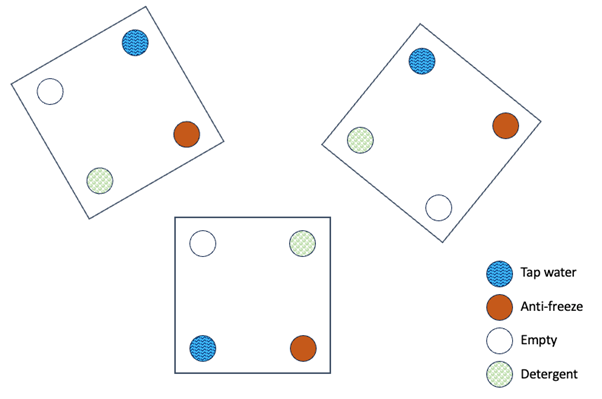
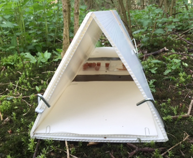
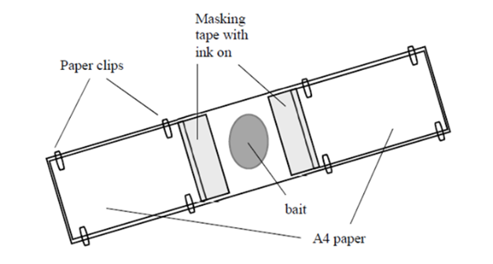

# Sampling Ground-Dwelling Insects and Small Animals {#sec-pitfall-practical}

[Download the practical files](files/BIO00036I%20Animal%20Sampling%20Practical.docx)

## Overview

Communities of plants and animals are notoriously difficult to study. Each species in the community will tend to occur at a different density (e.g. number of individuals per $m^2$) in the environment and may follow different patterns of spatial distribution too (aggregated, random or regular). Ecologists have approached this complex set of information through a variety of means, trying to see the wood despite the trees (i.e. appreciate how the whole community was organised without being mesmerised by too much detail).

In this practical, you are going to be introduced to a simple technique to sample ground dwelling arthropods, and to identify vertebrate presence.

In these practicals, you will:

-   Set up pitfall traps to sample ground dwelling arthropods
-   Set out animal tracking tunnels as a way of detecting small animal activity

## Learning outcomes

By the end of these practicals, you should be able to:

-   Set up pitfall traps and conduct a field experiment to determine whether ground arthropods might be attracted or deterred by different fluids used traditionally in pitfall traps.
-   Set up animal tracking tunnels and identify what small mammals, birds and invertebrates are present in the study area.

## Assessment

This practical is not directly assessed, but techniques may be used during the field course, and the data may be used for practising analyses.

## Coordinating instructions

-   A briefing presentation will be given by video and written instructions on the VLE, with details of what you will need to do explained. In practical 1, you will collect equipment from the department and set out the pitfall traps and tracking tunnels. In practical 2, you will collect in the equipment, then return to the department lab to do identification.
-   Your timetable for weeks 7 & 8 will show when you need to attend sessions.
-   The practicals will take place in the Biology teaching labs and locally on campus
-   Wear sensible footwear and, if necessary, waterproofs.
-   **You should work in your bird-based module groups.**

## Practical techniques you should be familiar with before this practical

-   Keeping a laboratory notebook.

If you are unfarmiliar with these techniques or need a referesher before the practical please visit the practical skills section of the skills hub on the VLE.

## New practical techniques learnt in this practical

-   This practical allows you to learn pitfall trapping, tracking tunnel use, and ID of invertebrates and footprints

## Skills that can be signed off during this practical

-   Keeping a laboratory notebook

## Safety

-   This practical will partly be held outside at a field site on campus. You should remain with the group and in contact with the module organiser and/or demonstrator at all times. Wear sensible footwear and, if necessary, waterproofs. Be careful when carrying equipment to the field site. No smoking.
-   Soil corers are very sharp and you must be extremely careful when you carry them and use them. Always point the cutting edge away from you. Wear gardening or other thick gloves when handling them.
-   The antifreeze and detergent solutions are irritants if you get them on your skin or in your eyes, so take care with them. Wear disposable gloves and eye protection when you are pouring the solutions. Should the antifreeze or detergent solutions come in contact with your skin or eyes rinse immediately with water and notify the module organiser or demonstrator.
-   Should they be needed in the field, the module organiser has a first aid kit (e.g. for cuts) and container of water (e.g. to rinse skin or eyes that have come in contact with chemicals).
-   You may wish to wear disposable gloves when applying paint and bait to the tracking tunnels. Wash your hands after handling the animal tracking tunnels.

## Experimental protcol

### Practical 1

#### Overview of practical

In the first practical, you are going to be introduced to and set up, a very simple yet efficient technique to sample ground dwelling arthropods, called pitfall traps. This technique relies on the natural activity (dwelling and crawling) of ground arthropods to work. The more active an individual is, the more likely it is to fall and be trapped in the pitfall. This adds a complicating factor, however, as the abundance of the species in the samples will not just reflect their abundance in the environment but their relative level of activity as well (which may vary between taxa, between sexes, or with the size of the individual). In the case of pitfalls, one also has to consider carefully the type of fluid used as preservative at the bottom of the traps. Some may emit a smell which may attract or alternatively repel some species more than others, further distorting our measure of their relative abundance.

In the second part of the practical you will have the chance to set up animal tracking tunnels to give you experience detecting small animals.

#### Sampling ground dwelling insects

A pitfall trap is a very simple device for catching ground dwelling arthropods. Essentially it is a cup that is dug into the soil with the rim slightly below the soil level. Passing insects simply walk into the trap, and like the spider in your bath, are unable to climb out (especially if the trap contains some preservative fluid).

There are all sorts of pros and cons associated with pitfall trapping. One factor that could affect what and how much is caught is the solution placed in the traps to kill and preserve the catch. This experiment examines the effects of different solutions on what is caught. It also allows you to compare and contrast the organisms found using this method. The pitfall traps will be located near the Biology department, along a habitat gradient that includes different tree species and ground cover. We will examine the catches next week in Practical 2.

1.  To determine whether there is a difference between treatments we will adopt a randomised block design. This means that each group will set up a 'block' of 4 traps each, with the 4 treatments randomised within each block (@fig-randomised-block).

:::{#fig-randomised-block}
{fig-alt = "Diagram showing three blocks, each holding four pitfall traps placed towards the corners of a one metre square area. The trap treatments are tap water, antifreeze, empty and detergent, and are ordered differently in each block. The blocks do not all have to be aligned with the compass directions."}
Examples of a randomised block design, with three blocks (boxed) containing each the same four treatments but in random order. Your group will put out one or two of these blocks.
:::

2.  Within each block you will need four traps (plastic cups quarter-full with fluid) with one of the following, either: tap water, 25% anti-freeze, 10% detergent (washing-up liquid) or empty. **Wear goggles and gloves when handling the anti-freeze and detergent**.

3.  Each group will set up one or two metre-square blocks of 4 traps (see @fig-randomised-block). If there are four or more people in the group, aim to do two blocks. If there are three or fewer, you can do one block and then decide if you want to do a second. There should be 8-16 blocks completed by the class as a whole. Note that the trap spacing within the blocks is regular, and the blocks will be evenly spaced along the grass bank near Biology; it is the allocation of the different treatments within each block that is randomised. 

4.  All four traps within each block should be placed within one habitat (e.g. grass, or bare earth), rather than straddling two or more habitats. 

5.  To set the cups in the ground use the soil corer to remove sufficient soil to allow the cup to sit snugly in the ground with the lip just below the surface of the soil. Wear gloves when handling the soil corer, when digging it in and when removing soil from it. Once securely placed, half fill the appropriate cups with the different preservative solutions. The removed soil cores should be stacked at the edge of the field site, so that they can be replaced when the pitfall traps are removed in Practical 2.

#### Setting tracking tunnels
A tracking tunnel is a very simple device for collecting presence data on small mammals, birds and invertebrates. It comprises of two parts, the tunnel and the tracking plate that slides into the bottom of the tunnel. Bait is placed in the centre of the trap, and strips of tape are painted so that animals crossing the tape create footprints on the tracking paper when they leave. As a class, we will set out three tunnels. We will examine the tracking paper next week, and identify any footprints that have been captured.

1.  The tunnel is made of corrugated plastic, and should be folded up to make a triangular tunnel (there are Velcro pads and plastic grips to keep it in place). See @fig-assembled-tracking-tunnel.

::: {#fig-assembled-tracking-tunnel}
{fig-alt = "Tracking tunnel in place on ground showing pegging, bait and tracking plate"}

The assembled tracking tunnel, with bait and paint.
:::

2.  Fix 2 A4 sheets of paper to the tracking plate using paper clips inserted into the flutes of the plastic. Label the paper with the date and some identifying marks (e.g. a group name). See @fig-tracking-plate-setup.

::: {#fig-tracking-plate-setup}
{fig-alt = "Tracking plate with A4 paper at ends, tape and bait in middle"}
Details of how to set up tracking plate.
:::

3.  Two square dishes are available to place in the middle of the tracking plate; you may wish to secure these with masking tape. 

4.  Place two or three strips of masking tape either side of the bait dishes, so that any animal entering the tunnel will have to walk on them to reach the bait (width should be 8-10 cm). Paint these with tracking paint; this should be a mixture of 1 unit (e.g. tbsp) non-toxic powder paint to 2 units vegetable oil. 

5.  Choose some bait from the available bait types, and add it to the bait dishes. You may wish to make a note of what bait types your group has chosen to use.

6.  Once you have chosen a location for your tunnel, slide your tracking plate into the tunnel and secure the whole assembly to the ground using 6-8 tent pegs. 

You may find it useful to angle the pegs to keep the tunnel near the ground, and/or use the hooked ends of the pegs to hold the ends of the tunnel/tracking plate down. 

#### Before you leave

-   Tell a member of staff that your group has finished setting out your pitfall traps.
-   Take part in setting out a tracking tunnel.
-   Return all equipment to the location that you got it from.

### Practical 2

#### Overview of practical

In the practical today you will collect the pitfall traps and tracking tunnels from the field before analysing them to identify the invertebrates caught in the pitfall traps, and the animals that have left footprints in your tunnels. These data will be uploaded to a google spreadsheet. The pitfall trap data will be analysed later in the course to determine the effect of the type of fluid used in the pitfall traps on catch size by family. Both techniques may be used in field course projects in the spring.

#### Pitfall traps

The pitfalls with their contents need to be collected from the field and their contents analysed.  As you will remember, we organised the pitfalls into a randomised block design.

1.  Collect each cup, cap it with one of the plastic lids provided, label it and tape the lid on securely.  Carry them back to the lab in the buckets provided.

The 4 pitfalls in block 1, need to be kept separate from those in block 2, etc. so a sensible labelling scheme is important if you have collected more than one block. You also need to know what the treatment was for each of your pitfall traps.

2.  Count the total number of invertebrates in each trap of each block and record them in your lab book according to the layout in table 1 in the appendix of the downloadable practical file. 

3.  For each of your 4 pots, sort their contents into the following categories, ants, beetles, woodlice, myriapods (centipedes and millipedes), spiders, earthworms, molluscs (slugs and snails). Add columns for additional families if required.

4.  Enter your counts into your lab book and transcribe this data into the Google spreadsheet linked on the VLE so that class data can be collated. Each group should enter their data onto the correct row for their pitfall trap data; these will have been set up for you in advance.

#### Tracking tunnels

The tracking tunnels should have footprints in them of the creatures that have been through the traps to take the bait. 

1.  Use the ID cards provided to identify what small creatures have been traipsing through your tracking tunnel. Record this information in your lab book.

2.  Enter your data into the Google spreadsheet linked on the VLE so that class data can be collated.

#### Before you leave

-   Make sure your data has been recorded on the Google sheet.
-   Tidy your workstation and put away any unused equipment.
-   Place used liquids into the relevant labelled containers.
-   Place dead invertebrates into waste bags.
-   Place live invertebrates into the bag labelled ‘Live invertebrates’.
-   Place used Petri dishes into the tray labelled ‘Used Petri dishes’
-   Rinse used plastic cups and lids and place in the tray labelled ‘Used cups and lids’
-   Leave used tracking tunnel papers on the bench. Make sure they include your group name and date, and have any identifications clearly labelled on the sheets.
-   Remove your lab coat and wash your hands before leaving the lab.

