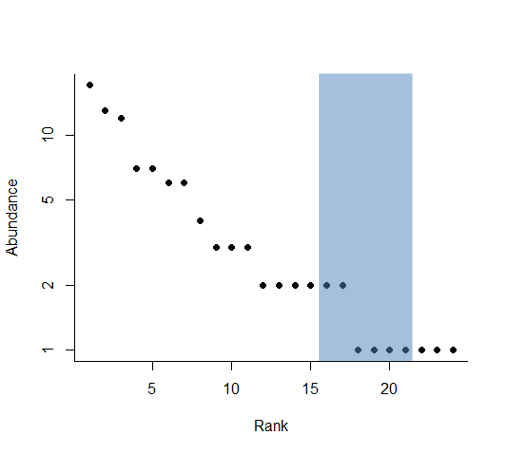
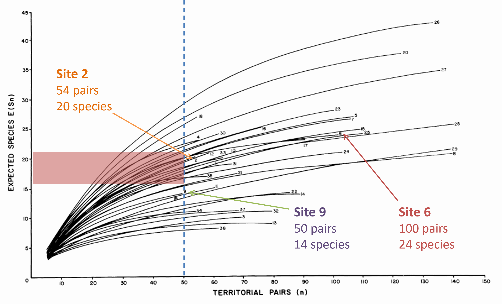
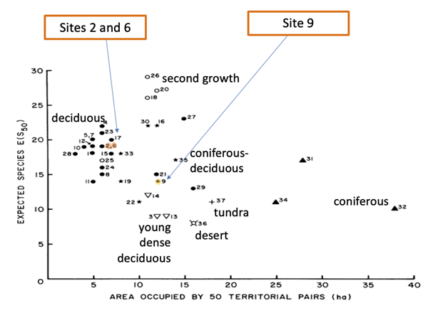

# Case study: breeding bird censuses {#sec-bird-survey-case-study}

James and Rathbun (1981) carried out 37 surveys of breeding birds in the US and Canada, recording the number of breeding pairs of birds in each area, what species the breeding pairs were, and information about the local landscape. They were interested in how the 37 communities differed in organisation and structure across the habitats: however, it’s also clear that the sampling effort across the sites varied. We will pick three sites of interest to explore in more detail (@tbl-bird-survey-data).

```{r}
#| echo: false
# create the data
bird_survey_data <- matrix(c("54", "100", "50",
                             "20","24","14",
                             "6","11.6","12.0",
                             "Tulip tree-beech-hickory", "Oak-beech", "Mature jack pine-birch"),  
                    nrow = 4,
                    byrow = TRUE)

# make a list object to hold two vectors
vars <- list(characters = c("Number of breeding pairs",
                        "Number of species",
                        "Size of site (ha)",
                        "Habitat"),
             headers = c("Site 2",
                        "Site 6",
                       "Site 9"))
dimnames(bird_survey_data) <- vars
```

```{r}
#| echo: false
#| label: tbl-bird-survey-data

knitr::kable(bird_survey_data, 
             caption = "Details of three sites from James and Rathbun (1981).") |> 
  kableExtra::kable_styling()
```

Our three sites have three different habitats, on different size plots, and have recorded different species richnesses from different numbers of breeding pairs. How could we use rarefaction to determine if these three sites have the same species richness as a function of sampling effort (measured by number of individuals)?

In the oak-beech forest at site 6, there were 24 bird species spread across 100 breeding pairs (@tbl-bird-survey-data). With our rarefaction equation, we can ask – if only 50 pairs were sampled, how many species would we expect to have been found at this site? For this, we need the rank abundance data from the site (@fig-bird-survey-abundance), which shows that some species are quite rare: we have seven species represented by only 1 breeding pair. There are many common species (more than 5 breeding pairs) at the site.

Applying the rarefaction equation to these numbers suggests that we’d expect to see 18.5 species if we halved our sample effort and only recorded 50 breeding pairs. This 18.5 isn’t half of the original 24 species represented by 100 breeding pairs, but does represent approximately 2/3rds of them. Rarefaction also lets us calculate a standard deviation that helps us be 95% sure that halving sample effort would let us observe between 15 and 21 species at the site.

::: {#fig-bird-survey-abundance}
{fig-alt="Abundance of species found at site 6: see caption for salient details."} Abundance of each of the 24 species found at site 6, showing that there are seven species represented by only one breeding pair, but three species with more than ten breeding pairs. The expected number of species found if we sampled only 50 of the breeding pairs at random is 18.5 (blue vertical line), and we can be 95% sure that we would see between 15 and 21 species at the site with that level of sampling effort (blue shaded area).
:::

Repeating this process for all 37 of the breeding bird censuses allows comparison across all of the sites and sampling efforts (@fig-bird-survey-rarefied). We can conclude that sites 2 and 6 are of similar species richness, after adjusting for sampling effort. However, site 9 appears to be significantly less diverse.

::: {#fig-bird-survey-rarefied}
{fig-alt="Expected species richness as a function of number of territorial pairs. See caption for salient details."}

Rarefied estimate for expected number of species given the number of breeding pairs recorded, for all sites. The total number of pairs and species observed at a site can be read from the top right of each line; e.g. site 26 has the highest number of species but sites 8, 27, 28 and 29 had more breeding pairs. Site 9 had the lowest number of breeding pairs (50, highlighted with the blue dashed line) observed in one survey. The expected number of breeding pairs at Site 6 if 50 breeding pairs were observed is highlighted by the orange line (mean) and 95% confidence interval (orange rectangle). Site 2 crosses the 50-breeding-pairs line within the confidence interval. Site 9 falls below it.
:::

So rarefaction has allowed us to compare species between samples with different efforts and sampling sizes to **describe** comparable differences between the communities. We now want to **explain** the differences between sites.

Remember that each of the study areas was a different size, as well as having a different number of breeding pairs of any species? This means that each community was also at a different density. We can calculate the area occupied by 50 breeding pairs (assuming that the pairs are evenly distributed in space) so see what the effect of density might be on expected species richness (@fig-bird-species-expected). There is a relationship between territory density and species richness, and this is broadly related to the habitat type. Sites 2 and 6 are both deciduous habitats with a similar expected species richness and density: their 50 pairs occupy a fairly small area with a high species richness. Site 9, on the other hand, is lower in species richness and density. It sits in a transition space on the graph between deciduous forest and coniferous-deciduous habitats. We now see that second growth habitats are expected to have higher species richness, and while tundra, desert and coniferous habitats have lower species richness, coniferous areas operate at lower density as well.

Rarefaction has allowed us to make this direct comparison, and draw out more information about factors impacting the communities of bird species.

::: {#fig-bird-species-expected}
{fig-alt= "See caption for salient details"} Expected number of species after sampling 50 breeding pairs (y axis) against the area occupied by those 50 breeding pairs. Sites cluster by habitat type (see labels), indicating a relationship between territory density and species richness, broadly related to habitat type.
:::

## References

James, F. C., & Rathbun, S. (1981). Rarefaction, Relative Abundance, and Diversity of Avian Communities. The Auk, 98(4), 785–800. http://www.jstor.org/stable/4085899
