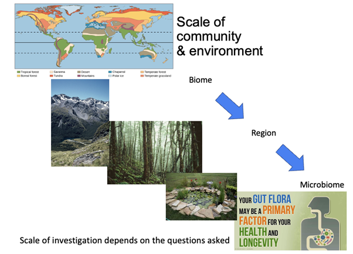
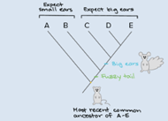
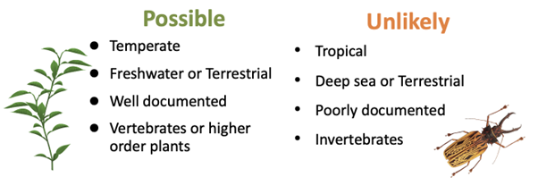

# Characterising communities {#sec-characterising-communities}

## Questions we can answer by looking at communities of populations

When we look at a community of organisms through a scientific lens, we may have a number of different questions that we want to answer. Generally speaking, these are the what, the where, the who, the how, and the why. The kind of questions we may ask include: - How are groupings of species distributed in nature? (the **what** - what is going on?) - How are these groupings affected by their abiotic environment? (the **where**, but also potentially the why) - How are these groupings affected by interactions among species? (the **who** - who is interacting?)

This all sounds simple: go somewhere, count the species present! But there are a number of considerations we need to take into account when designing an experiment to really understand what is present, and whether a species is really absent or if we just haven’t found it yet.

## Scales of communities and environments

The scale (in time and space) that we use to ask questions about communities can vary across a wide range of scales (@fig-scales-communities). If we are interested, for example, in the limitations of where vegetation spreads, we might look at a very large scale, considering whole biomes. This might lead us to conclude that climate (an abiotic factor) is broadly limiting the spread of various species of trees and plants. In equatorial regions, we’d see tropical forests, while in the extreme north we might see boreal forest or tundra, all of which are characterised by different vegetation types.

However, we can also consider communities at smaller scales. For example, we might be interested in different mountainous regions, and the environmental and ecological drivers behind different plant and animal communities in these regions. We could go even smaller, and think about the pond in your back garden, or all the way down to the gut microbiome. All of these different scales of environment may have different whats, wheres, whos, hows, or whys driving the community composition.

::: {#fig-scales-communities}
{fig-alt="Diagram showing scales of exploration from the whole world (a map showing different biomes at a global scale) through individual biomes to regions and even into the microbiome of gut flora. The scale of investigation depends on the questions being asked."}

Scales of different communities and environments.
:::

## What is a species?

Species richness is considered to be the number of species in a given taxon in the community. But how do you define a species? We generally use the biological species concept, but any of these potential approaches may be used: - Biological species - Phylogenetic species - Cohesion concept - Species discrimination - Morphotypes/morphospecies

The phylogenetic species concept is where a species is the smallest group of populations that can be distinguished by a unique set of genetic traits (@fig-phylogenetic-tree, with five species A-E).

The cohesion concept says that a species is a series of populations with genetic or demographic cohesion, rather than a biological species (@fig-phylogenetic-tree, two species, with small-eared and big-eared groups).

We may also have the challenge of discriminating between species that are very similar looking species, or ‘cryptic species.’It is not always easy to tell the difference between them without DNA testing (@fig-phylogenetic-tree, differences between species C, D and E).

::: {#fig-phylogenetic-tree}
{fig-alt=A phylogentic tree showing a common ancestor creature with small ears and a thin tail. Five populations A-E are identified. A has small ears and a thin tail like the ancestor. B has small ears and a fuzzy tail. C-E all have the fuzzy tail but also have big ears."}

A phylogenetic tree for fictional small rodent-like creatures with different ears and tails.
:::

This means that, in your community, species richness can go up if you split up previously lumped species or distinguished cryptic species, or it can go down where a single species is identified as previously having two scientific names attached to it. The approach that you choose to take to identify the species in your community must be carefully considered as part of your experimental approach when surveying species richness.

## What does species richness tell us about a community?

“What is present here?” is one of the first questions an ecologist might ask about a community. At its heart, this is a question about species richness: if we sample this location, and we count or collect individuals of our taxa of interest, what species will those individuals belong to?

Of course, a community is made up of a variety of species, but it’s unlikely that each species is going to be represented by the same number of individuals. Some species are more common, with a large number of individuals, and some are rare, with fewer individuals. This might be because common species have out-competed the rarer species, or perhaps because the rarer species have found it harder to survive in this environment, or have less appropriate habitat. Ultimately, we want to describe the relationship between the number of species, and the number of individuals in those species, with respect to the environment and the biotic interactions that occur, and have occurred, in that location.

As researchers, the question then becomes - what do we measure, in order to look at the number of species, and these patterns of rarity and commonness across the set of species that makes up the community? We could measure the number of individuals in a species, but we could also measure the total biomass within a community that can be attributed to each species. Which of these two approaches (or proxies for each one) that you use will depend on what it is that you are investigating.

## What is true species richness?

When assemblages consist of relatively well-known flora and fauna, and there are relatively few species, it’s possible to record them all and have a good idea that you’ve measured all of them. This might be the case if surveying a temperate zone, and/or a habitat with clear boundaries, such as a lake or a small island, allowing you to document it well. There may also be historical records that you can use. Often this documentation is of assemblages of invertebrates or higher order plants: things that are easy to define (@fig-easily-defined-things).

::: {#fig-easily-defined-things}
{fig-alt = "Scenarios where it is possible to census all species include temperate zones, freshwater and terrestrial habitats, well documented communities where you can go looking for everything, and vertebrates and higher order plants that are easy to find and record. Scenarios where it is unlikely you will find representative individuals for all species present include tropical habitats, deep sea and difficult to reach terrestrial zones, poorly documented places and invertebrate communities."}

Scenarios in which you may be able to census the species present and record ‘true’ species richness (left) and scenarios in which it is unlikely that you can find all the species present, in which case you will only be able to record ‘observed’ species richness.
:::

You are probably not observing true species richness if you’re working in a tropical zone, because it is incredibly diverse. Similarly, areas allowing a lot of movement in and out of the habitat, such as a deep sea area, mean that you may not know if you’ve recorded all species present. These locations tend to be poorly documented, and that might be because of limited funding to look into these habitats. Often they are highly diverse, and in these areas true species diversity is never going to be recorded. We have to make do with an estimate. It could also be that your study species, such as invertebrates, is incredibly diverse with a lot of cryptic species. This means that, for any measure of species richness, we need to consider how likely it is that we’re going to find all of the species present, even with a good sampling effort.

## Case study: Yasuni rainforest, Ecuadorian Amazon

One approach to recording species richness is to measure the number of species found in a given area. In the Ecuadorian rainforest of Yasuni in the Amazon, an experiment was undertaken to assess species richness. Initially, researchers used a one hectare (100m x 100m) search area, counting the trees within this area with a measurement of the diameter at breast height (DBH - i.e. about 4 feet above the ground) of more than 10 cm. These are considered established trees, as opposed to saplings or seedlings. The study found seven hundred individual trees, representing 253 species – clearly a diverse area. The researchers then wanted to examine whether increasing the search effort increased the number of species observed.

When the search area was increased to 25 times the size, they found over 17 thousand individual trees, but only four times as many species (@tbl-amazon-rainforest-species). The species count did not increase proportionally to the increased sampling effort, meaning that we can’t simply assume in this region that species richness is a function of sampling area. This also makes it hard to compare different regions, as we can’t assume a linear relationship between the sampled area and the species richness.

```{r}
#| echo: false
# create the data
amazon_rainforest_species <- matrix(c("1 ha", "DBH > 10 cm", "702", "253",
                               "25 ha", "DBH > 10 cm", "17 550","820",
                               "25 ha", "DBH > 1cm", "152 350", "1140"),  
                    nrow = 3,
                    byrow = TRUE)

# make a list object to hold two vectors
vars <- list(plants = c("","", ""),
             headers = c("Search area",
                        "Search critera",
                       "Number of trees",
                       "Number of species"))
dimnames(amazon_rainforest_species) <- vars
```

```{r}
#| echo: false
#| label: tbl-amazon-rainforest-species

knitr::kable(amazon_rainforest_species, 
             caption = "Individual and species counts from searching different areas and tree sizes in the Ecuadorian Amazon rainforest") |> 
  kableExtra::kable_styling()


```

The researchers also asked what would happen if we increased the available population to sample not just adult trees, but all the way down to the smallest saplings? Excluding seedlings that have not reached 4 feet tall, but counting all plants that have reached greater than four feet, regardless of their DBH, the number of trees present that reach this criteria increased substantially, from over 17 thousand to over 152 thousand. There was also an increase in the number of species counted, but again disproportionate to the increased sampling effort.

The demographics of the population, and the way that sampling is carried out, will affect records of observed species richness. We need a way to calculate ‘true’ species richness if we want to be able to compare studies that use different sampling regimes, or be resilient to changes in sampling effort within a single study. This calculation of how many species there really are in a given area should be independent of effort, to be comparable between sites.
