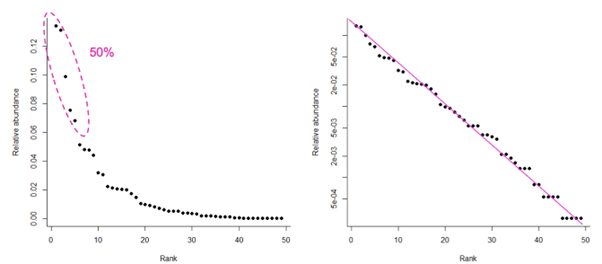
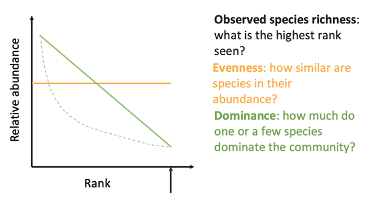
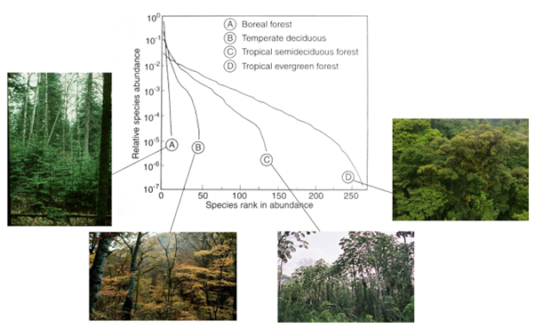

# Commonness and rarity matters {#sec-commonness-and-rarity}

## Patterns of commonness and rarity

A community is made up of a collection of populations of different species, but it is unlikely that each species is going to be represented by the same number of individuals. Some species are more common, with a large number of individuals, and some are rare, with fewer individuals. This might be because common species have out-competed the rarer species, or perhaps because the rarer species have found it harder to survive in this environment, or have less appropriate habitat. To understand the composition of a community in relation to its history and its environment, we want to be able to describe the relationship between the number of species, and the number of individuals in each of those species.

Whittaker plots (also called rank-abundance plots) are a measure of how abundance progressively decreases from the most common to the most rare species in the community. On the y axis, we can plot the abundance or the relative abundance of each species, and we can plot that against their rank. We plot the most abundant species close to the origin, then the next abundant, then the next, all the way to the least abundant species.

## Case study: the grassy bank near the library

In previous years, students on this module have done fieldwork projects using vegetation surveys on the grassy bank near the library. In this dataset we have the abundance of various species, ranked them by their commonness (@fig-library-abundance). In total, 49 species of plant were counted across a number of quadrats. The top 5 species account for 50% of the total number of individuals. There is a relatively large drop in the relative abundance between species 1 and 2 and species 4 and 5, but as the rarity of species increases, we start to see less of a difference in the relative abundance of individuals. Comparing the data graphed with a linear y axis (@fig-library-abundance, left) with a log y axis (@fig-library-abundance, right), we can see the relationship is an exponential decay. With the linear y axis, we get a steep drop in abundance through the first 5 most common species, followed by a plateauing of the relative abundance of individuals in the less common species. On the right, we see a straight line of decreasing relative abundance. The log scale tells us that increasing in rank in the community (i.e. increasing rarity) is associated with a relative decrease in abundance by an order of magnitude.

::: {#fig-library-abundance}
 {fig-alt="Two graphs showing the rank abundance of plant species found on the grass bank by the library. On the left is a curved line of exponential decay, on the right is a straight line with negative slope due to the logged axis."}

Two versions of the rank abundance plot of 49 plant species found on the grassy bank near the University of York library. Half of the individuals come from the five most common species (left, pink dashed ellipse). Note the log scale on the right panel, which changes the shape of the data to a straight line.
:::

## Evenness and dominance

In addition to determining which species are the most abundant, rank abundance plots also help us to work out the **observed species richness** of a community. We know how many species have been recorded in the study in total - that is our highest ranking species, or our rarest species, on the x axis (@fig-rank-abundance-plot-guide).

We can also see how rapidly the abundance decreases from the commonest to the rarest species in the community. This means we can assess the **evenness** of the community: how similar the species are in their abundance, or how abundant are the very rare species compared to the most common species (@fig-rank-abundance-plot-guide).

Finally, we can see the extent to which one or a few species dominate the community. The steeper or more curved the line, the more the common species have a greater degree of **dominance** in the community compared to the rarer species (@fig-rank-abundance-plot-guide). A straight line with a negative slope, however, would imply that there’s a fairly consistent decrease in abundance of individuals as rarity increases, so while the community is not even, there are fewer species with a high degree of dominance over others.

::: {#fig-rank-abundance-plot-guide}
{fig-alt = "Graph showing relative abundance of species against their rank abundance in the community. See caption for salient points."}

How to read observed species richness (black arrow), evenness (orange horizontal line) or dominance (green solid and dashed lines) on a rank abundance plot. Observed species richness is the highest rank plotted on the graph. A totally even community has the same number of individuals in each species. The steeper the slope on the graph, the less even is the community, with a greater chance that the most common species are dominant over the rarer species.
:::

## Case study: Rank abundance in forests

Plotting the relative abundance of species found in different forests can help us to understand how the communities differ (@fig-rank-abundance-forests). The rank abundance plot of the boreal forest shows a straight line: there are very few species in total, and there is a high degree of dominance of only a few species. As we move through temperate deciduous and tropical semideciduous forests, towards the equator, we can see higher species richness appearing (the lines on the plot are longer, reaching higher ranks). We also see more evenness; the lines are less steep particularly in the middle ranks of the community. Finally, in the tropical evergreen forest, there is both a high degree of species richness (with a very high maximum rank), and a higher degree of evenness, as the slope of the line is much shallower than for the boreal forest even when we reach the rarer species.

::: {#fig-rank-abundance-forests}
{fig-alt = "Rank abundance plots for four forest types, showing differing species richness and evenness across the different communities."}

Rank abundance of species differs between (A) boreal forest, (B) temperate deciduous forest, (C) tropical semideciduous forest, and (D) tropical evergreen forest. Note the logarithmic y-axis scale.
:::

We’ll come back to relative abundance of species in more detail next week.
