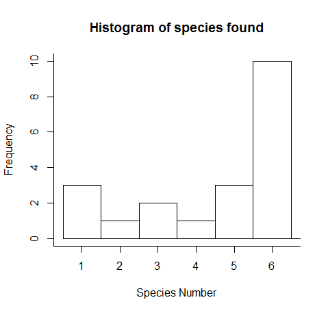
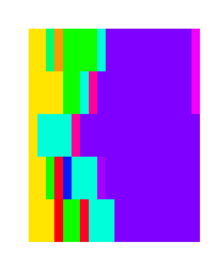
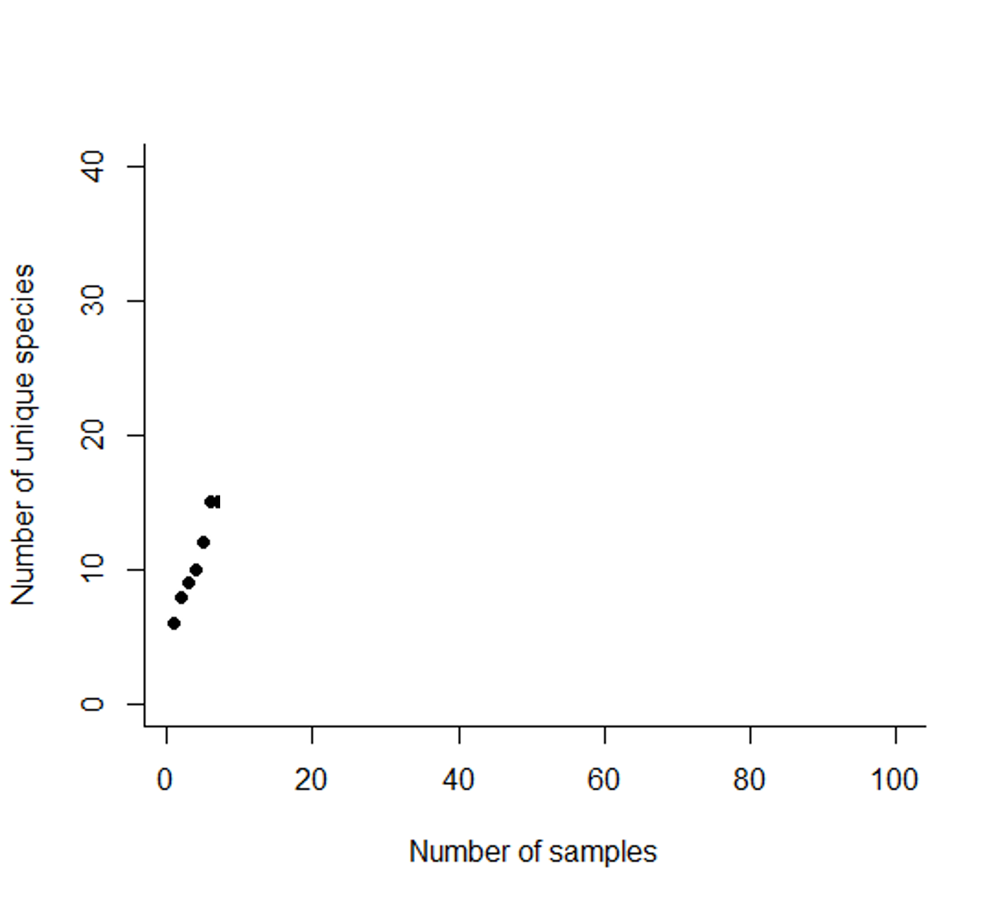
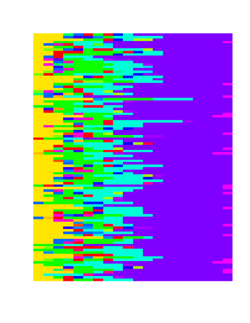
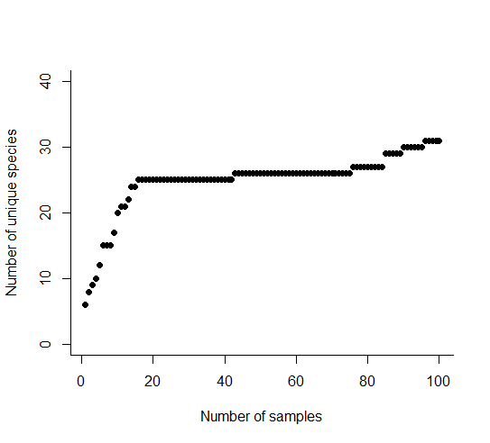
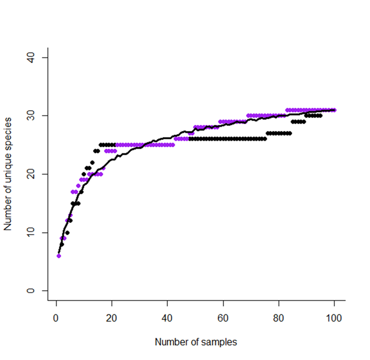
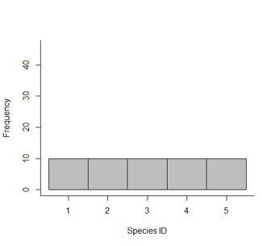
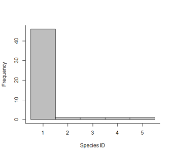
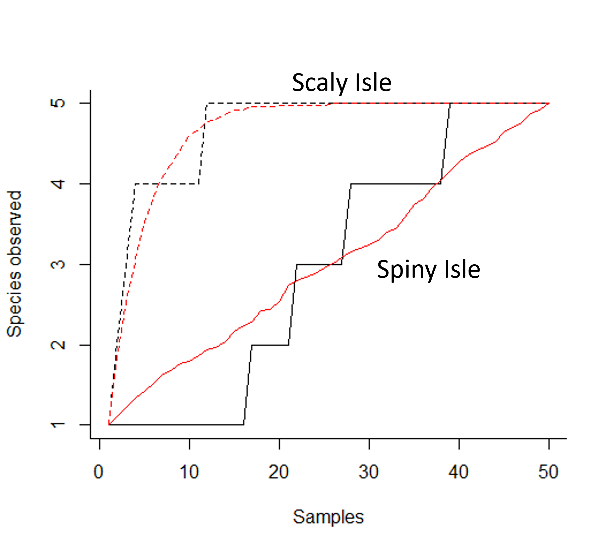
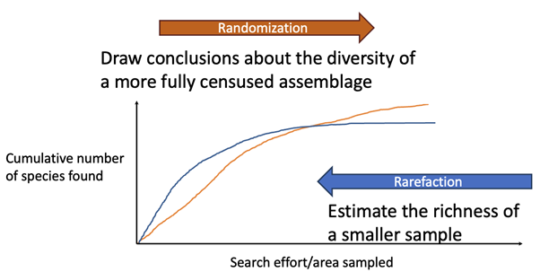

# Measuring species richness {#sec-measuring-species-richness}

## Cumulative species richness and sampling effort

When we sample a community to estimate species richness, we need to think about how our sampling effort changes what we can observe. If we put no effort in, we know that we don’t see any species. So how does the number of species relate to the amount of effort that we put in?

Using your LEGO communities as an example, think about taking a handful of bricks out of the bag. How many species do you find? Initially you might discover a lot of new species: for example, a first handful of ten bricks might give you 7 different shapes or colours of brick. If you took another handful about the same size, are they all the same ‘species’ as the initial seven? And, if not, how many new ones have you found? You are likely to find in your second sample that you find fewer individuals from as yet unseen species. If you were to keep sampling, would you find any more species?

The cumulative number of species found can be plotted against increasing effort, to get the characteristic curve called a species accumulation curve (@fig-species-accumulation-curve). The curve has an initial steep slope, as the species found at the beginning must be new to the record. As we take more samples, we start to see the same species reappearing. New species may continue to turn up, but they’re increasingly less likely. Even though we’re putting in more effort, our cumulative tally slows down. Eventually you may eventually conclude that you’ve got a good representation of the community, because the curve is tending to the horizontal. We can never be certain that we have sampled enough, and that we are not going to find a new species, but we can be reasonably sure.

```{r}
#| echo: false
#| label: fig-species-accumulation-curve
#| fig-cap: "Species accumulation curve: initially the species tally increases quickly, but then slows down with increased sampling effort. New species may continue to turn up even after a lot of effort has been expended."
#| fig-alt: "Illustration of the characteristic curve found in a species accumulation plot."
# generate data
y_pos <- c(1,3,4,6,7,9,10,12,12,14,16,16,16,17,17,18,18,19)
x_pos <- c(1,2,3,4,5,6,7,8,9,10,11,12,13,14,15,16,17,18)
number_of_species_data <- data.frame(x_pos, y_pos)
# create ggplot object
library(tidyverse)
p1 <- ggplot(number_of_species_data, aes(x = x_pos, y = y_pos)) +
  geom_point(size = 3) +
 scale_x_discrete(labels = NULL, breaks = NULL) +
  scale_y_discrete(labels = NULL, breaks = NULL) +
  labs(x = "Search effort / area samplied", y = "Cumulative number of species found", colour = NULL) +
  theme_classic()
p1

```

## Species accumulation curves

In order to increase confidence in your estimates, we might sample a number of different sites across the community and record the number of species at each one. Combining the results can help us to analyse the data and make them comparable with other locations and studies. In a hypothetical field trip to the Island of Dragons, off the north-west coast of Scotland, we will walk through this method of data collection and analysis step by step to understand the benefits.

At site 1 (the rocky beach on which we have landed our rowing boat), we record a total number of six dragon species. Many of these individuals are from a more common species (species 6, a purple dragonfly, ten of whom are buzzing around our heads). However there are three individuals of species 1 (a yellow-bellied rock dragon) and species 5 (a pleasant turquoise cliff dragon). We also spot one or two individuals of three other species (@fig-site-one-histogram). This is our first record on the project sheet, so all of the species are new to our study.

::: {#fig-site-one-histogram}
{fig-alt="Histogram indicating the frequency/density of six numbered species of dragon found in one sample location. Bars reach 3, 1, 2, 1, 3 and 10 on the y axis."}

Abundance of the first six species of dragon recorded on the Island of Dragons, on the rocky beach (site 1).
:::

We walk up the beach and up a steep valley that leads into the interior of the island, and stop to take another sample. There’s a lovely view back to the sea, but we are far enough from the beach, and have travelled rapidly enough, that we are confident that we will only see different individuals here. At site 2 (the valley), we are still surrounded by purple dragonflies, and indeed five of the six species we saw on the beach are also visible here. However, in the undergrowth at the side of the path we find a deep blue dragon snake, and in one of the trees there is a violet humming dragon. We get very excited; they are extremely rare. In the valley (site 2) we have found seven species in total, two of which are new to the study. Our cumulative species count goes up from six to eight.

We take another short hike and emerge at the top of the valley, at the side of a scree slope. The purple dragonflies are menacing us, but no-one has been bitten yet. We are surprised not to see more than one yellow-bellied rock dragon, but there is a good show of turquoise cliff dragons. After a few minutes we spot a pink slow-dragon basking on a flat rock. That gives us four species for the site, one of which is new to our set of observations, and brings our total species count up to nine species.

We keep moving across the island, taking observations and counts in multiple locations. Our number of new species keeps increasing: by the fifth site (on the far side of Spiny Mountain, back in the scrub just above the treeline), we have seen 12 different species, although each site has an average of about six species within it. We take a lunch break and start to plot the number of unique species recorded against the number of samples that we’ve taken (@fig-site-5).

::: {#fig-site-5 layout-ncol="2"}
{fig-alt="Infographic showing the species of dragons found at the first five sampling locations, cumulative number of species (6, 8, 9, 10 and then 12) at each site in turn."} {fig-alt="Infographic showing the species of dragons found at the first five sampling locations, cumulative number of species (6, 8, 9, 10 and then 12) at each site in turn, and the beginnings of a species accumulation graph plotting these values against sample number"} Our species records (coloured blocks) for the first five sites on the Island of Dragons, showing how purple dragonflies are most common across the island. The cumulative species count has gone up rapidly with these first five samples (table, and graph) because we have seen a lot of single individuals of relatively rare dragon species as we have walked across the island.
:::

Fired up by sandwiches and scroggin, and aided by a three day camping trip, we launch ourselves into more sampling. We repeat our counts at 100 sites across the island, in the hope that we will see patterns emerging in the dataset. There is likely a dominant species in this community – one species turning up in all of our samples.

By the 100th site, we have found 31 unique species even though each site has an average of six to ten species each (@fig-site-100). The rapid rise in the number of species at the start is followed by a long period of plateauing at approximately 26 species. Eventually we find a few rarer species; the discovery of an azure dragontoad hiding under a waterfall and the lime green wyvern will definitely help us get funding for the next field trip.

::: {#fig-site-100 layout-ncol="2"}
{fig-alt="Infographic showing the species of dragons found at 100 sampling locations"}

{fig-alt="Infographic showing the species of dragons found at 100 sampling locations, and cumulative number of species at each site in turn on a species accumulation graph."} The species accumulation curve after 100 samples: purple dragonflies continue to be the most common species, but there are a lot of rare dragons and if we had given up after 60 samples we would have observed only 26 of the 31 we eventually found.
:::

The problem with our records is that they produce a ‘noisy’ curve. The individual sites with particularly rare species or even just a lot of species have the potential to affect the shape of the curve simply by the order in which we sampled them. If, for example, the weather had been different, or we had chosen a different path around the island, the order of the sampling regime would have been different and our species accumulation curve could have looked very different. This curve is known as a ‘collector’s curve’ – it is reflecting the one particular way in which the data were collected

## Reordering, randomisation, and rarefaction

### Reordering

Reordering the data differently produces a similar, but not identical, species accumulation curve. We see the same characteristic curve with a rapid rise at the beginning, followed by a slowing down, but the reordering doesn't necessarily get the long plateau that we saw in our walk around the Island of Dragons (@fig-reordered-curve). The end point is the same, but the curve is shaped differently. However, we are not getting much of use from a single reordering; we’re just going on a walk across the island using a different route. What we really want to know is, for a walk in any possible direction around the island, how many dragon species should we expect to see on average after 1, 10, 25 sampling sites?

::: {#fig-reordered-curve}
{fig-alt="Species accumulation graph showing a collector curve, a re-ordered collector curve and the randomised curve."} The collector curve for our dragon data (black dots) and a reordered species accumulation curve (purple). The black line shows the mean number of unique species observed for a given number of samples, calculated from a set of 50 re-ordered data sets.
:::

### Randomisation

To try and reduce the bias that can come from the specific order in which we collect our data, we can re-order the data multiple times through a process called randomisation. We can then work out the mean number of observed species for a given sampling effort from lots of different sample orders, and we produce a smooth curve.

Randomisation is a tool that helps us to smooth out the data, and helps us to compare between communities. It is affected by the relative abundance of individuals of species in your community.

A short hop over the sea from the Island of Dragons lie Scaly Isle and Spiny Isle. These are both extremely well documented lumps of land, and the last population count indicated that both islets hold 50 individuals of five species of small, cold-blooded dragons (@fig-scaly-spiny). However, Scaly Isle is a very even community, with all species present occurring at the same frequency. Spiny Isle on the other hand is a very uneven community, with a lot of individuals from one species and very few individuals from the other species.

::: {#fig-scaly-spiny layout-ncol="2"}
{fig-alt="Relative abundance of dragons on Scaly Isle. There are ten each of five species of dragon here."}

{fig-alt="Relative abundance of dragons on Spiny Isle. There are 46 of one species of dragon here, and one each of four other species."}

The distribution of 50 individuals among five species on Scaly Isle (left) and Spiny Isle (right).
:::

When we visit, we record the individuals one at the time in the order that we see them. On Scaly Isle, we meet all five species very quickly: our collector curve gets us to five species by the time we’ve sampled individual number 12, and we have reasonable confidence that there aren’t any more to find after sampling half of the population (@fig-scaly-spiny-collector-curves). On Spiny Isle, we don’t find all species until we sample the 40th individual, and cannot expect to do so with any reasonable confidence until we have sampled them all. If we didn’t know that there are only 50 individuals, we might even conclude that there are more species still to discover.

::: {#fig-scaly-spiny-collector-curves}
{fig-alt="The collector curve and randomised curves for species accumulation on Scaly Isle and Spiny Isle."}

Collector curves (black) and randomised curves (red) for Scaly Isle (dashed lines) and Spiny Isle (solid lines). Using the randomised curves, we expect to encounter all five species by the 25th individual on Scaly Isle, where the species are equally well represented in the community. However, we cannot be confident that we have found all five species on Spiny Isle until we have sampled all 50 individuals, because four of the species are so (relatively) rare.
:::

Why randomise? When you have species data from different communities with similar sampling effort, randomization gives you a smooth curve that is easier to compare between communities, and less subject to random biases. The shape of the species accumulation curve helps us to distinguish between communities. Randomisation gives us more confidence that the differences are real, and helps us draw conclusions about the species richness of a more fully surveyed community (@fig-randomisation-rarefaction-info): if the sampling effort doubled, how would that affect the observed species richness?

Because randomisation keeps the collection of individuals and species found in any one site or sample together (just reorders these), it preserves the spatial differences and distribution of species among sites. For example, if some sites are particularly different, e.g. one site only has very rare individuals, or where there’s a large jump in diversity in a single site, then it will appear in your randomized data, acknowledged in the width of the confidence intervals around the mean.

### Rarefaction

Rarefaction is a process that allows us to use information about species and samples to estimate the species richness of a smaller sample. It uses information about the abundance of each of the species in an observed sample to calculate the chance of observing some number of species in a smaller sample (@fig-randomisation-rarefaction-info). For example, on the Island of Dragons, we collected data from one hundred sample sites. If we want to compare that to a historical study that only sampled fifty sites, or perhaps compare species richness on this island with another further up the coast, we can use a process called rarefaction.

::: {#fig-randomisation-rarefaction-info}
{fig-alt="Infographic showing how randomization and rarefaction work in opposite directions to infer things about species richness and diversity of communities."}

Species accumulation curves can be constructed for increasing sampling effort. Randomisation helps to draw robust conclusions about the species richness of the ‘complete’ community, by inferring from left to right on the graph what may happen if we keep sampling. Rarefaction works from right to left to infer the likely species richness of a sample smaller than the whole.
:::

Rarefaction can be carried out using the following equation. You don’t have to memorise it, or even calculate it yourself, but it will help you understand how it works if you can see how it is put together:

\$\$ E(S_n) = K - ({N \over n})\^{-1} \Sigma\_{i = 1}\^{k} ({N - N_i \over n})

\$\$

Here, the number of unique species in any subsample of size *n* is $(S_n)$. The expected number (on average) of unique species in a subsample of size *n* is $E(S_n)$. This is equal to the total number of unique species in the whole sample (*K*), minus the chance that any or each species is not represented. This is calculated taking into account:

-   How many ways there are of choosing n individuals from your total N individuals (“N choose n”): $({N \over n})$
-   How many ways there might be of doing this for every one of the *K* species ($\sum_{i = 1}^{k}$)
-   And, if the individuals from species *i* are removed ($N - N_i$), how many ways are there of picking *n* individuals from the remainder: $({N - N_i \over n})$

Thus, the equation accounts for the problem that if you have lots of rare species, it is fairly easy to pick a sub-sample and miss some of your species. If your community is quite even, it’s less easy to avoid those. Our understanding of commonness and rarity of species from the relative abundance of the larger sample allows us to ‘backtrack’, and say that if we only sampled 50% of the community, how many species are we likely to find?
