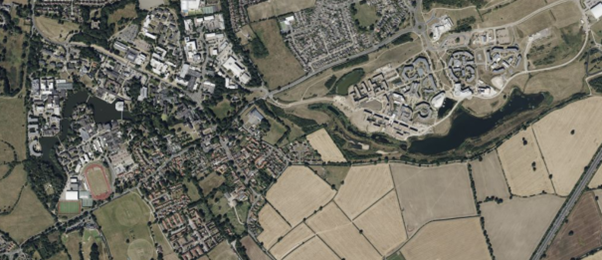

# A Biodiversity Challenge: Dragon Style {#sec-diversity-workshop}

[Download the workshop files](files/BIO00036I Workshop 4_ Species Richness (2025-26 edition).docx)

## Background and aims

Being able to estimate how many species are present in an ecological community is an important question in conservation ecology, as it underpins efficient and effective land management at a larger scale. For example, if you have a limited budget, how will you decide which bit of land to designate as a National Park?

In this session, you will explore how sampling effort and relative abundance of species (the 'shape' of the community) affects our ability to estimate how many species are present in a community, using concepts that you have read about in @sec-species-richness-overview.

## Learning objectives 

By the end of this workshop, you should be able to: 
-   Construct a species accumulation curve from sampling data;
-   Explain how the shape of the curve depends on the relative abundance of species in a community;
-   Explain why different sampling effort might be appropriate for differently shaped communities;
-   Identify and record bird species present on the Campus West lake

## Where are we working? 
You are going to imagine that your LEGO communities each represent an island in the Dragon Archipelago: Coot Island, Moorhen Island, etc. If it makes you happy, you can also draw a map of your island. The outline of all the islands in the archipelago are depicted on the first page of the [Dragon Archipelago slides](https://docs.google.com/presentation/d/1Mnm4yiSW9MO3yQ6lAY4V7wAybTaO7nC1CuTE4TW3U2E/edit?usp=sharing)

## LEGO Task

### Sampling on your island 

You are going to simulate the communities of dragons living on each island using LEGO bricks.

Take a sample of 6-8 individuals from your bag (don't worry about exact numbers; just use a small handful that will give roughly the same number of individuals each time). This represents a number of dragons that you might see in one area of the island. You could note down the location on your map.

Using your identification key as the primary distinguisher between 'species' in the sample, count how many species there are in this sample. Do you think this is representative of the community as a whole?

Take a second sample, and keep it separate. How many species are in this sample? Is it the same as before? Are they the same species as you found in the first sample? Use a recording sheet to record the sample, adding the species name to the top row. You could model it on the [Species Richness of Ecological Diversity Indices tab of the model data spreadsheet](https://docs.google.com/spreadsheets/d/1zEzeLF_fLPYlXqvPcCZ0r0Jmb_i7pkLywQs--5LQuZw/edit?usp=sharing), with each row of the data being the number of individuals in each species found in one sample.

A species accumulation curve is a graph with sampling effort along the x axis, and number of species along the y axis. A set of axes is printed on the next page (Figure 1). Mark your first sample on the graph paper on the next page, or draw it out for yourself using spreadsheet graphs, R, or on physical paper.

For the second and subsequent samples, you must pool your samples to get a cumulative number of unique species (e.g. you still only count red once even if it appears in two or more samples). Add the second sample to the graph and connect the data points with a straight line.

Repeat the sampling at least ten times in total and add the cumulative number of observed unique species after each new sample to the graph. What would you estimate the true number of species in the dragon community to be? How good do you think your estimate is?

Build a tower of each unique species from all the samples, and line them up from most individuals per species to the least. This represents the rank abundance of the community, and tells you something about the relative commonness or rarity of each of the species.

### Share your results 

Add a photograph of your graph (see the downloadable workshop document or a workshop handout), and your rank abundance, to the [Dragon Archipelago slides](https://docs.google.com/presentation/d/1Mnm4yiSW9MO3yQ6lAY4V7wAybTaO7nC1CuTE4TW3U2E/edit?usp=sharing).

How different are the islands, in total species richness (the number of species on each island) and community composition (relative commonness and rarity of species)?

If you had only taken one sample, which community would you have suggested was the most diverse? Did this change with greater sampling effort? 

If you had taken the samples in a different order, how might this have changed your cumulative species calculations? Try drawing the randomisation curve for your islands by recalculating the cumulative species numbers in lots of different ways and taking a mean.

You can draw these curves using R with this starter code (@sec-species-richness-R-code). 

## Lake Task

Weather dependent, we will go out and record bird species from various locations around the campus west lake, and see what the cumulative species curve looks like in real life. You will need a recording sheet, and a bird identification key.

There are two real lakes at the University of York (the two largest plastic lined lakes in Europe!), one on Campus West (the original lake) and one on Campus East (the ‘new’ lake).

:::{#fig-campus-lakes}
{fig-alt = "A satellite image showing the University of York campuses."}

A satellite image of the campuses showing the west (left) and east (right) lakes.
:::

## Key points
-   A species accumulation curve is a plot with sampling effort on the x axis, and number of unique species on the y axis. 
-   The relative abundance of individuals among species in the community affects the shape of the species accumulation curve. When the community is even (similar number of individuals in each species), the species accumulation curve is likely to reach a plateau relatively soon, and give a good estimate of the true species richness (number of species). When the community is dominated by one or a few species, and has a number of relatively rare species, the species accumulation curve may never reach a plateau, as new unique, rare species continue to turn up with increased sampling effort.
-   The number of samples needed to be confident about an estimate of species richness is lower for an even community, and higher for a community with many rare species.
-   Confidence intervals around the species accumulation curve can be drawn by randomizing the order of samples and calculating the distribution of the number of species seen per x samples (e.g. after 4 samples, in community A we are likely to have found 6-7 species, but in community B it may be 4-8). 

